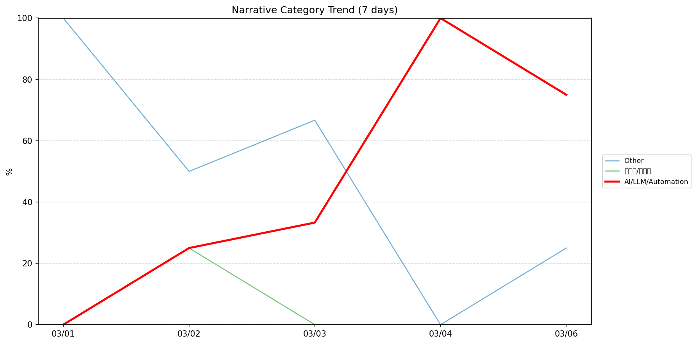
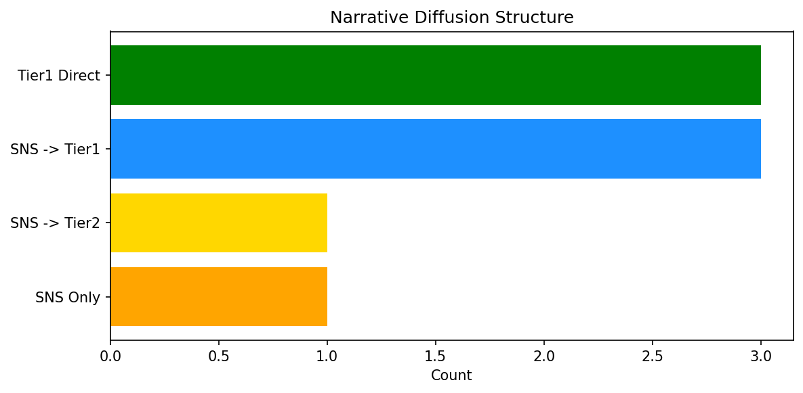

# 週次メタ分析レポート - 2026-03-07

> 分析期間: 過去7日間

---

## ショックタイプ分布

| ショックタイプ | 件数 |
|----------------|------|
| ナラティブシフト | 13 |
| テクノロジーショック | 2 |
| 業績シグナル | 2 |
| 規制ショック | 1 |

---

## ナラティブ推移

### 2026-03-01
- その他: 100%

### 2026-03-02
- その他: 50%
- 半導体/供給網: 25%
- AI/LLM/自動化: 25%

### 2026-03-03
- その他: 67%
- AI/LLM/自動化: 33%

### 2026-03-04
- AI/LLM/自動化: 100%

### 2026-03-06
- AI/LLM/自動化: 75%
- その他: 25%

---

## ナラティブ伝播構造

| 伝播パターン | 件数 |
|--------------|------|
| SNS→Tier1 | 3 |
| Tier1直接 | 3 |
| SNSのみ | 1 |
| カバレッジなし | 10 |
| SNS→Tier2 | 1 |

---

## 過熱警告事後検証

> ※ "過熱警告を出したか"と"AI偏重が実際に続いたか"の検証

| 指標 | 値 |
|------|-----|
| 検証対象数 | 6 |
| 正警告（TP） | 0 |
| 過剰警告（FP） | 0 |
| 正常判定（TN） | 2 |
| 見逃し（FN） | 4 |
| Recall | 0.0% |

- **2026-03-01**: 正常判定 — No overheat and conditions normal: ai_continued=False, price_sustained=True.
- **2026-03-02**: 見逃し — Missed overheat: AI events continued without price backing. An alert should have been raised.
- **2026-03-03**: 見逃し — Missed overheat: AI events continued without price backing. An alert should have been raised.
- **2026-03-04**: 見逃し — Missed overheat: AI events continued without price backing. An alert should have been raised.
- **2026-03-05**: 見逃し — Missed overheat: AI events continued without price backing. An alert should have been raised.
- **2026-03-06**: 正常判定 — No overheat and conditions normal: ai_continued=False, price_sustained=False.

---

## 非AIハイライト（週次）

### 1. NVDA
- **サマリー**: 7件の言及（通常の20.0倍）
- **スコア**: 0.57
- **ナラティブ分類**: 半導体/供給網
- **ショックタイプ**: 業績シグナル
- **AI関連度**: 12%

### 2. GOOGL
- **サマリー**: 6件の言及（通常の20.0倍）
- **スコア**: 0.57
- **ナラティブ分類**: その他
- **ショックタイプ**: ナラティブシフト
- **AI関連度**: 3%

### 3. LMT
- **サマリー**: 出来高が平均の2.22倍
- **スコア**: 0.49
- **ナラティブ分類**: その他
- **ショックタイプ**: ナラティブシフト
- **AI関連度**: 0%

### 4. MDB
- **サマリー**: 出来高が平均の6.65倍
- **スコア**: 0.42
- **ナラティブ分類**: その他
- **ショックタイプ**: ナラティブシフト
- **AI関連度**: 0%

### 5. NEE
- **サマリー**: 出来高が平均の2.61倍
- **スコア**: 0.42
- **ナラティブ分類**: その他
- **ショックタイプ**: ナラティブシフト
- **AI関連度**: 0%

---

## 構造持続確率 Top3

| 順位 | 銘柄 | SPP | ショックタイプ | 伝播パターン | サマリー |
|------|------|-----|----------------|--------------|----------|
| 1 | GOOGL | 0.62 | ナラティブシフト | SNS→Tier1 | 9件の言及（通常の3.0倍） |
| 2 | NVDA | 0.60 | 業績シグナル | Tier1直接 | 7件の言及（通常の20.0倍） |
| 3 | MSFT | 0.46 | ナラティブシフト | Tier1直接 | 7件の言及（通常の14.0倍） |

---

## イベント持続性

| 銘柄 | 出現日数/観測日数 | SPP推移 | 最新SPP |
|------|------------------|---------|---------|
| GOOGL | 5/5日 | 上昇 | 0.62 |
| NVDA | 2/5日 | 上昇 | 0.60 |
| LMT | 2/5日 | 横ばい | 0.42 |
| XOM | 2/5日 | 横ばい | 0.41 |
| MSFT | 1/5日 | 横ばい | 0.46 |
| NEE | 1/5日 | 横ばい | 0.42 |
| JPM | 1/5日 | 横ばい | 0.42 |
| PLTR | 1/5日 | 横ばい | 0.42 |
| MDB | 1/5日 | 横ばい | 0.34 |
| NET | 1/5日 | 横ばい | 0.19 |

---

## 転換点候補

- 「AI/LLM/自動化」が2026-03-03→2026-03-04で67ポイント上昇（33% → 100%）

---

## 組織インパクト仮説

### 1. 今週の構造変化は「ナラティブシフト」に集中（72%）。この領域の専門知識・人材の重要性が高まっている可能性。
- **根拠**: ショックタイプ分布: ナラティブシフトが13件

### 2. 「AI/LLM/自動化」ナラティブの急上昇は、この分野への注目シフトを示唆。関連するリスク管理体制の見直しが必要かもしれません。
- **根拠**: 「AI/LLM/自動化」が2026-03-03→2026-03-04で67ポイント上昇（33% → 100%）

### 3. GOOGL（AI/LLM/自動化）: 言及急増 + ナラティブシフト + 5日間持続 + 高ボラ環境 → 構造的な市場関心の変化の可能性、SPP上昇中
- **根拠**: 出現: 5/5日, SPP推移: 上昇
- **根拠要素**:
- 言及急増
- ナラティブシフト型
- 規制ショック型
- テクノロジーショック型
- 5日間持続観測
- SPP上昇（0.55→0.62）
- 高ボラレジーム下
- 関連: Google's new command-line tool can plug OpenClaw into your Workspace data
- 関連: Google joins Microsoft in telling users Anthropic is still available outside defense projects
- **データ期間**: 2026-03-01〜2026-03-06 (5日間)
- **信頼度注記**: 前週データなしのため方向性は未確定

### 4. レジーム変化とナラティブシフトが同時期に発生 — 偶然か構造的連動かは継続観測が必要
- **根拠**: 同時変動検出: 2件
- **根拠要素**:
- レジーム変化（引き締め→高ボラ）と「AI/LLM/自動化」の25pt減少が同時期に観測
- レジーム変化（引き締め→高ボラ）と「その他」の25pt増加が同時期に観測
- **データ期間**: 2026-03-01〜2026-03-06 (5日間)
- **信頼度注記**: 前週データなしのため方向性は未確定

---

## 市場レジーム推移

| 日付 | レジーム | ボラティリティ | 下落比率 | 信頼度 |
|------|----------|---------------|----------|--------|
| 2026-03-06 | 高ボラ | 50.5% | 33% | 90% |
| 2026-03-05 | 高ボラ | 52.2% | 33% | 90% |
| 2026-03-04 | 引き締め | 53.4% | 60% | 76% |
| 2026-03-03 | 引き締め | 54.2% | 73% | 97% |
| 2026-03-02 | 引き締め | 52.5% | 73% | 97% |
| 2026-03-01 | 引き締め | 52.1% | 73% | 97% |

---

## 前週比較

前週データ不足 — 次週以降比較可能

---

## レジーム・ナラティブ同時変動

> ※ 同時期の観測であり、因果関係を示すものではありません

- **2026-03-03**: レジーム異常（引き締め）と「その他」ナラティブ集中（67%）が共起
- **2026-03-04**: レジーム異常（引き締め）と「AI/LLM/自動化」ナラティブ集中（100%）が共起
- **2026-03-06**: レジーム変化（引き締め→高ボラ）と「AI/LLM/自動化」の25pt減少が同時期に観測
- **2026-03-06**: レジーム変化（引き締め→高ボラ）と「その他」の25pt増加が同時期に観測
- **2026-03-06**: レジーム異常（高ボラ）と「AI/LLM/自動化」ナラティブ集中（75%）が共起

---

## 来週の監視比重提案

### 1. 「規制/政策/地政学」の監視比重を維持・注視
- **根拠**: 週平均ナラティブ比率0%と低く、イベント未検出だが、構造的に重要なカテゴリのため意図的な監視継続を推奨。
- **週平均ナラティブ比率**: 0%

### 2. 「金融/金利/流動性」の監視比重を維持・注視
- **根拠**: 週平均ナラティブ比率0%と低く、イベント未検出だが、構造的に重要なカテゴリのため意図的な監視継続を推奨。
- **週平均ナラティブ比率**: 0%

### 3. 「エネルギー/資源」の監視比重を維持・注視
- **根拠**: 週平均ナラティブ比率0%と低く、イベント未検出だが、構造的に重要なカテゴリのため意図的な監視継続を推奨。
- **週平均ナラティブ比率**: 0%

### 4. 「半導体/供給網」の監視比重を引き上げ
- **根拠**: 週平均ナラティブ比率5%と低いが、過去7日で1件のイベントが検出されており、見落としリスクがあります。
- **週平均ナラティブ比率**: 5%

### 5. 「その他」の過集中に注意
- **根拠**: 週平均ナラティブ比率48%と高く、他カテゴリの構造変化を見落とすリスクがあります。
- **週平均ナラティブ比率**: 48%
- **⚡ 急変フラグ**: 直近25%へ急変 — 動向注視を推奨

### 6. 「AI/LLM/自動化」の過集中に注意
- **根拠**: 週平均ナラティブ比率47%と高く、他カテゴリの構造変化を見落とすリスクがあります。
- **週平均ナラティブ比率**: 47%
- **⚡ 急変フラグ**: 直近75%へ急変 — 動向注視を推奨

---

*レポート生成日時: 2026-03-07 01:55:05*
