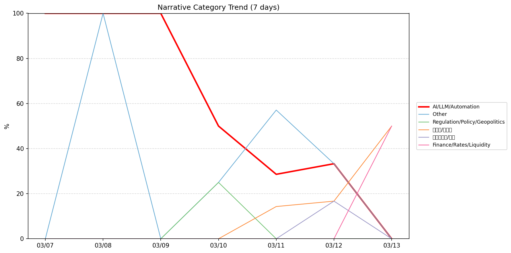
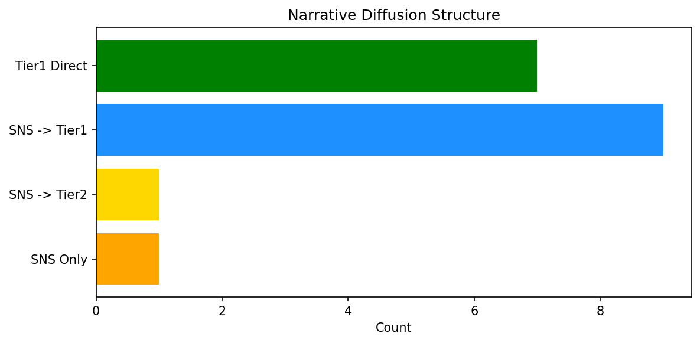

# 週次メタ分析レポート - 2026-03-14

> 分析期間: 過去7日間

---

## ショックタイプ分布

| ショックタイプ | 件数 |
|----------------|------|
| ナラティブシフト | 14 |
| テクノロジーショック | 6 |
| 業績シグナル | 3 |
| ビジネスモデルショック | 1 |

---

## ナラティブ推移

### 2026-03-07
- AI/LLM/自動化: 100%

### 2026-03-08
- その他: 100%
- AI/LLM/自動化: 100%

### 2026-03-09
- AI/LLM/自動化: 100%

### 2026-03-10
- AI/LLM/自動化: 50%
- その他: 25%
- 規制/政策/地政学: 25%

### 2026-03-11
- その他: 57%
- AI/LLM/自動化: 29%
- 半導体/供給網: 14%

### 2026-03-12
- その他: 33%
- AI/LLM/自動化: 33%
- 半導体/供給網: 17%
- ガバナンス/経営: 17%

### 2026-03-13
- 金融/金利/流動性: 50%
- 半導体/供給網: 50%

---

## ナラティブ伝播構造

| 伝播パターン | 件数 |
|--------------|------|
| Tier1直接 | 7 |
| SNS→Tier2 | 1 |
| SNS→Tier1 | 9 |
| カバレッジなし | 6 |
| SNSのみ | 1 |

---

## 過熱警告事後検証

> ※ "過熱警告を出したか"と"AI偏重が実際に続いたか"の検証

| 指標 | 値 |
|------|-----|
| 検証対象数 | 7 |
| 正警告（TP） | 0 |
| 過剰警告（FP） | 0 |
| 正常判定（TN） | 7 |
| 見逃し（FN） | 0 |

- **2026-03-07**: 正常判定 — No overheat and conditions normal: ai_continued=True, price_sustained=True.
- **2026-03-08**: 正常判定 — No overheat and conditions normal: ai_continued=True, price_sustained=True.
- **2026-03-09**: 正常判定 — No overheat and conditions normal: ai_continued=False, price_sustained=False.
- **2026-03-10**: 正常判定 — No overheat and conditions normal: ai_continued=False, price_sustained=False.
- **2026-03-11**: 正常判定 — No overheat and conditions normal: ai_continued=False, price_sustained=True.
- **2026-03-12**: 正常判定 — No overheat and conditions normal: ai_continued=False, price_sustained=False.
- **2026-03-13**: 正常判定 — No overheat and conditions normal: ai_continued=False, price_sustained=False.

---

## 非AIハイライト（週次）

### 1. MSFT
- **サマリー**: 13件の言及（通常の9.0倍）
- **スコア**: 0.72
- **ナラティブ分類**: ガバナンス/経営
- **ショックタイプ**: 業績シグナル
- **AI関連度**: 7%

### 2. MSFT
- **サマリー**: 10件の言及（通常の8.7倍）
- **スコア**: 0.72
- **ナラティブ分類**: その他
- **ショックタイプ**: ナラティブシフト
- **AI関連度**: 11%

### 3. NVDA
- **サマリー**: 9件の言及（通常の8.2倍）
- **スコア**: 0.72
- **ナラティブ分類**: 半導体/供給網
- **ショックタイプ**: テクノロジーショック
- **AI関連度**: 19%

### 4. NVDA
- **サマリー**: 7件の言及（通常の4.8倍）
- **スコア**: 0.67
- **ナラティブ分類**: 半導体/供給網
- **ショックタイプ**: ビジネスモデルショック
- **AI関連度**: 24%

### 5. NVDA
- **サマリー**: 5件の言及（通常の4.5倍）
- **スコア**: 0.63
- **ナラティブ分類**: 半導体/供給網
- **ショックタイプ**: テクノロジーショック
- **AI関連度**: 26%

---

## 構造持続確率 Top3

| 順位 | 銘柄 | SPP | ショックタイプ | 伝播パターン | サマリー |
|------|------|-----|----------------|--------------|----------|
| 1 | MSFT | 0.69 | 業績シグナル | SNS→Tier1 | 13件の言及（通常の9.0倍） |
| 2 | NVDA | 0.65 | ビジネスモデルショック | Tier1直接 | 7件の言及（通常の4.8倍） |
| 3 | PLTR | 0.64 | テクノロジーショック | SNS→Tier1 | 3件の言及（通常の6.7倍） |

---

## イベント持続性

| 銘柄 | 出現日数/観測日数 | SPP推移 | 最新SPP |
|------|------------------|---------|---------|
| MSFT | 5/7日 | 上昇 | 0.69 |
| NVDA | 4/7日 | 上昇 | 0.65 |
| PLTR | 4/7日 | 横ばい | 0.64 |
| GOOGL | 4/7日 | 上昇 | 0.58 |
| CRWD | 2/7日 | 上昇 | 0.48 |
| PATH | 2/7日 | 横ばい | 0.42 |
| JPM | 1/7日 | 横ばい | 0.41 |
| NET | 1/7日 | 横ばい | 0.22 |

---

## 転換点候補

- 「半導体/供給網」が2026-03-12→2026-03-13で33ポイント上昇（17% → 50%）
- 「AI/LLM/自動化」が2026-03-09→2026-03-10で50ポイント下降（100% → 50%）

---

## 組織インパクト仮説

### 1. 今週の構造変化は「ナラティブシフト」に集中（58%）。この領域の専門知識・人材の重要性が高まっている可能性。
- **根拠**: ショックタイプ分布: ナラティブシフトが14件

### 2. 「半導体/供給網」ナラティブの急上昇は、この分野への注目シフトを示唆。関連するリスク管理体制の見直しが必要かもしれません。
- **根拠**: 「半導体/供給網」が2026-03-12→2026-03-13で33ポイント上昇（17% → 50%）

### 3. 「AI/LLM/自動化」ナラティブの下降は、市場の関心が他分野に移行中であることを示唆。この分野の見落としリスクに注意が必要です。
- **根拠**: 「AI/LLM/自動化」が2026-03-09→2026-03-10で50ポイント下降（100% → 50%）

### 4. MSFT（ガバナンス/経営）: 言及急増 + 業績シグナル + 5日間持続 + 引き締め環境 → 構造的な市場関心の変化の可能性、SPP上昇中
- **根拠**: 出現: 5/7日, SPP推移: 上昇
- **根拠要素**:
- 言及急増
- 業績シグナル型
- ナラティブシフト型
- 5日間持続観測
- SPP上昇（0.47→0.69）
- 引き締めレジーム下
- 関連: Microsoft’s Copilot AI assistant is coming to current-gen Xbox consoles this year
- 関連: Microsoft is working to eliminate PC gaming's "compiling shaders" wait times
- **データ期間**: 2026-03-07〜2026-03-13 (7日間)
- **信頼度注記**: 観測データに基づく示唆であり、因果関係を示すものではありません

### 5. NVDA（半導体/供給網）: 言及急増 + ビジネスモデルショック + 4日間持続 + 引き締め環境 → 構造的な市場関心の変化の可能性、SPP上昇中
- **根拠**: 出現: 4/7日, SPP推移: 上昇
- **根拠要素**:
- 言及急増
- ビジネスモデルショック型
- ナラティブシフト型
- テクノロジーショック型
- 4日間持続観測
- SPP上昇（0.44→0.65）
- 引き締めレジーム下
- 関連: Oil and Nvidia are key for Wall Street next week amid Iran war volatility
- 関連: Nvidia's GTC will mark an AI chip pivot. Here's why the CPU is taking center stage
- **データ期間**: 2026-03-07〜2026-03-13 (7日間)
- **信頼度注記**: 観測データに基づく示唆であり、因果関係を示すものではありません

### 6. PLTR（AI/LLM/自動化）: 言及急増・出来高急増 + ナラティブシフト + 4日間持続 + 引き締め環境 → 構造的な市場関心の変化の可能性
- **根拠**: 出現: 4/7日, SPP推移: 横ばい
- **根拠要素**:
- 言及急増
- 出来高急増
- ナラティブシフト型
- テクノロジーショック型
- 4日間持続観測
- SPP横ばい（0.64）
- 引き締めレジーム下
- 関連: Palantir's technology gives the West a critical edge in Middle East, CEO Alex Karp says
- 関連: Palantir rallies 15% for the week as Iran war boosts prospects, muting Anthropic concern
- **データ期間**: 2026-03-07〜2026-03-13 (7日間)
- **信頼度注記**: 観測データに基づく示唆であり、因果関係を示すものではありません

---

## 市場レジーム推移

| 日付 | レジーム | ボラティリティ | 下落比率 | 信頼度 |
|------|----------|---------------|----------|--------|
| 2026-03-13 | 引き締め | 44.5% | 53% | 65% |
| 2026-03-12 | 引き締め | 45.5% | 53% | 65% |
| 2026-03-11 | 高ボラ | 46.3% | 40% | 82% |
| 2026-03-10 | 引き締め | 46.9% | 53% | 65% |
| 2026-03-09 | 高ボラ | 47.5% | 40% | 82% |
| 2026-03-08 | 高ボラ | 47.9% | 33% | 90% |
| 2026-03-07 | 高ボラ | 49.3% | 27% | 98% |

---

## 前週比較

> 比較期間: 2026-03-01〜2026-03-07 (6日分)

**イベント件数**: 今週 24 件 / 前週 20 件（差分 +4）

**支配的レジーム**: 引き締め → 高ボラ（変化あり）

### ショックタイプ増減

| ショックタイプ | 今週 | 前週 | 差分 |
|----------------|------|------|------|
| テクノロジーショック | 6 | 2 | +4 |
| ナラティブシフト | 14 | 15 | -1 |
| ビジネスモデルショック | 1 | 0 | +1 |
| 業績シグナル | 3 | 2 | +1 |
| 規制ショック | 0 | 1 | -1 |

### ナラティブ比率変化

| カテゴリ | 今週平均 | 前週平均 | 差分(pt) |
|----------|----------|----------|----------|
| AI/LLM/自動化 | 59% | 56% | +3 |
| その他 | 31% | 40% | -10 |
| ガバナンス/経営 | 2% | 0% | +2 |
| 半導体/供給網 | 12% | 4% | +7 |
| 規制/政策/地政学 | 4% | 0% | +4 |
| 金融/金利/流動性 | 7% | 0% | +7 |

---

## レジーム・ナラティブ同時変動

> ※ 同時期の観測であり、因果関係を示すものではありません

- **2026-03-08**: レジーム異常（高ボラ）と「その他」ナラティブ集中（100%）が共起
- **2026-03-08**: レジーム異常（高ボラ）と「AI/LLM/自動化」ナラティブ集中（100%）が共起
- **2026-03-09**: レジーム異常（高ボラ）と「AI/LLM/自動化」ナラティブ集中（100%）が共起
- **2026-03-10**: レジーム変化（高ボラ→引き締め）と「AI/LLM/自動化」の50pt減少が同時期に観測
- **2026-03-10**: レジーム変化（高ボラ→引き締め）と「規制/政策/地政学」の25pt増加が同時期に観測
- **2026-03-10**: レジーム変化（高ボラ→引き締め）と「その他」の25pt増加が同時期に観測
- **2026-03-11**: レジーム変化（引き締め→高ボラ）と「半導体/供給網」の14pt増加が同時期に観測
- **2026-03-11**: レジーム変化（引き締め→高ボラ）と「AI/LLM/自動化」の21pt減少が同時期に観測
- **2026-03-11**: レジーム変化（引き締め→高ボラ）と「規制/政策/地政学」の25pt減少が同時期に観測
- **2026-03-11**: レジーム変化（引き締め→高ボラ）と「その他」の32pt増加が同時期に観測
- **2026-03-12**: レジーム変化（高ボラ→引き締め）と「ガバナンス/経営」の17pt増加が同時期に観測
- **2026-03-12**: レジーム変化（高ボラ→引き締め）と「その他」の24pt減少が同時期に観測

---

## 来週の監視比重提案

### 1. 「エネルギー/資源」の監視比重を維持・注視
- **根拠**: 週平均ナラティブ比率0%と低く、イベント未検出だが、構造的に重要なカテゴリのため意図的な監視継続を推奨。
- **週平均ナラティブ比率**: 0%

### 2. 「ガバナンス/経営」の監視比重を引き上げ
- **根拠**: 週平均ナラティブ比率2%と低いが、過去7日で1件のイベントが検出されており、見落としリスクがあります。
- **週平均ナラティブ比率**: 2%

### 3. 「規制/政策/地政学」の監視比重を引き上げ
- **根拠**: 週平均ナラティブ比率4%と低いが、過去7日で1件のイベントが検出されており、見落としリスクがあります。
- **週平均ナラティブ比率**: 4%

### 4. 「AI/LLM/自動化」の過集中に注意
- **根拠**: 週平均ナラティブ比率59%と高く、他カテゴリの構造変化を見落とすリスクがあります。
- **週平均ナラティブ比率**: 59%
- **⚡ 急変フラグ**: 直近0%へ急変 — 動向注視を推奨

### 5. 「その他」の過集中に注意
- **根拠**: 週平均ナラティブ比率31%と高く、他カテゴリの構造変化を見落とすリスクがあります。
- **週平均ナラティブ比率**: 31%
- **⚡ 急変フラグ**: 直近0%へ急変 — 動向注視を推奨

---

*レポート生成日時: 2026-03-14 01:59:07*
