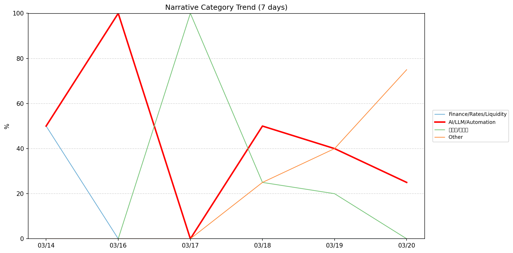
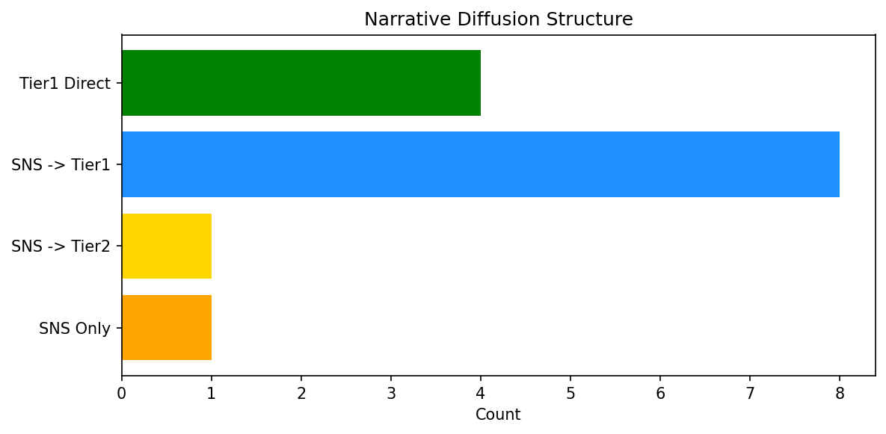

# 週次メタ分析レポート - 2026-03-21

> 分析期間: 過去7日間

---

## ショックタイプ分布

| ショックタイプ | 件数 |
|----------------|------|
| ナラティブシフト | 13 |
| テクノロジーショック | 5 |
| 業績シグナル | 1 |
| 規制ショック | 1 |
| ビジネスモデルショック | 1 |

---

## ナラティブ推移

### 2026-03-14
- 金融/金利/流動性: 50%
- AI/LLM/自動化: 50%

### 2026-03-16
- AI/LLM/自動化: 100%

### 2026-03-17
- 半導体/供給網: 100%

### 2026-03-18
- AI/LLM/自動化: 50%
- その他: 25%
- 半導体/供給網: 25%

### 2026-03-19
- AI/LLM/自動化: 40%
- その他: 40%
- 半導体/供給網: 20%

### 2026-03-20
- その他: 75%
- AI/LLM/自動化: 25%

---

## ナラティブ伝播構造

| 伝播パターン | 件数 |
|--------------|------|
| SNS→Tier1 | 8 |
| SNSのみ | 1 |
| カバレッジなし | 7 |
| Tier1直接 | 4 |
| SNS→Tier2 | 1 |

---

## 過熱警告事後検証

> ※ "過熱警告を出したか"と"AI偏重が実際に続いたか"の検証

| 指標 | 値 |
|------|-----|
| 検証対象数 | 7 |
| 正警告（TP） | 0 |
| 過剰警告（FP） | 0 |
| 正常判定（TN） | 5 |
| 見逃し（FN） | 2 |
| Recall | 0.0% |

- **2026-03-14**: 見逃し — Missed overheat: AI events continued without price backing. An alert should have been raised.
- **2026-03-15**: 見逃し — Missed overheat: AI events continued without price backing. An alert should have been raised.
- **2026-03-16**: 正常判定 — No overheat and conditions normal: ai_continued=False, price_sustained=False.
- **2026-03-17**: 正常判定 — No overheat and conditions normal: ai_continued=False, price_sustained=False.
- **2026-03-18**: 正常判定 — No overheat and conditions normal: ai_continued=False, price_sustained=True.
- **2026-03-19**: 正常判定 — No overheat and conditions normal: ai_continued=False, price_sustained=True.
- **2026-03-20**: 正常判定 — No overheat and conditions normal: ai_continued=False, price_sustained=False.

---

## 非AIハイライト（週次）

### 1. NVDA
- **サマリー**: 14件の言及（通常の4.4倍）
- **スコア**: 0.72
- **ナラティブ分類**: 半導体/供給網
- **ショックタイプ**: テクノロジーショック
- **AI関連度**: 14%

### 2. MSFT
- **サマリー**: 9件の言及（通常の4.0倍）
- **スコア**: 0.68
- **ナラティブ分類**: その他
- **ショックタイプ**: ナラティブシフト
- **AI関連度**: 6%

### 3. NVDA
- **サマリー**: 8件の言及（通常の2.4倍）
- **スコア**: 0.55
- **ナラティブ分類**: 半導体/供給網
- **ショックタイプ**: ナラティブシフト
- **AI関連度**: 9%

### 4. NVDA
- **サマリー**: 9件の言及（通常の3.1倍）
- **スコア**: 0.48
- **ナラティブ分類**: 半導体/供給網
- **ショックタイプ**: テクノロジーショック
- **AI関連度**: 16%

### 5. JPM
- **サマリー**: 4件の言及（通常の8.9倍）
- **スコア**: 0.40
- **ナラティブ分類**: 金融/金利/流動性
- **ショックタイプ**: ナラティブシフト
- **AI関連度**: 4%

---

## 構造持続確率 Top3

| 順位 | 銘柄 | SPP | ショックタイプ | 伝播パターン | サマリー |
|------|------|-----|----------------|--------------|----------|
| 1 | NVDA | 0.63 | ナラティブシフト | SNS→Tier1 | 8件の言及（通常の2.4倍） |
| 2 | JPM | 0.54 | ナラティブシフト | なし | 出来高が平均の2.21倍 |
| 3 | MSFT | 0.49 | ナラティブシフト | SNS→Tier1 | 9件の言及（通常の3.3倍） |

---

## イベント持続性

| 銘柄 | 出現日数/観測日数 | SPP推移 | 最新SPP |
|------|------------------|---------|---------|
| NVDA | 5/6日 | 横ばい | 0.63 |
| JPM | 4/6日 | 上昇 | 0.54 |
| MSFT | 3/6日 | 下降 | 0.49 |
| GOOGL | 3/6日 | 横ばい | 0.45 |
| CRWD | 1/6日 | 横ばい | 0.45 |
| LMT | 1/6日 | 横ばい | 0.34 |
| UNH | 1/6日 | 横ばい | 0.34 |
| DDOG | 1/6日 | 横ばい | 0.34 |
| NEE | 1/6日 | 横ばい | 0.33 |
| NET | 1/6日 | 横ばい | 0.22 |

---

## 転換点候補

- 「その他」が2026-03-19→2026-03-20で35ポイント上昇（40% → 75%）

---

## 組織インパクト仮説

### 1. 今週の構造変化は「ナラティブシフト」に集中（62%）。この領域の専門知識・人材の重要性が高まっている可能性。
- **根拠**: ショックタイプ分布: ナラティブシフトが13件

### 2. 「その他」ナラティブの急上昇は、この分野への注目シフトを示唆。関連するリスク管理体制の見直しが必要かもしれません。
- **根拠**: 「その他」が2026-03-19→2026-03-20で35ポイント上昇（40% → 75%）

### 3. NVDA（AI/LLM/自動化）: 言及急増 + ビジネスモデルショック + 5日間持続 + 引き締め環境 → 構造的な市場関心の変化の可能性
- **根拠**: 出現: 5/6日, SPP推移: 横ばい
- **根拠要素**:
- 言及急増
- ビジネスモデルショック型
- テクノロジーショック型
- ナラティブシフト型
- 5日間持続観測
- SPP横ばい（0.63）
- 引き締めレジーム下
- 関連: Super Micro co-founder indicted on Nvidia smuggling charges leaves board
- 関連: What happened at Nvidia GTC: NemoClaw, Robot Olaf, and a $1 trillion bet
- **データ期間**: 2026-03-14〜2026-03-20 (6日間)
- **信頼度注記**: 観測データに基づく示唆であり、因果関係を示すものではありません

### 4. JPM（その他）: 言及急増・出来高急増 + ナラティブシフト + 4日間持続 + 引き締め環境 → 構造的な市場関心の変化の可能性、SPP上昇中
- **根拠**: 出現: 4/6日, SPP推移: 上昇
- **根拠要素**:
- 言及急増
- 出来高急増
- ナラティブシフト型
- 4日間持続観測
- SPP上昇（0.46→0.54）
- 引き締めレジーム下
- 関連: JPMorgan Chase taps Dwyane Wade, Tom Brady for new athlete wealth management push
- **データ期間**: 2026-03-14〜2026-03-20 (6日間)
- **信頼度注記**: 観測データに基づく示唆であり、因果関係を示すものではありません

### 5. MSFT（その他）: 言及急増 + ナラティブシフト + 3日間持続 + 引き締め環境 → 構造的な市場関心の変化の可能性、SPP下降中
- **根拠**: 出現: 3/6日, SPP推移: 下降
- **根拠要素**:
- 言及急増
- ナラティブシフト型
- 3日間持続観測
- SPP下降（0.57→0.49）
- 引き締めレジーム下
- 関連: Microsoft rolls back some of its Copilot AI bloat on Windows
- 関連: Microsoft is ending the Windows Update nightmare — and letting you pause them indefinitely
- **データ期間**: 2026-03-14〜2026-03-20 (6日間)
- **信頼度注記**: 観測データに基づく示唆であり、因果関係を示すものではありません

---

## 市場レジーム推移

| 日付 | レジーム | ボラティリティ | 下落比率 | 信頼度 |
|------|----------|---------------|----------|--------|
| 2026-03-20 | 引き締め | 43.2% | 67% | 87% |
| 2026-03-19 | 高ボラ | 42.4% | 47% | 74% |
| 2026-03-18 | 引き締め | 43.2% | 53% | 65% |
| 2026-03-17 | 高ボラ | 43.7% | 40% | 82% |
| 2026-03-16 | 高ボラ | 44.6% | 40% | 82% |
| 2026-03-15 | 引き締め | 44.7% | 67% | 87% |
| 2026-03-14 | 高ボラ | 44.6% | 47% | 74% |

---

## 前週比較

> 比較期間: 2026-03-07〜2026-03-14 (8日分)

**イベント件数**: 今週 21 件 / 前週 26 件（差分 -5）

**支配的レジーム**: 高ボラ（変化なし）

### ショックタイプ増減

| ショックタイプ | 今週 | 前週 | 差分 |
|----------------|------|------|------|
| テクノロジーショック | 5 | 6 | -1 |
| ナラティブシフト | 13 | 15 | -2 |
| ビジネスモデルショック | 1 | 2 | -1 |
| 業績シグナル | 1 | 3 | -2 |
| 規制ショック | 1 | 0 | +1 |

### ナラティブ比率変化

| カテゴリ | 今週平均 | 前週平均 | 差分(pt) |
|----------|----------|----------|----------|
| AI/LLM/自動化 | 44% | 58% | -14 |
| その他 | 23% | 27% | -4 |
| ガバナンス/経営 | 0% | 2% | -2 |
| 半導体/供給網 | 24% | 10% | +14 |
| 規制/政策/地政学 | 0% | 3% | -3 |
| 金融/金利/流動性 | 8% | 12% | -4 |

---

## レジーム・ナラティブ同時変動

> ※ 同時期の観測であり、因果関係を示すものではありません

- **2026-03-16**: レジーム異常（高ボラ）と「AI/LLM/自動化」ナラティブ集中（100%）が共起
- **2026-03-17**: レジーム異常（高ボラ）と「半導体/供給網」ナラティブ集中（100%）が共起
- **2026-03-18**: レジーム変化（高ボラ→引き締め）と「その他」の25pt増加が同時期に観測
- **2026-03-18**: レジーム変化（高ボラ→引き締め）と「半導体/供給網」の75pt減少が同時期に観測
- **2026-03-18**: レジーム変化（高ボラ→引き締め）と「AI/LLM/自動化」の50pt増加が同時期に観測
- **2026-03-19**: レジーム変化（引き締め→高ボラ）と「その他」の15pt増加が同時期に観測
- **2026-03-20**: レジーム変化（高ボラ→引き締め）と「その他」の35pt増加が同時期に観測
- **2026-03-20**: レジーム変化（高ボラ→引き締め）と「AI/LLM/自動化」の15pt減少が同時期に観測
- **2026-03-20**: レジーム変化（高ボラ→引き締め）と「半導体/供給網」の20pt減少が同時期に観測
- **2026-03-20**: レジーム異常（引き締め）と「その他」ナラティブ集中（75%）が共起

---

## 来週の監視比重提案

### 1. 「規制/政策/地政学」の監視比重を維持・注視
- **根拠**: 週平均ナラティブ比率0%と低く、イベント未検出だが、構造的に重要なカテゴリのため意図的な監視継続を推奨。
- **週平均ナラティブ比率**: 0%

### 2. 「エネルギー/資源」の監視比重を維持・注視
- **根拠**: 週平均ナラティブ比率0%と低く、イベント未検出だが、構造的に重要なカテゴリのため意図的な監視継続を推奨。
- **週平均ナラティブ比率**: 0%

### 3. 「AI/LLM/自動化」の過集中に注意
- **根拠**: 週平均ナラティブ比率44%と高く、他カテゴリの構造変化を見落とすリスクがあります。
- **週平均ナラティブ比率**: 44%
- **⚡ 急変フラグ**: 直近25%へ急変 — 動向注視を推奨

---

*レポート生成日時: 2026-03-21 01:57:30*
