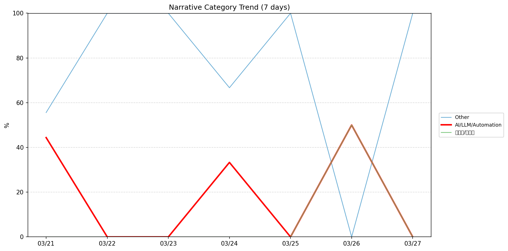
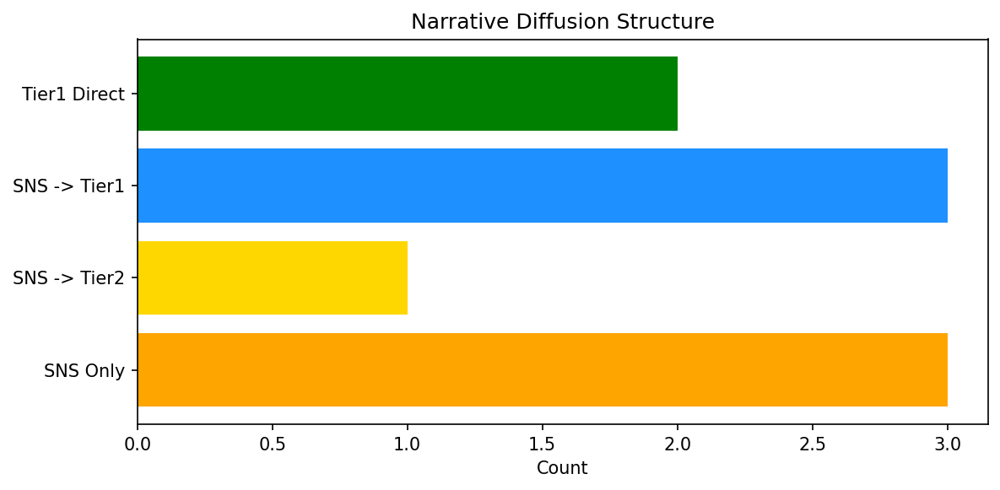

# 週次メタ分析レポート - 2026-03-28

> 分析期間: 過去7日間

---

## ショックタイプ分布

| ショックタイプ | 件数 |
|----------------|------|
| ナラティブシフト | 15 |
| 業績シグナル | 9 |
| テクノロジーショック | 3 |

---

## ナラティブ推移

### 2026-03-21
- その他: 56%
- AI/LLM/自動化: 44%

### 2026-03-22
- その他: 100%

### 2026-03-23
- その他: 100%

### 2026-03-24
- その他: 67%
- AI/LLM/自動化: 33%

### 2026-03-25
- その他: 100%

### 2026-03-26
- 半導体/供給網: 50%
- AI/LLM/自動化: 50%

### 2026-03-27
- その他: 100%

---

## ナラティブ伝播構造

| 伝播パターン | 件数 |
|--------------|------|
| カバレッジなし | 18 |
| SNS→Tier2 | 1 |
| SNS→Tier1 | 3 |
| Tier1直接 | 2 |
| SNSのみ | 3 |

---

## 過熱警告事後検証

> ※ "過熱警告を出したか"と"AI偏重が実際に続いたか"の検証

| 指標 | 値 |
|------|-----|
| 検証対象数 | 7 |
| 正警告（TP） | 0 |
| 過剰警告（FP） | 0 |
| 正常判定（TN） | 7 |
| 見逃し（FN） | 0 |

- **2026-03-21**: 正常判定 — No overheat and conditions normal: ai_continued=False, price_sustained=True.
- **2026-03-22**: 正常判定 — No overheat and conditions normal: ai_continued=False, price_sustained=True.
- **2026-03-23**: 正常判定 — No overheat and conditions normal: ai_continued=False, price_sustained=False.
- **2026-03-24**: 正常判定 — No overheat and conditions normal: ai_continued=False, price_sustained=False.
- **2026-03-25**: 正常判定 — No overheat and conditions normal: ai_continued=False, price_sustained=False.
- **2026-03-26**: 正常判定 — No overheat and conditions normal: ai_continued=False, price_sustained=False.
- **2026-03-27**: 正常判定 — No overheat and conditions normal: ai_continued=False, price_sustained=False.

---

## 非AIハイライト（週次）

### 1. NVDA
- **サマリー**: 前日比-4.16%の価格変動
- **スコア**: 0.36
- **ナラティブ分類**: 半導体/供給網
- **ショックタイプ**: 業績シグナル
- **AI関連度**: 9%

### 2. LMT
- **サマリー**: 出来高が平均の3.92倍
- **スコア**: 0.36
- **ナラティブ分類**: その他
- **ショックタイプ**: ナラティブシフト
- **AI関連度**: 0%

### 3. UNH
- **サマリー**: 出来高が平均の5.38倍
- **スコア**: 0.36
- **ナラティブ分類**: その他
- **ショックタイプ**: ナラティブシフト
- **AI関連度**: 0%

### 4. LMT
- **サマリー**: 出来高が平均の3.95倍
- **スコア**: 0.36
- **ナラティブ分類**: その他
- **ショックタイプ**: ナラティブシフト
- **AI関連度**: 0%

### 5. UNH
- **サマリー**: 出来高が平均の5.28倍
- **スコア**: 0.36
- **ナラティブ分類**: その他
- **ショックタイプ**: ナラティブシフト
- **AI関連度**: 0%

---

## 構造持続確率 Top3

| 順位 | 銘柄 | SPP | ショックタイプ | 伝播パターン | サマリー |
|------|------|-----|----------------|--------------|----------|
| 1 | PATH | 0.68 | 業績シグナル | Tier1直接 | 前日比-8.74%の価格変動 |
| 2 | GOOGL | 0.66 | テクノロジーショック | SNS→Tier2 | 20件の言及（通常の3.3倍） |
| 3 | JPM | 0.63 | 業績シグナル | なし | 前日比-3.02%の価格変動 |

---

## イベント持続性

| 銘柄 | 出現日数/観測日数 | SPP推移 | 最新SPP |
|------|------------------|---------|---------|
| GOOGL | 4/7日 | 上昇 | 0.66 |
| JPM | 3/7日 | 上昇 | 0.63 |
| DDOG | 3/7日 | 上昇 | 0.62 |
| LMT | 3/7日 | 上昇 | 0.62 |
| NVDA | 2/7日 | 下降 | 0.53 |
| MSFT | 2/7日 | 横ばい | 0.51 |
| UNH | 2/7日 | 横ばい | 0.46 |
| NEE | 2/7日 | 横ばい | 0.41 |
| PATH | 1/7日 | 横ばい | 0.68 |
| SNOW | 1/7日 | 横ばい | 0.45 |
| PLTR | 1/7日 | 横ばい | 0.45 |
| XOM | 1/7日 | 横ばい | 0.45 |
| CRWD | 1/7日 | 横ばい | 0.37 |

---

## 転換点候補

転換点候補は検出されませんでした。

---

## 組織インパクト仮説

### 1. 今週の構造変化は「ナラティブシフト」に集中（56%）。この領域の専門知識・人材の重要性が高まっている可能性。
- **根拠**: ショックタイプ分布: ナラティブシフトが15件

### 2. GOOGL（その他）: 価格変動・出来高急増 + ナラティブシフト + 4日間持続 + 引き締め環境 → 構造的な市場関心の変化の可能性、SPP上昇中
- **根拠**: 出現: 4/7日, SPP推移: 上昇
- **根拠要素**:
- 価格変動
- 出来高急増
- 言及急増
- ナラティブシフト型
- 業績シグナル型
- テクノロジーショック型
- 4日間持続観測
- SPP上昇（0.49→0.66）
- 引き締めレジーム下
- 関連: Social media is now a massive liability for Meta, Google and the rest of Big Tech
- 関連: Epstein victims sue Google and the Trump administration over alleged disclosure of personal information
- **データ期間**: 2026-03-21〜2026-03-27 (7日間)
- **信頼度注記**: 観測データに基づく示唆であり、因果関係を示すものではありません

### 3. JPM（その他）: 出来高急増・価格変動 + ナラティブシフト + 3日間持続 + 引き締め環境 → 構造的な市場関心の変化の可能性、SPP上昇中
- **根拠**: 出現: 3/7日, SPP推移: 上昇
- **根拠要素**:
- 出来高急増
- 価格変動
- ナラティブシフト型
- 業績シグナル型
- 3日間持続観測
- SPP上昇（0.54→0.63）
- 引き締めレジーム下
- **データ期間**: 2026-03-21〜2026-03-27 (7日間)
- **信頼度注記**: 観測データに基づく示唆であり、因果関係を示すものではありません

### 4. DDOG（その他）: 出来高急増・価格変動 + ナラティブシフト + 3日間持続 + 引き締め環境 → 構造的な市場関心の変化の可能性、SPP上昇中
- **根拠**: 出現: 3/7日, SPP推移: 上昇
- **根拠要素**:
- 出来高急増
- 価格変動
- ナラティブシフト型
- 業績シグナル型
- 3日間持続観測
- SPP上昇（0.42→0.62）
- 引き締めレジーム下
- **データ期間**: 2026-03-21〜2026-03-27 (7日間)
- **信頼度注記**: 観測データに基づく示唆であり、因果関係を示すものではありません

---

## 市場レジーム推移

| 日付 | レジーム | ボラティリティ | 下落比率 | 信頼度 |
|------|----------|---------------|----------|--------|
| 2026-03-27 | 引き締め | 40.7% | 60% | 76% |
| 2026-03-26 | 引き締め | 40.0% | 53% | 65% |
| 2026-03-25 | 引き締め | 39.5% | 53% | 65% |
| 2026-03-24 | 引き締め | 40.1% | 53% | 65% |
| 2026-03-23 | 引き締め | 37.9% | 53% | 65% |
| 2026-03-22 | 引き締め | 43.2% | 60% | 76% |
| 2026-03-21 | 引き締め | 44.1% | 67% | 87% |

---

## 前週比較

> 比較期間: 2026-03-14〜2026-03-21 (7日分)

**イベント件数**: 今週 27 件 / 前週 30 件（差分 -3）

**支配的レジーム**: 引き締め（変化なし）

### ショックタイプ増減

| ショックタイプ | 今週 | 前週 | 差分 |
|----------------|------|------|------|
| テクノロジーショック | 3 | 7 | -4 |
| ナラティブシフト | 15 | 20 | -5 |
| ビジネスモデルショック | 0 | 1 | -1 |
| 業績シグナル | 9 | 1 | +8 |
| 規制ショック | 0 | 1 | -1 |

### ナラティブ比率変化

| カテゴリ | 今週平均 | 前週平均 | 差分(pt) |
|----------|----------|----------|----------|
| AI/LLM/自動化 | 18% | 44% | -26 |
| その他 | 75% | 28% | +47 |
| 半導体/供給網 | 7% | 21% | -14 |
| 金融/金利/流動性 | 0% | 7% | -7 |

---

## レジーム・ナラティブ同時変動

> ※ 同時期の観測であり、因果関係を示すものではありません

- **2026-03-22**: レジーム異常（引き締め）と「その他」ナラティブ集中（100%）が共起
- **2026-03-23**: レジーム異常（引き締め）と「その他」ナラティブ集中（100%）が共起
- **2026-03-24**: レジーム異常（引き締め）と「その他」ナラティブ集中（67%）が共起
- **2026-03-25**: レジーム異常（引き締め）と「その他」ナラティブ集中（100%）が共起
- **2026-03-27**: レジーム異常（引き締め）と「その他」ナラティブ集中（100%）が共起

---

## 来週の監視比重提案

### 1. 「規制/政策/地政学」の監視比重を維持・注視
- **根拠**: 週平均ナラティブ比率0%と低く、イベント未検出だが、構造的に重要なカテゴリのため意図的な監視継続を推奨。
- **週平均ナラティブ比率**: 0%

### 2. 「金融/金利/流動性」の監視比重を維持・注視
- **根拠**: 週平均ナラティブ比率0%と低く、イベント未検出だが、構造的に重要なカテゴリのため意図的な監視継続を推奨。
- **週平均ナラティブ比率**: 0%

### 3. 「エネルギー/資源」の監視比重を維持・注視
- **根拠**: 週平均ナラティブ比率0%と低く、イベント未検出だが、構造的に重要なカテゴリのため意図的な監視継続を推奨。
- **週平均ナラティブ比率**: 0%

### 4. 「その他」の過集中に注意
- **根拠**: 週平均ナラティブ比率75%と高く、他カテゴリの構造変化を見落とすリスクがあります。
- **週平均ナラティブ比率**: 75%
- **⚡ 急変フラグ**: 直近100%へ急変 — 動向注視を推奨

---

*レポート生成日時: 2026-03-28 02:06:34*
