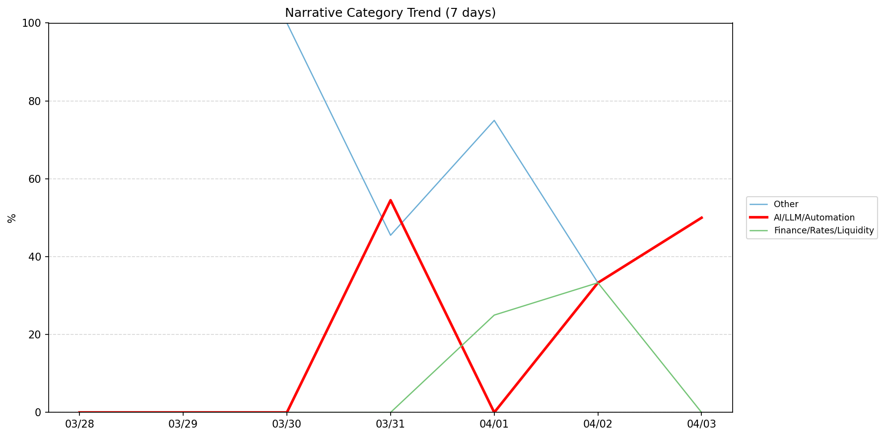
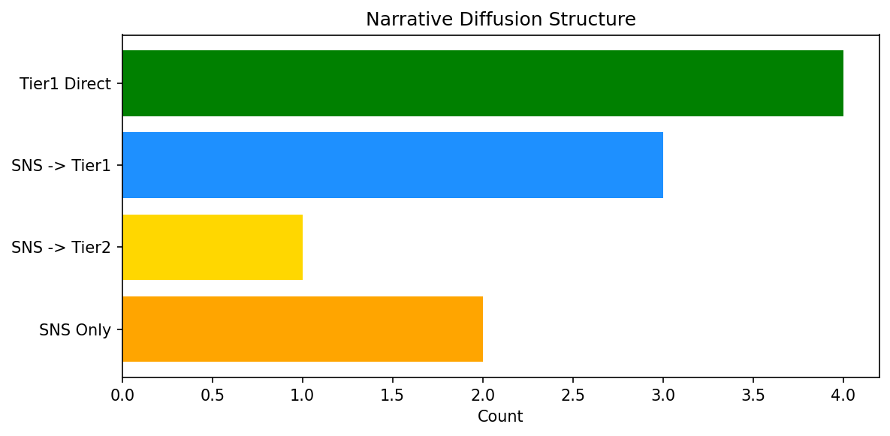

# 週次メタ分析レポート - 2026-04-04

> 分析期間: 過去7日間

---

## ショックタイプ分布

| ショックタイプ | 件数 |
|----------------|------|
| ナラティブシフト | 15 |
| 業績シグナル | 12 |
| テクノロジーショック | 2 |

---

## ナラティブ推移

### 2026-03-28
- その他: 100%

### 2026-03-29
- その他: 100%

### 2026-03-30
- その他: 100%

### 2026-03-31
- AI/LLM/自動化: 55%
- その他: 46%

### 2026-04-01
- その他: 75%
- 金融/金利/流動性: 25%

### 2026-04-02
- その他: 33%
- 金融/金利/流動性: 33%
- AI/LLM/自動化: 33%

### 2026-04-03
- その他: 50%
- AI/LLM/自動化: 50%

---

## ナラティブ伝播構造

| 伝播パターン | 件数 |
|--------------|------|
| SNS→Tier1 | 3 |
| カバレッジなし | 19 |
| SNS→Tier2 | 1 |
| Tier1直接 | 4 |
| SNSのみ | 2 |

---

## 過熱警告事後検証

> ※ "過熱警告を出したか"と"AI偏重が実際に続いたか"の検証

| 指標 | 値 |
|------|-----|
| 検証対象数 | 7 |
| 正警告（TP） | 0 |
| 過剰警告（FP） | 0 |
| 正常判定（TN） | 7 |
| 見逃し（FN） | 0 |

- **2026-03-28**: 正常判定 — No overheat and conditions normal: ai_continued=False, price_sustained=True.
- **2026-03-29**: 正常判定 — No overheat and conditions normal: ai_continued=False, price_sustained=True.
- **2026-03-30**: 正常判定 — No overheat and conditions normal: ai_continued=False, price_sustained=True.
- **2026-03-31**: 正常判定 — No overheat and conditions normal: ai_continued=False, price_sustained=False.
- **2026-04-01**: 正常判定 — No overheat and conditions normal: ai_continued=False, price_sustained=True.
- **2026-04-02**: 正常判定 — No overheat and conditions normal: ai_continued=True, price_sustained=True.
- **2026-04-03**: 正常判定 — No overheat and conditions normal: ai_continued=False, price_sustained=False.

---

## 非AIハイライト（週次）

### 1. JPM
- **サマリー**: 4件の言及（通常の6.2倍）
- **スコア**: 0.38
- **ナラティブ分類**: 金融/金利/流動性
- **ショックタイプ**: ナラティブシフト
- **AI関連度**: 4%

### 2. JPM
- **サマリー**: 4件の言及（通常の4.7倍）
- **スコア**: 0.37
- **ナラティブ分類**: 金融/金利/流動性
- **ショックタイプ**: ナラティブシフト
- **AI関連度**: 4%

### 3. SNOW
- **サマリー**: 出来高が平均の2.03倍
- **スコア**: 0.36
- **ナラティブ分類**: その他
- **ショックタイプ**: ナラティブシフト
- **AI関連度**: 0%

### 4. XOM
- **サマリー**: 出来高が平均の1.72倍
- **スコア**: 0.28
- **ナラティブ分類**: その他
- **ショックタイプ**: ナラティブシフト
- **AI関連度**: 0%

### 5. XOM
- **サマリー**: 前日比-5.23%の価格変動
- **スコア**: 0.28
- **ナラティブ分類**: その他
- **ショックタイプ**: 業績シグナル
- **AI関連度**: 0%

---

## 構造持続確率 Top3

| 順位 | 銘柄 | SPP | ショックタイプ | 伝播パターン | サマリー |
|------|------|-----|----------------|--------------|----------|
| 1 | NVDA | 0.69 | ナラティブシフト | Tier1直接 | 出来高が平均の1.29倍 |
| 2 | DDOG | 0.62 | 業績シグナル | なし | 前日比-7.9%の価格変動 |
| 3 | JPM | 0.56 | ナラティブシフト | Tier1直接 | 4件の言及（通常の6.2倍） |

---

## イベント持続性

| 銘柄 | 出現日数/観測日数 | SPP推移 | 最新SPP |
|------|------------------|---------|---------|
| JPM | 5/7日 | 下降 | 0.56 |
| XOM | 5/7日 | 横ばい | 0.54 |
| NET | 3/7日 | 上昇 | 0.36 |
| DDOG | 2/7日 | 横ばい | 0.62 |
| GOOGL | 2/7日 | 下降 | 0.42 |
| SNOW | 2/7日 | 横ばい | 0.42 |
| MSFT | 2/7日 | 横ばい | 0.41 |
| NVDA | 1/7日 | 横ばい | 0.69 |
| UNH | 1/7日 | 横ばい | 0.45 |
| PLTR | 1/7日 | 横ばい | 0.45 |

---

## 転換点候補

転換点候補は検出されませんでした。

---

## 組織インパクト仮説

### 1. 今週の構造変化は「ナラティブシフト」に集中（52%）。この領域の専門知識・人材の重要性が高まっている可能性。
- **根拠**: ショックタイプ分布: ナラティブシフトが15件

### 2. JPM（その他）: 価格変動・言及急増 + 業績シグナル + 5日間持続 + 引き締め環境 → 構造的な市場関心の変化の可能性、SPP下降中
- **根拠**: 出現: 5/7日, SPP推移: 下降
- **根拠要素**:
- 価格変動
- 言及急増
- 業績シグナル型
- ナラティブシフト型
- 5日間持続観測
- SPP下降（0.63→0.56）
- 引き締めレジーム下
- 関連: This JPMorgan income ETF was named one of the best by Morningstar. Where its manager is investing now
- **データ期間**: 2026-03-28〜2026-04-03 (7日間)
- **信頼度注記**: 観測データに基づく示唆であり、因果関係を示すものではありません

### 3. XOM（その他）: 価格変動・出来高急増 + 業績シグナル + 5日間持続 + 引き締め環境 → 構造的な市場関心の変化の可能性
- **根拠**: 出現: 5/7日, SPP推移: 横ばい
- **根拠要素**:
- 価格変動
- 出来高急増
- 業績シグナル型
- ナラティブシフト型
- 5日間持続観測
- SPP横ばい（0.54）
- 引き締めレジーム下
- **データ期間**: 2026-03-28〜2026-04-03 (7日間)
- **信頼度注記**: 観測データに基づく示唆であり、因果関係を示すものではありません

### 4. NET（その他）: 出来高急増 + ナラティブシフト + 3日間持続 + 引き締め環境 → 構造的な市場関心の変化の可能性、SPP上昇中
- **根拠**: 出現: 3/7日, SPP推移: 上昇
- **根拠要素**:
- 出来高急増
- ナラティブシフト型
- 3日間持続観測
- SPP上昇（0.28→0.36）
- 引き締めレジーム下
- **データ期間**: 2026-03-28〜2026-04-03 (7日間)
- **信頼度注記**: 観測データに基づく示唆であり、因果関係を示すものではありません

---

## 市場レジーム推移

| 日付 | レジーム | ボラティリティ | 下落比率 | 信頼度 |
|------|----------|---------------|----------|--------|
| 2026-04-03 | 引き締め | 37.7% | 60% | 76% |
| 2026-04-02 | 高ボラ | 37.6% | 47% | 74% |
| 2026-04-01 | 引き締め | 41.0% | 53% | 65% |
| 2026-03-31 | 引き締め | 41.0% | 53% | 65% |
| 2026-03-30 | 引き締め | 39.4% | 73% | 97% |
| 2026-03-29 | 引き締め | 39.9% | 73% | 97% |
| 2026-03-28 | 引き締め | 40.0% | 73% | 97% |

---

## 前週比較

> 比較期間: 2026-03-21〜2026-03-28 (8日分)

**イベント件数**: 今週 29 件 / 前週 31 件（差分 -2）

**支配的レジーム**: 引き締め（変化なし）

### ショックタイプ増減

| ショックタイプ | 今週 | 前週 | 差分 |
|----------------|------|------|------|
| テクノロジーショック | 2 | 3 | -1 |
| ナラティブシフト | 15 | 16 | -1 |
| 業績シグナル | 12 | 12 | +0 |

### ナラティブ比率変化

| カテゴリ | 今週平均 | 前週平均 | 差分(pt) |
|----------|----------|----------|----------|
| AI/LLM/自動化 | 20% | 16% | +4 |
| その他 | 72% | 78% | -6 |
| 半導体/供給網 | 0% | 6% | -6 |
| 金融/金利/流動性 | 8% | 0% | +8 |

---

## レジーム・ナラティブ同時変動

> ※ 同時期の観測であり、因果関係を示すものではありません

- **2026-03-29**: レジーム異常（引き締め）と「その他」ナラティブ集中（100%）が共起
- **2026-03-30**: レジーム異常（引き締め）と「その他」ナラティブ集中（100%）が共起
- **2026-04-01**: レジーム異常（引き締め）と「その他」ナラティブ集中（75%）が共起
- **2026-04-02**: レジーム変化（引き締め→高ボラ）と「AI/LLM/自動化」の33pt増加が同時期に観測
- **2026-04-02**: レジーム変化（引き締め→高ボラ）と「その他」の42pt減少が同時期に観測
- **2026-04-03**: レジーム変化（高ボラ→引き締め）と「金融/金利/流動性」の33pt減少が同時期に観測
- **2026-04-03**: レジーム変化（高ボラ→引き締め）と「AI/LLM/自動化」の17pt増加が同時期に観測
- **2026-04-03**: レジーム変化（高ボラ→引き締め）と「その他」の17pt増加が同時期に観測

---

## 来週の監視比重提案

### 1. 「規制/政策/地政学」の監視比重を維持・注視
- **根拠**: 週平均ナラティブ比率0%と低く、イベント未検出だが、構造的に重要なカテゴリのため意図的な監視継続を推奨。
- **週平均ナラティブ比率**: 0%

### 2. 「エネルギー/資源」の監視比重を維持・注視
- **根拠**: 週平均ナラティブ比率0%と低く、イベント未検出だが、構造的に重要なカテゴリのため意図的な監視継続を推奨。
- **週平均ナラティブ比率**: 0%

### 3. 「その他」の過集中に注意
- **根拠**: 週平均ナラティブ比率72%と高く、他カテゴリの構造変化を見落とすリスクがあります。
- **週平均ナラティブ比率**: 72%
- **⚡ 急変フラグ**: 直近50%へ急変 — 動向注視を推奨

---

*レポート生成日時: 2026-04-04 02:06:38*
