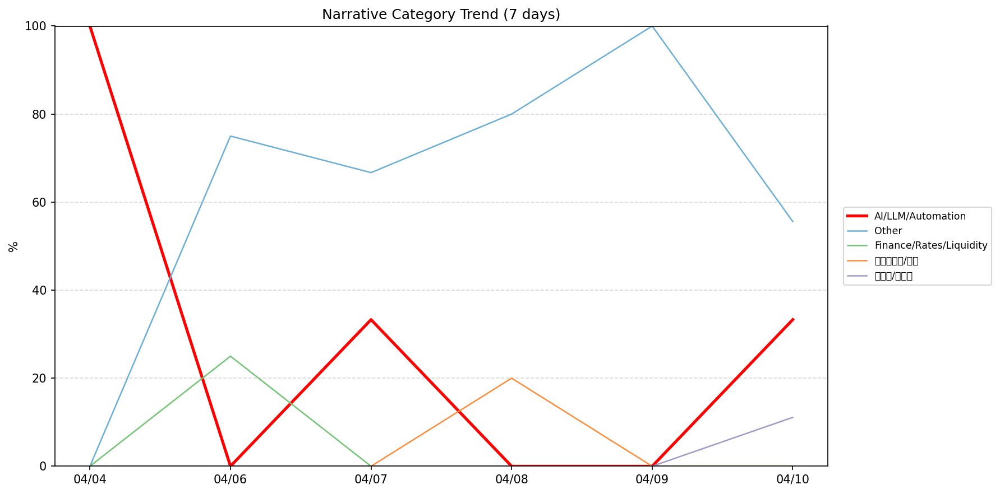
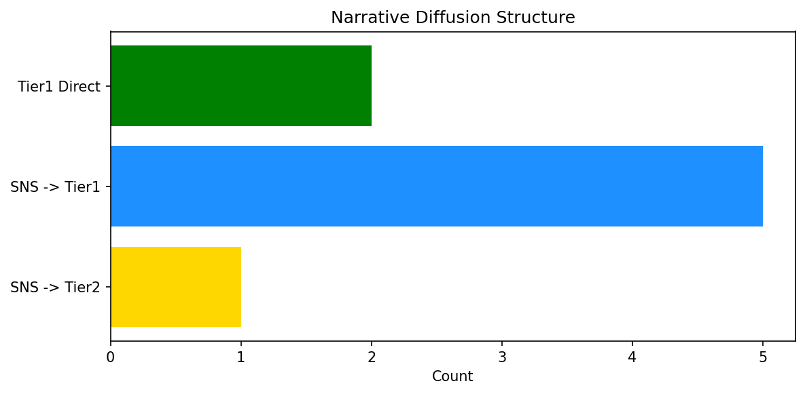

# 週次メタ分析レポート - 2026-04-11

> 分析期間: 過去7日間

---

## ショックタイプ分布

| ショックタイプ | 件数 |
|----------------|------|
| ナラティブシフト | 19 |
| 業績シグナル | 8 |
| テクノロジーショック | 3 |

---

## ナラティブ推移

### 2026-04-04
- AI/LLM/自動化: 100%

### 2026-04-06
- その他: 75%
- 金融/金利/流動性: 25%

### 2026-04-07
- その他: 67%
- AI/LLM/自動化: 33%

### 2026-04-08
- その他: 80%
- ガバナンス/経営: 20%

### 2026-04-09
- その他: 100%

### 2026-04-10
- その他: 56%
- AI/LLM/自動化: 33%
- 半導体/供給網: 11%

---

## ナラティブ伝播構造

| 伝播パターン | 件数 |
|--------------|------|
| Tier1直接 | 2 |
| SNS→Tier2 | 1 |
| SNS→Tier1 | 5 |
| カバレッジなし | 22 |

---

## 過熱警告事後検証

> ※ "過熱警告を出したか"と"AI偏重が実際に続いたか"の検証

| 指標 | 値 |
|------|-----|
| 検証対象数 | 7 |
| 正警告（TP） | 0 |
| 過剰警告（FP） | 0 |
| 正常判定（TN） | 7 |
| 見逃し（FN） | 0 |

- **2026-04-04**: 正常判定 — No overheat and conditions normal: ai_continued=False, price_sustained=True.
- **2026-04-05**: 正常判定 — No overheat and conditions normal: ai_continued=False, price_sustained=False.
- **2026-04-06**: 正常判定 — No overheat and conditions normal: ai_continued=False, price_sustained=True.
- **2026-04-07**: 正常判定 — No overheat and conditions normal: ai_continued=False, price_sustained=True.
- **2026-04-08**: 正常判定 — No overheat and conditions normal: ai_continued=False, price_sustained=True.
- **2026-04-09**: 正常判定 — No overheat and conditions normal: ai_continued=False, price_sustained=True.
- **2026-04-10**: 正常判定 — No overheat and conditions normal: ai_continued=False, price_sustained=False.

---

## 非AIハイライト（週次）

### 1. MSFT
- **サマリー**: 11件の言及（通常の3.7倍）
- **スコア**: 0.56
- **ナラティブ分類**: ガバナンス/経営
- **ショックタイプ**: テクノロジーショック
- **AI関連度**: 1%

### 2. NVDA
- **サマリー**: 5件の言及（通常の3.3倍）
- **スコア**: 0.50
- **ナラティブ分類**: 半導体/供給網
- **ショックタイプ**: ナラティブシフト
- **AI関連度**: 22%

### 3. SNOW
- **サマリー**: 出来高が平均の3.11倍
- **スコア**: 0.49
- **ナラティブ分類**: その他
- **ショックタイプ**: ナラティブシフト
- **AI関連度**: 0%

### 4. MDB
- **サマリー**: 出来高が平均の1.84倍
- **スコア**: 0.42
- **ナラティブ分類**: その他
- **ショックタイプ**: ナラティブシフト
- **AI関連度**: 0%

### 5. SNOW
- **サマリー**: 出来高が平均の4.36倍
- **スコア**: 0.42
- **ナラティブ分類**: その他
- **ショックタイプ**: ナラティブシフト
- **AI関連度**: 0%

---

## 構造持続確率 Top3

| 順位 | 銘柄 | SPP | ショックタイプ | 伝播パターン | サマリー |
|------|------|-----|----------------|--------------|----------|
| 1 | PLTR | 0.80 | ナラティブシフト | Tier1直接 | 出来高が平均の2.73倍 |
| 2 | MSFT | 0.63 | テクノロジーショック | SNS→Tier1 | 7件の言及（通常の2.5倍） |
| 3 | JPM | 0.61 | 業績シグナル | なし | 前日比+3.55%の価格変動 |

---

## イベント持続性

| 銘柄 | 出現日数/観測日数 | SPP推移 | 最新SPP |
|------|------------------|---------|---------|
| PLTR | 4/6日 | 上昇 | 0.80 |
| MSFT | 4/6日 | 上昇 | 0.63 |
| MDB | 4/6日 | 上昇 | 0.50 |
| JPM | 2/6日 | 横ばい | 0.61 |
| SNOW | 2/6日 | 横ばい | 0.38 |
| CRWD | 2/6日 | 下降 | 0.38 |
| NET | 2/6日 | 横ばい | 0.37 |
| NVDA | 2/6日 | 横ばい | 0.34 |
| GOOGL | 1/6日 | 横ばい | 0.61 |
| UNH | 1/6日 | 横ばい | 0.56 |
| XOM | 1/6日 | 横ばい | 0.54 |

---

## 転換点候補

転換点候補は検出されませんでした。

---

## 組織インパクト仮説

### 1. 今週の構造変化は「ナラティブシフト」に集中（63%）。この領域の専門知識・人材の重要性が高まっている可能性。
- **根拠**: ショックタイプ分布: ナラティブシフトが19件

### 2. PLTR（その他）: 出来高急増・言及急増 + ナラティブシフト + 4日間持続 + 引き締め環境 → 構造的な市場関心の変化の可能性、SPP上昇中
- **根拠**: 出現: 4/6日, SPP推移: 上昇
- **根拠要素**:
- 出来高急増
- 言及急増
- ナラティブシフト型
- 4日間持続観測
- SPP上昇（0.37→0.80）
- 引き締めレジーム下
- 関連: Trump praises Palantir as stock has worst week in over a year and Iran conflict drags on
- 関連: Michael Burry says he's still betting against Palantir after Trump post boosts stock
- **データ期間**: 2026-04-04〜2026-04-10 (6日間)
- **信頼度注記**: 観測データに基づく示唆であり、因果関係を示すものではありません

### 3. MSFT（その他）: 出来高急増・言及急増 + ナラティブシフト + 4日間持続 + 引き締め環境 → 構造的な市場関心の変化の可能性、SPP上昇中
- **根拠**: 出現: 4/6日, SPP推移: 上昇
- **根拠要素**:
- 出来高急増
- 言及急増
- ナラティブシフト型
- テクノロジーショック型
- 4日間持続観測
- SPP上昇（0.45→0.63）
- 引き締めレジーム下
- 関連: Microsoft's "commitment to Windows quality" starts with overhaul of beta program
- 関連: Microsoft finally lets Windows 11 testers unlock experimental features without ViVeTool
- **データ期間**: 2026-04-04〜2026-04-10 (6日間)
- **信頼度注記**: 観測データに基づく示唆であり、因果関係を示すものではありません

### 4. MDB（その他）: 出来高急増・価格変動 + ナラティブシフト + 4日間持続 + 引き締め環境 → 構造的な市場関心の変化の可能性、SPP上昇中
- **根拠**: 出現: 4/6日, SPP推移: 上昇
- **根拠要素**:
- 出来高急増
- 価格変動
- ナラティブシフト型
- 業績シグナル型
- 4日間持続観測
- SPP上昇（0.33→0.50）
- 引き締めレジーム下
- **データ期間**: 2026-04-04〜2026-04-10 (6日間)
- **信頼度注記**: 観測データに基づく示唆であり、因果関係を示すものではありません

---

## 市場レジーム推移

| 日付 | レジーム | ボラティリティ | 下落比率 | 信頼度 |
|------|----------|---------------|----------|--------|
| 2026-04-10 | 引き締め | 42.6% | 60% | 76% |
| 2026-04-09 | 引き締め | 41.4% | 67% | 87% |
| 2026-04-08 | 引き締め | 38.4% | 60% | 76% |
| 2026-04-07 | 引き締め | 38.0% | 67% | 87% |
| 2026-04-06 | 引き締め | 37.4% | 73% | 97% |
| 2026-04-05 | 引き締め | 37.6% | 73% | 97% |
| 2026-04-04 | 引き締め | 37.3% | 73% | 96% |

---

## 前週比較

> 比較期間: 2026-03-28〜2026-04-04 (8日分)

**イベント件数**: 今週 30 件 / 前週 30 件（差分 +0）

**支配的レジーム**: 引き締め（変化なし）

### ショックタイプ増減

| ショックタイプ | 今週 | 前週 | 差分 |
|----------------|------|------|------|
| テクノロジーショック | 3 | 2 | +1 |
| ナラティブシフト | 19 | 16 | +3 |
| 業績シグナル | 8 | 12 | -4 |

### ナラティブ比率変化

| カテゴリ | 今週平均 | 前週平均 | 差分(pt) |
|----------|----------|----------|----------|
| AI/LLM/自動化 | 28% | 30% | -2 |
| その他 | 63% | 63% | -0 |
| ガバナンス/経営 | 3% | 0% | +3 |
| 半導体/供給網 | 2% | 0% | +2 |
| 金融/金利/流動性 | 4% | 7% | -3 |

---

## レジーム・ナラティブ同時変動

> ※ 同時期の観測であり、因果関係を示すものではありません

- **2026-04-06**: レジーム異常（引き締め）と「その他」ナラティブ集中（75%）が共起
- **2026-04-07**: レジーム異常（引き締め）と「その他」ナラティブ集中（67%）が共起
- **2026-04-08**: レジーム異常（引き締め）と「その他」ナラティブ集中（80%）が共起
- **2026-04-09**: レジーム異常（引き締め）と「その他」ナラティブ集中（100%）が共起

---

## 来週の監視比重提案

### 1. 「規制/政策/地政学」の監視比重を維持・注視
- **根拠**: 週平均ナラティブ比率0%と低く、イベント未検出だが、構造的に重要なカテゴリのため意図的な監視継続を推奨。
- **週平均ナラティブ比率**: 0%

### 2. 「エネルギー/資源」の監視比重を維持・注視
- **根拠**: 週平均ナラティブ比率0%と低く、イベント未検出だが、構造的に重要なカテゴリのため意図的な監視継続を推奨。
- **週平均ナラティブ比率**: 0%

### 3. 「半導体/供給網」の監視比重を引き上げ
- **根拠**: 週平均ナラティブ比率2%と低いが、過去7日で1件のイベントが検出されており、見落としリスクがあります。
- **週平均ナラティブ比率**: 2%

### 4. 「ガバナンス/経営」の監視比重を引き上げ
- **根拠**: 週平均ナラティブ比率3%と低いが、過去7日で1件のイベントが検出されており、見落としリスクがあります。
- **週平均ナラティブ比率**: 3%

### 5. 「金融/金利/流動性」の監視比重を引き上げ
- **根拠**: 週平均ナラティブ比率4%と低いが、過去7日で1件のイベントが検出されており、見落としリスクがあります。
- **週平均ナラティブ比率**: 4%

### 6. 「その他」の過集中に注意
- **根拠**: 週平均ナラティブ比率63%と高く、他カテゴリの構造変化を見落とすリスクがあります。
- **週平均ナラティブ比率**: 63%

### 7. 「AI/LLM/自動化」の過集中に注意
- **根拠**: 週平均ナラティブ比率28%と高く、他カテゴリの構造変化を見落とすリスクがあります。
- **週平均ナラティブ比率**: 28%

---

*レポート生成日時: 2026-04-11 02:10:10*
