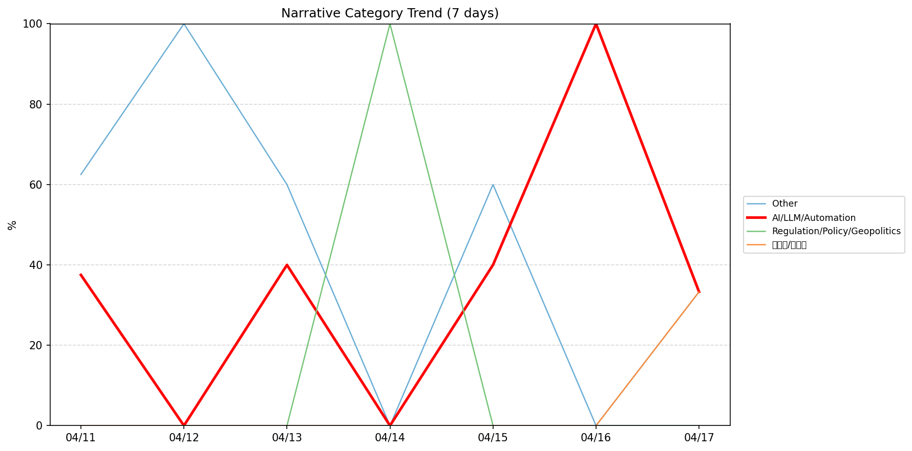
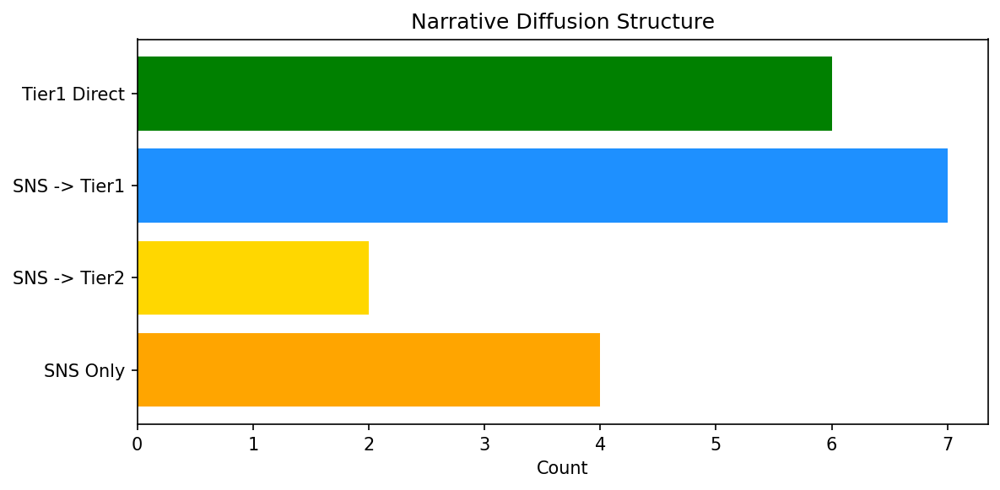

# 週次メタ分析レポート - 2026-04-18

> 分析期間: 過去7日間

---

## ショックタイプ分布

| ショックタイプ | 件数 |
|----------------|------|
| ナラティブシフト | 17 |
| 業績シグナル | 9 |
| テクノロジーショック | 4 |
| 規制ショック | 2 |

---

## ナラティブ推移

### 2026-04-11
- その他: 62%
- AI/LLM/自動化: 38%

### 2026-04-12
- その他: 100%

### 2026-04-13
- その他: 60%
- AI/LLM/自動化: 40%

### 2026-04-14
- 規制/政策/地政学: 100%

### 2026-04-15
- その他: 60%
- AI/LLM/自動化: 40%

### 2026-04-16
- AI/LLM/自動化: 100%

### 2026-04-17
- その他: 33%
- 半導体/供給網: 33%
- AI/LLM/自動化: 33%

---

## ナラティブ伝播構造

| 伝播パターン | 件数 |
|--------------|------|
| SNS→Tier1 | 7 |
| Tier1直接 | 6 |
| カバレッジなし | 13 |
| SNSのみ | 4 |
| SNS→Tier2 | 2 |

---

## 過熱警告事後検証

> ※ "過熱警告を出したか"と"AI偏重が実際に続いたか"の検証

| 指標 | 値 |
|------|-----|
| 検証対象数 | 7 |
| 正警告（TP） | 0 |
| 過剰警告（FP） | 0 |
| 正常判定（TN） | 5 |
| 見逃し（FN） | 2 |
| Recall | 0.0% |

- **2026-04-11**: 正常判定 — No overheat and conditions normal: ai_continued=False, price_sustained=True.
- **2026-04-12**: 正常判定 — No overheat and conditions normal: ai_continued=False, price_sustained=True.
- **2026-04-13**: 正常判定 — No overheat and conditions normal: ai_continued=True, price_sustained=True.
- **2026-04-14**: 見逃し — Missed overheat: AI events continued without price backing. An alert should have been raised.
- **2026-04-15**: 見逃し — Missed overheat: AI events continued without price backing. An alert should have been raised.
- **2026-04-16**: 正常判定 — No overheat and conditions normal: ai_continued=False, price_sustained=False.
- **2026-04-17**: 正常判定 — No overheat and conditions normal: ai_continued=False, price_sustained=False.

---

## 非AIハイライト（週次）

### 1. GOOGL
- **サマリー**: 18件の言及（通常の3.0倍）
- **スコア**: 0.58
- **ナラティブ分類**: 規制/政策/地政学
- **ショックタイプ**: 規制ショック
- **AI関連度**: 8%

### 2. MSFT
- **サマリー**: 9件の言及（通常の2.6倍）
- **スコア**: 0.57
- **ナラティブ分類**: その他
- **ショックタイプ**: ナラティブシフト
- **AI関連度**: 1%

### 3. MSFT
- **サマリー**: 前日比+4.61%の価格変動
- **スコア**: 0.51
- **ナラティブ分類**: その他
- **ショックタイプ**: 業績シグナル
- **AI関連度**: 1%

### 4. NET
- **サマリー**: 出来高が平均の3.66倍
- **スコア**: 0.48
- **ナラティブ分類**: その他
- **ショックタイプ**: ナラティブシフト
- **AI関連度**: 5%

### 5. SNOW
- **サマリー**: 出来高が平均の4.21倍
- **スコア**: 0.42
- **ナラティブ分類**: その他
- **ショックタイプ**: ナラティブシフト
- **AI関連度**: 0%

---

## 構造持続確率 Top3

| 順位 | 銘柄 | SPP | ショックタイプ | 伝播パターン | サマリー |
|------|------|-----|----------------|--------------|----------|
| 1 | SNOW | 0.67 | 業績シグナル | なし | 前日比+10.84%の価格変動 |
| 2 | NVDA | 0.63 | ナラティブシフト | Tier1直接 | 4件の言及（通常の2.8倍） |
| 3 | MSFT | 0.63 | ナラティブシフト | Tier1直接 | 10件の言及（通常の2.8倍） |

---

## イベント持続性

| 銘柄 | 出現日数/観測日数 | SPP推移 | 最新SPP |
|------|------------------|---------|---------|
| MSFT | 4/7日 | 横ばい | 0.63 |
| GOOGL | 4/7日 | 上昇 | 0.57 |
| NET | 4/7日 | 横ばい | 0.35 |
| SNOW | 3/7日 | 上昇 | 0.67 |
| NVDA | 3/7日 | 上昇 | 0.63 |
| MDB | 2/7日 | 横ばい | 0.58 |
| PLTR | 2/7日 | 下降 | 0.54 |
| CRWD | 2/7日 | 横ばい | 0.46 |
| DDOG | 1/7日 | 横ばい | 0.46 |
| PATH | 1/7日 | 横ばい | 0.46 |
| LMT | 1/7日 | 横ばい | 0.33 |

---

## 転換点候補

- 「その他」が2026-04-13→2026-04-14で60ポイント下降（60% → 0%）

---

## 組織インパクト仮説

### 1. 今週の構造変化は「ナラティブシフト」に集中（53%）。この領域の専門知識・人材の重要性が高まっている可能性。
- **根拠**: ショックタイプ分布: ナラティブシフトが17件

### 2. 「その他」ナラティブの下降は、市場の関心が他分野に移行中であることを示唆。この分野の見落としリスクに注意が必要です。
- **根拠**: 「その他」が2026-04-13→2026-04-14で60ポイント下降（60% → 0%）

### 3. MSFT（AI/LLM/自動化）: 価格変動・言及急増 + テクノロジーショック + 4日間持続 + 引き締め環境 → 構造的な市場関心の変化の可能性
- **根拠**: 出現: 4/7日, SPP推移: 横ばい
- **根拠要素**:
- 価格変動
- 言及急増
- テクノロジーショック型
- 業績シグナル型
- ナラティブシフト型
- 4日間持続観測
- SPP横ばい（0.63）
- 引き締めレジーム下
- 関連: AMD, Oracle, Microsoft and the IGV lead a monster week for tech stocks
- 関連: Microsoft and Stellantis want to use AI to help car owners
- **データ期間**: 2026-04-11〜2026-04-17 (7日間)
- **信頼度注記**: 観測データに基づく示唆であり、因果関係を示すものではありません

### 4. GOOGL（AI/LLM/自動化）: 言及急増 + テクノロジーショック + 4日間持続 + 引き締め環境 → 構造的な市場関心の変化の可能性、SPP上昇中
- **根拠**: 出現: 4/7日, SPP推移: 上昇
- **根拠要素**:
- 言及急増
- テクノロジーショック型
- 規制ショック型
- 4日間持続観測
- SPP上昇（0.39→0.57）
- 引き締めレジーム下
- 関連: Google’s AI Mode can now help you find products in stock nearby
- 関連: Gucci-branded Google smart glasses are coming next year
- **データ期間**: 2026-04-11〜2026-04-17 (7日間)
- **信頼度注記**: 観測データに基づく示唆であり、因果関係を示すものではありません

### 5. NET（AI/LLM/自動化）: 価格変動・出来高急増 + テクノロジーショック + 4日間持続 + 引き締め環境 → 構造的な市場関心の変化の可能性
- **根拠**: 出現: 4/7日, SPP推移: 横ばい
- **根拠要素**:
- 価格変動
- 出来高急増
- 言及急増
- テクノロジーショック型
- 業績シグナル型
- ナラティブシフト型
- 4日間持続観測
- SPP横ばい（0.35）
- 引き締めレジーム下
- **データ期間**: 2026-04-11〜2026-04-17 (7日間)
- **信頼度注記**: 観測データに基づく示唆であり、因果関係を示すものではありません

---

## 市場レジーム推移

| 日付 | レジーム | ボラティリティ | 下落比率 | 信頼度 |
|------|----------|---------------|----------|--------|
| 2026-04-17 | 引き締め | 47.5% | 60% | 76% |
| 2026-04-16 | 引き締め | 47.5% | 67% | 87% |
| 2026-04-15 | 引き締め | 47.4% | 67% | 87% |
| 2026-04-14 | 引き締め | 46.3% | 73% | 97% |
| 2026-04-13 | 引き締め | 46.9% | 73% | 97% |
| 2026-04-12 | 引き締め | 43.7% | 67% | 87% |
| 2026-04-11 | 引き締め | 42.9% | 67% | 87% |

---

## 前週比較

> 比較期間: 2026-04-04〜2026-04-11 (7日分)

**イベント件数**: 今週 32 件 / 前週 38 件（差分 -6）

**支配的レジーム**: 引き締め（変化なし）

### ショックタイプ増減

| ショックタイプ | 今週 | 前週 | 差分 |
|----------------|------|------|------|
| テクノロジーショック | 4 | 4 | +0 |
| ナラティブシフト | 17 | 25 | -8 |
| 業績シグナル | 9 | 9 | +0 |
| 規制ショック | 2 | 0 | +2 |

### ナラティブ比率変化

| カテゴリ | 今週平均 | 前週平均 | 差分(pt) |
|----------|----------|----------|----------|
| AI/LLM/自動化 | 36% | 29% | +7 |
| その他 | 45% | 63% | -18 |
| ガバナンス/経営 | 0% | 3% | -3 |
| 半導体/供給網 | 5% | 2% | +3 |
| 規制/政策/地政学 | 14% | 0% | +14 |
| 金融/金利/流動性 | 0% | 4% | -4 |

---

## レジーム・ナラティブ同時変動

> ※ 同時期の観測であり、因果関係を示すものではありません

- **2026-04-12**: レジーム異常（引き締め）と「その他」ナラティブ集中（100%）が共起
- **2026-04-14**: レジーム異常（引き締め）と「規制/政策/地政学」ナラティブ集中（100%）が共起
- **2026-04-16**: レジーム異常（引き締め）と「AI/LLM/自動化」ナラティブ集中（100%）が共起

---

## 来週の監視比重提案

### 1. 「金融/金利/流動性」の監視比重を維持・注視
- **根拠**: 週平均ナラティブ比率0%と低く、イベント未検出だが、構造的に重要なカテゴリのため意図的な監視継続を推奨。
- **週平均ナラティブ比率**: 0%

### 2. 「エネルギー/資源」の監視比重を維持・注視
- **根拠**: 週平均ナラティブ比率0%と低く、イベント未検出だが、構造的に重要なカテゴリのため意図的な監視継続を推奨。
- **週平均ナラティブ比率**: 0%

### 3. 「半導体/供給網」の監視比重を引き上げ
- **根拠**: 週平均ナラティブ比率5%と低いが、過去7日で1件のイベントが検出されており、見落としリスクがあります。
- **週平均ナラティブ比率**: 5%
- **⚡ 急変フラグ**: 直近33%へ急変 — 動向注視を推奨

### 4. 「その他」の過集中に注意
- **根拠**: 週平均ナラティブ比率45%と高く、他カテゴリの構造変化を見落とすリスクがあります。
- **週平均ナラティブ比率**: 45%

### 5. 「AI/LLM/自動化」の過集中に注意
- **根拠**: 週平均ナラティブ比率36%と高く、他カテゴリの構造変化を見落とすリスクがあります。
- **週平均ナラティブ比率**: 36%

---

*レポート生成日時: 2026-04-18 02:23:17*
