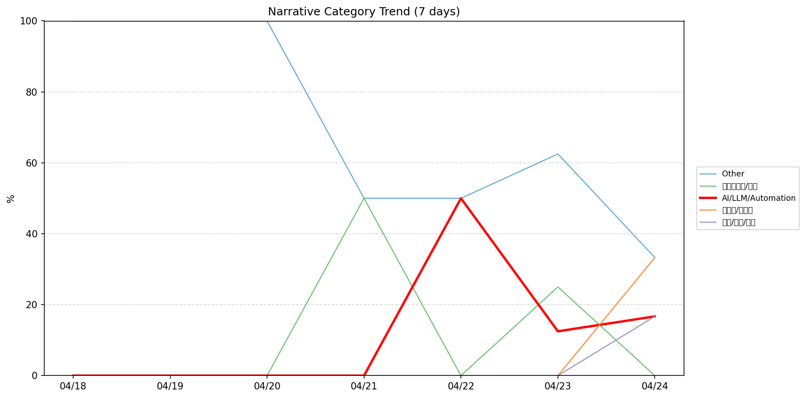
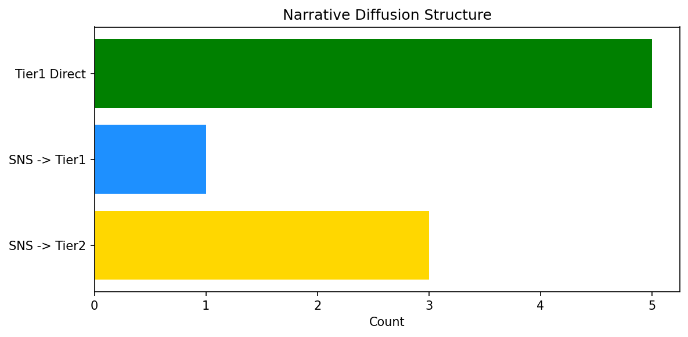

# 週次メタ分析レポート - 2026-04-25

> 分析期間: 過去7日間

---

## ショックタイプ分布

| ショックタイプ | 件数 |
|----------------|------|
| ナラティブシフト | 17 |
| 業績シグナル | 3 |
| テクノロジーショック | 1 |

---

## ナラティブ推移

### 2026-04-18
- その他: 100%

### 2026-04-19
- その他: 100%

### 2026-04-20
- その他: 100%

### 2026-04-21
- その他: 50%
- ガバナンス/経営: 50%

### 2026-04-22
- その他: 50%
- AI/LLM/自動化: 50%

### 2026-04-23
- その他: 62%
- ガバナンス/経営: 25%
- AI/LLM/自動化: 12%

### 2026-04-24
- その他: 33%
- 半導体/供給網: 33%
- AI/LLM/自動化: 17%
- 社会/労働/教育: 17%

---

## ナラティブ伝播構造

| 伝播パターン | 件数 |
|--------------|------|
| Tier1直接 | 5 |
| SNS→Tier1 | 1 |
| SNS→Tier2 | 3 |
| カバレッジなし | 12 |

---

## 過熱警告事後検証

> ※ "過熱警告を出したか"と"AI偏重が実際に続いたか"の検証

| 指標 | 値 |
|------|-----|
| 検証対象数 | 7 |
| 正警告（TP） | 0 |
| 過剰警告（FP） | 0 |
| 正常判定（TN） | 7 |
| 見逃し（FN） | 0 |

- **2026-04-18**: 正常判定 — No overheat and conditions normal: ai_continued=False, price_sustained=True.
- **2026-04-19**: 正常判定 — No overheat and conditions normal: ai_continued=False, price_sustained=True.
- **2026-04-20**: 正常判定 — No overheat and conditions normal: ai_continued=False, price_sustained=True.
- **2026-04-21**: 正常判定 — No overheat and conditions normal: ai_continued=False, price_sustained=False.
- **2026-04-22**: 正常判定 — No overheat and conditions normal: ai_continued=False, price_sustained=True.
- **2026-04-23**: 正常判定 — No overheat and conditions normal: ai_continued=False, price_sustained=True.
- **2026-04-24**: 正常判定 — No overheat and conditions normal: ai_continued=False, price_sustained=False.

---

## 非AIハイライト（週次）

### 1. MSFT
- **サマリー**: 17件の言及（通常の4.7倍）
- **スコア**: 0.63
- **ナラティブ分類**: 社会/労働/教育
- **ショックタイプ**: ナラティブシフト
- **AI関連度**: 5%

### 2. MSFT
- **サマリー**: 14件の言及（通常の3.9倍）
- **スコア**: 0.63
- **ナラティブ分類**: ガバナンス/経営
- **ショックタイプ**: ナラティブシフト
- **AI関連度**: 2%

### 3. MSFT
- **サマリー**: 前日比-3.97%の価格変動
- **スコア**: 0.46
- **ナラティブ分類**: ガバナンス/経営
- **ショックタイプ**: 業績シグナル
- **AI関連度**: 2%

### 4. NVDA
- **サマリー**: 出来高が平均の1.51倍
- **スコア**: 0.45
- **ナラティブ分類**: 半導体/供給網
- **ショックタイプ**: ナラティブシフト
- **AI関連度**: 9%

### 5. NVDA
- **サマリー**: 4件の言及（通常の2.8倍）
- **スコア**: 0.43
- **ナラティブ分類**: 半導体/供給網
- **ショックタイプ**: ナラティブシフト
- **AI関連度**: 9%

---

## 構造持続確率 Top3

| 順位 | 銘柄 | SPP | ショックタイプ | 伝播パターン | サマリー |
|------|------|-----|----------------|--------------|----------|
| 1 | NVDA | 0.69 | ナラティブシフト | Tier1直接 | 出来高が平均の1.51倍 |
| 2 | LMT | 0.57 | ナラティブシフト | なし | 出来高が平均の2.25倍 |
| 3 | GOOGL | 0.57 | テクノロジーショック | SNS→Tier1 | 12件の言及（通常の1.8倍） |

---

## イベント持続性

| 銘柄 | 出現日数/観測日数 | SPP推移 | 最新SPP |
|------|------------------|---------|---------|
| LMT | 6/7日 | 上昇 | 0.57 |
| GOOGL | 3/7日 | 上昇 | 0.57 |
| MSFT | 2/7日 | 下降 | 0.51 |
| PLTR | 2/7日 | 上昇 | 0.34 |
| NVDA | 1/7日 | 横ばい | 0.69 |
| NEE | 1/7日 | 横ばい | 0.42 |
| UNH | 1/7日 | 横ばい | 0.42 |
| PATH | 1/7日 | 横ばい | 0.42 |

---

## 転換点候補

転換点候補は検出されませんでした。

---

## 組織インパクト仮説

### 1. 今週の構造変化は「ナラティブシフト」に集中（81%）。この領域の専門知識・人材の重要性が高まっている可能性。
- **根拠**: ショックタイプ分布: ナラティブシフトが17件

### 2. LMT（その他）: 出来高急増・価格変動 + 業績シグナル + 6日間持続 + 高ボラ環境 → 構造的な市場関心の変化の可能性、SPP上昇中
- **根拠**: 出現: 6/7日, SPP推移: 上昇
- **根拠要素**:
- 出来高急増
- 価格変動
- 業績シグナル型
- ナラティブシフト型
- 6日間持続観測
- SPP上昇（0.41→0.57）
- 高ボラレジーム下
- **データ期間**: 2026-04-18〜2026-04-24 (7日間)
- **信頼度注記**: 観測データに基づく示唆であり、因果関係を示すものではありません

### 3. GOOGL（AI/LLM/自動化）: 言及急増 + ナラティブシフト + 3日間持続 + 高ボラ環境 → 構造的な市場関心の変化の可能性、SPP上昇中
- **根拠**: 出現: 3/7日, SPP推移: 上昇
- **根拠要素**:
- 言及急増
- ナラティブシフト型
- テクノロジーショック型
- 3日間持続観測
- SPP上昇（0.46→0.57）
- 高ボラレジーム下
- 関連: Google to invest up to $40 billion in Anthropic as search giant spreads its AI bets
- 関連: Google to invest up to $40B in Anthropic in cash and compute
- **データ期間**: 2026-04-18〜2026-04-24 (7日間)
- **信頼度注記**: 観測データに基づく示唆であり、因果関係を示すものではありません

### 4. レジームが引き締め→高ボラに変化 — リスク管理基準の見直しを検討する契機
- **根拠**: 前週: 引き締め, 今週: 高ボラ
- **根拠要素**:
- 前週レジーム: 引き締め
- 今週レジーム: 高ボラ
- **データ期間**: 2026-04-18〜2026-04-24 (7日間)
- **信頼度注記**: 観測データに基づく示唆であり、因果関係を示すものではありません

---

## 市場レジーム推移

| 日付 | レジーム | ボラティリティ | 下落比率 | 信頼度 |
|------|----------|---------------|----------|--------|
| 2026-04-24 | 高ボラ | 47.5% | 40% | 82% |
| 2026-04-23 | 高ボラ | 47.4% | 40% | 82% |
| 2026-04-22 | 引き締め | 46.9% | 53% | 65% |
| 2026-04-21 | 高ボラ | 47.4% | 47% | 74% |
| 2026-04-20 | 高ボラ | 47.9% | 47% | 74% |
| 2026-04-19 | 高ボラ | 48.4% | 40% | 82% |
| 2026-04-18 | 引き締め | 48.4% | 67% | 87% |

---

## 前週比較

> 比較期間: 2026-04-11〜2026-04-18 (8日分)

**イベント件数**: 今週 21 件 / 前週 33 件（差分 -12）

**支配的レジーム**: 引き締め → 高ボラ（変化あり）

### ショックタイプ増減

| ショックタイプ | 今週 | 前週 | 差分 |
|----------------|------|------|------|
| テクノロジーショック | 1 | 4 | -3 |
| ナラティブシフト | 17 | 18 | -1 |
| 業績シグナル | 3 | 9 | -6 |
| 規制ショック | 0 | 2 | -2 |

### ナラティブ比率変化

| カテゴリ | 今週平均 | 前週平均 | 差分(pt) |
|----------|----------|----------|----------|
| AI/LLM/自動化 | 11% | 31% | -20 |
| その他 | 71% | 52% | +19 |
| ガバナンス/経営 | 11% | 0% | +11 |
| 半導体/供給網 | 5% | 4% | +1 |
| 社会/労働/教育 | 2% | 0% | +2 |
| 規制/政策/地政学 | 0% | 12% | -12 |

---

## レジーム・ナラティブ同時変動

> ※ 同時期の観測であり、因果関係を示すものではありません

- **2026-04-19**: レジーム異常（高ボラ）と「その他」ナラティブ集中（100%）が共起
- **2026-04-20**: レジーム異常（高ボラ）と「その他」ナラティブ集中（100%）が共起
- **2026-04-22**: レジーム変化（高ボラ→引き締め）と「AI/LLM/自動化」の50pt増加が同時期に観測
- **2026-04-22**: レジーム変化（高ボラ→引き締め）と「ガバナンス/経営」の50pt減少が同時期に観測
- **2026-04-23**: レジーム変化（引き締め→高ボラ）と「AI/LLM/自動化」の38pt減少が同時期に観測
- **2026-04-23**: レジーム変化（引き締め→高ボラ）と「その他」の12pt増加が同時期に観測
- **2026-04-23**: レジーム変化（引き締め→高ボラ）と「ガバナンス/経営」の25pt増加が同時期に観測
- **2026-04-23**: レジーム異常（高ボラ）と「その他」ナラティブ集中（62%）が共起

---

## 来週の監視比重提案

### 1. 「規制/政策/地政学」の監視比重を維持・注視
- **根拠**: 週平均ナラティブ比率0%と低く、イベント未検出だが、構造的に重要なカテゴリのため意図的な監視継続を推奨。
- **週平均ナラティブ比率**: 0%

### 2. 「金融/金利/流動性」の監視比重を維持・注視
- **根拠**: 週平均ナラティブ比率0%と低く、イベント未検出だが、構造的に重要なカテゴリのため意図的な監視継続を推奨。
- **週平均ナラティブ比率**: 0%

### 3. 「エネルギー/資源」の監視比重を維持・注視
- **根拠**: 週平均ナラティブ比率0%と低く、イベント未検出だが、構造的に重要なカテゴリのため意図的な監視継続を推奨。
- **週平均ナラティブ比率**: 0%

### 4. 「社会/労働/教育」の監視比重を引き上げ
- **根拠**: 週平均ナラティブ比率2%と低いが、過去7日で1件のイベントが検出されており、見落としリスクがあります。
- **週平均ナラティブ比率**: 2%

### 5. 「半導体/供給網」の監視比重を引き上げ
- **根拠**: 週平均ナラティブ比率5%と低いが、過去7日で2件のイベントが検出されており、見落としリスクがあります。
- **週平均ナラティブ比率**: 5%
- **⚡ 急変フラグ**: 直近33%へ急変 — 動向注視を推奨

### 6. 「その他」の過集中に注意
- **根拠**: 週平均ナラティブ比率71%と高く、他カテゴリの構造変化を見落とすリスクがあります。
- **週平均ナラティブ比率**: 71%
- **⚡ 急変フラグ**: 直近33%へ急変 — 動向注視を推奨

---

*レポート生成日時: 2026-04-25 02:25:50*
