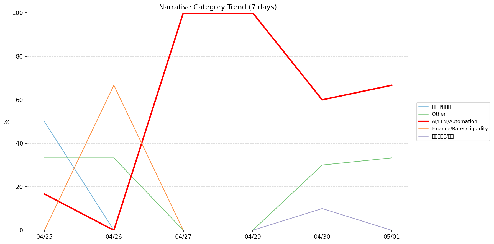
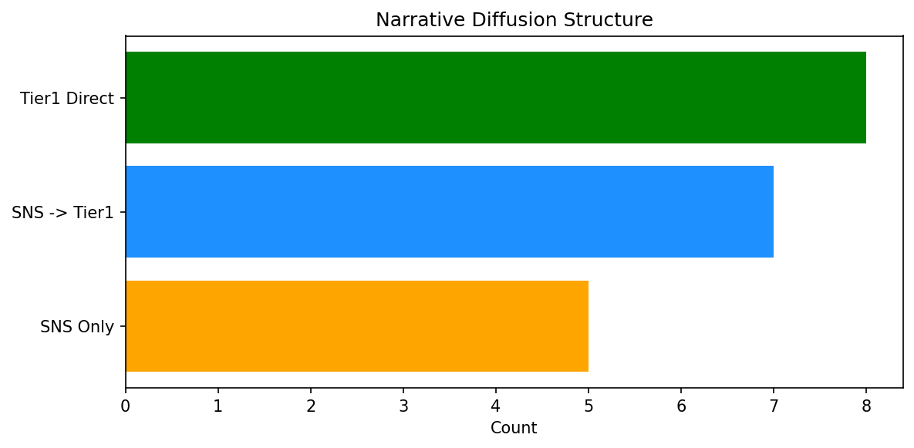

# 週次メタ分析レポート - 2026-05-02

> 分析期間: 過去7日間

---

## ショックタイプ分布

| ショックタイプ | 件数 |
|----------------|------|
| ナラティブシフト | 13 |
| 業績シグナル | 8 |
| 規制ショック | 2 |
| ビジネスモデルショック | 2 |
| テクノロジーショック | 1 |

---

## ナラティブ推移

### 2026-04-25
- 半導体/供給網: 50%
- その他: 33%
- AI/LLM/自動化: 17%

### 2026-04-26
- 金融/金利/流動性: 67%
- その他: 33%

### 2026-04-27
- AI/LLM/自動化: 100%

### 2026-04-29
- AI/LLM/自動化: 100%

### 2026-04-30
- AI/LLM/自動化: 60%
- その他: 30%
- ガバナンス/経営: 10%

### 2026-05-01
- AI/LLM/自動化: 67%
- その他: 33%

---

## ナラティブ伝播構造

| 伝播パターン | 件数 |
|--------------|------|
| SNS→Tier1 | 7 |
| Tier1直接 | 8 |
| SNSのみ | 5 |
| カバレッジなし | 6 |

---

## 過熱警告事後検証

> ※ "過熱警告を出したか"と"AI偏重が実際に続いたか"の検証

| 指標 | 値 |
|------|-----|
| 検証対象数 | 7 |
| 正警告（TP） | 0 |
| 過剰警告（FP） | 0 |
| 正常判定（TN） | 4 |
| 見逃し（FN） | 3 |
| Recall | 0.0% |

- **2026-04-25**: 正常判定 — No overheat and conditions normal: ai_continued=False, price_sustained=True.
- **2026-04-26**: 見逃し — Missed overheat: AI events continued without price backing. An alert should have been raised.
- **2026-04-27**: 正常判定 — No overheat and conditions normal: ai_continued=True, price_sustained=True.
- **2026-04-28**: 見逃し — Missed overheat: AI events continued without price backing. An alert should have been raised.
- **2026-04-29**: 正常判定 — No overheat and conditions normal: ai_continued=True, price_sustained=True.
- **2026-04-30**: 見逃し — Missed overheat: AI events continued without price backing. An alert should have been raised.
- **2026-05-01**: 正常判定 — No overheat and conditions normal: ai_continued=False, price_sustained=False.

---

## 非AIハイライト（週次）

### 1. NVDA
- **サマリー**: 出来高が平均の1.59倍
- **スコア**: 0.47
- **ナラティブ分類**: その他
- **ショックタイプ**: ナラティブシフト
- **AI関連度**: 0%

### 2. NVDA
- **サマリー**: 出来高が平均の1.53倍
- **スコア**: 0.46
- **ナラティブ分類**: 半導体/供給網
- **ショックタイプ**: ナラティブシフト
- **AI関連度**: 9%

### 3. NVDA
- **サマリー**: 前日比-4.63%の価格変動
- **スコア**: 0.45
- **ナラティブ分類**: その他
- **ショックタイプ**: 業績シグナル
- **AI関連度**: 0%

### 4. NVDA
- **サマリー**: 4件の言及（通常の2.9倍）
- **スコア**: 0.44
- **ナラティブ分類**: 半導体/供給網
- **ショックタイプ**: ナラティブシフト
- **AI関連度**: 9%

### 5. NVDA
- **サマリー**: 前日比+4.32%の価格変動
- **スコア**: 0.44
- **ナラティブ分類**: 半導体/供給網
- **ショックタイプ**: 業績シグナル
- **AI関連度**: 9%

---

## 構造持続確率 Top3

| 順位 | 銘柄 | SPP | ショックタイプ | 伝播パターン | サマリー |
|------|------|-----|----------------|--------------|----------|
| 1 | LMT | 0.57 | ナラティブシフト | なし | 出来高が平均の2.25倍 |
| 2 | MSFT | 0.56 | ナラティブシフト | Tier1直接 | 11件の言及（通常の2.3倍） |
| 3 | GOOGL | 0.53 | ナラティブシフト | SNS→Tier1 | 14件の言及（通常の1.9倍） |

---

## イベント持続性

| 銘柄 | 出現日数/観測日数 | SPP推移 | 最新SPP |
|------|------------------|---------|---------|
| MSFT | 4/6日 | 上昇 | 0.56 |
| GOOGL | 4/6日 | 下降 | 0.53 |
| NVDA | 3/6日 | 下降 | 0.52 |
| LMT | 2/6日 | 横ばい | 0.57 |
| SNOW | 2/6日 | 横ばい | 0.29 |
| DDOG | 1/6日 | 横ばい | 0.42 |
| PLTR | 1/6日 | 横ばい | 0.34 |
| NET | 1/6日 | 横ばい | 0.19 |

---

## 転換点候補

転換点候補は検出されませんでした。

---

## 組織インパクト仮説

### 1. 今週の構造変化は「ナラティブシフト」に集中（50%）。この領域の専門知識・人材の重要性が高まっている可能性。
- **根拠**: ショックタイプ分布: ナラティブシフトが13件

### 2. MSFT（AI/LLM/自動化）: 言及急増・価格変動 + ビジネスモデルショック + 4日間持続 + 高ボラ環境 → 構造的な市場関心の変化の可能性、SPP上昇中
- **根拠**: 出現: 4/6日, SPP推移: 上昇
- **根拠要素**:
- 言及急増
- 価格変動
- 出来高急増
- ビジネスモデルショック型
- 業績シグナル型
- ナラティブシフト型
- 4日間持続観測
- SPP上昇（0.51→0.56）
- 高ボラレジーム下
- 関連: Microsoft tests redesigned Windows 11 Run menu with dark mode and more
- 関連: Pentagon inks deals with Nvidia, Microsoft, and AWS to deploy AI on classified networks
- **データ期間**: 2026-04-25〜2026-05-01 (6日間)
- **信頼度注記**: 観測データに基づく示唆であり、因果関係を示すものではありません

### 3. GOOGL（AI/LLM/自動化）: 言及急増・価格変動 + ビジネスモデルショック + 4日間持続 + 高ボラ環境 → 構造的な市場関心の変化の可能性、SPP下降中
- **根拠**: 出現: 4/6日, SPP推移: 下降
- **根拠要素**:
- 言及急増
- 価格変動
- 出来高急増
- ビジネスモデルショック型
- テクノロジーショック型
- 業績シグナル型
- ナラティブシフト型
- 4日間持続観測
- SPP下降（0.59→0.53）
- 高ボラレジーム下
- 関連: Alphabet is winning the AI revolution. Here's how Mike Khouw is trading it
- 関連: Google cloud growth tops Microsoft and Amazon as all three beat estimates on AI demand
- **データ期間**: 2026-04-25〜2026-05-01 (6日間)
- **信頼度注記**: 観測データに基づく示唆であり、因果関係を示すものではありません

### 4. NVDA（金融/金利/流動性）: 価格変動・言及急増 + 業績シグナル + 3日間持続 + 高ボラ環境 → 構造的な市場関心の変化の可能性、SPP下降中
- **根拠**: 出現: 3/6日, SPP推移: 下降
- **根拠要素**:
- 価格変動
- 言及急増
- 出来高急増
- 業績シグナル型
- ナラティブシフト型
- 3日間持続観測
- SPP下降（0.69→0.52）
- 高ボラレジーム下
- 関連: Pentagon inks deals with Nvidia, Microsoft, and AWS to deploy AI on classified networks
- 関連: Lutnick gets grilling on Nvidia chip sales to China in letter from Sen. Chris Coons
- **データ期間**: 2026-04-25〜2026-05-01 (6日間)
- **信頼度注記**: 観測データに基づく示唆であり、因果関係を示すものではありません

---

## 市場レジーム推移

| 日付 | レジーム | ボラティリティ | 下落比率 | 信頼度 |
|------|----------|---------------|----------|--------|
| 2026-05-01 | 高ボラ | 45.9% | 33% | 90% |
| 2026-04-30 | 高ボラ | 45.5% | 40% | 82% |
| 2026-04-29 | 高ボラ | 44.8% | 27% | 98% |
| 2026-04-28 | 高ボラ | 45.4% | 27% | 98% |
| 2026-04-27 | 高ボラ | 46.2% | 27% | 98% |
| 2026-04-26 | 高ボラ | 46.3% | 27% | 98% |
| 2026-04-25 | 高ボラ | 47.6% | 40% | 82% |

---

## 前週比較

> 比較期間: 2026-04-18〜2026-04-25 (8日分)

**イベント件数**: 今週 26 件 / 前週 27 件（差分 -1）

**支配的レジーム**: 高ボラ（変化なし）

### ショックタイプ増減

| ショックタイプ | 今週 | 前週 | 差分 |
|----------------|------|------|------|
| テクノロジーショック | 1 | 2 | -1 |
| ナラティブシフト | 13 | 21 | -8 |
| ビジネスモデルショック | 2 | 0 | +2 |
| 業績シグナル | 8 | 4 | +4 |
| 規制ショック | 2 | 0 | +2 |

### ナラティブ比率変化

| カテゴリ | 今週平均 | 前週平均 | 差分(pt) |
|----------|----------|----------|----------|
| AI/LLM/自動化 | 57% | 12% | +45 |
| その他 | 22% | 66% | -44 |
| ガバナンス/経営 | 2% | 9% | -8 |
| 半導体/供給網 | 8% | 10% | -2 |
| 社会/労働/教育 | 0% | 2% | -2 |
| 金融/金利/流動性 | 11% | 0% | +11 |

---

## レジーム・ナラティブ同時変動

> ※ 同時期の観測であり、因果関係を示すものではありません

- **2026-04-26**: レジーム異常（高ボラ）と「金融/金利/流動性」ナラティブ集中（67%）が共起
- **2026-04-27**: レジーム異常（高ボラ）と「AI/LLM/自動化」ナラティブ集中（100%）が共起
- **2026-04-29**: レジーム異常（高ボラ）と「AI/LLM/自動化」ナラティブ集中（100%）が共起
- **2026-05-01**: レジーム異常（高ボラ）と「AI/LLM/自動化」ナラティブ集中（67%）が共起

---

## 来週の監視比重提案

### 1. 「規制/政策/地政学」の監視比重を維持・注視
- **根拠**: 週平均ナラティブ比率0%と低く、イベント未検出だが、構造的に重要なカテゴリのため意図的な監視継続を推奨。
- **週平均ナラティブ比率**: 0%

### 2. 「エネルギー/資源」の監視比重を維持・注視
- **根拠**: 週平均ナラティブ比率0%と低く、イベント未検出だが、構造的に重要なカテゴリのため意図的な監視継続を推奨。
- **週平均ナラティブ比率**: 0%

### 3. 「ガバナンス/経営」の監視比重を引き上げ
- **根拠**: 週平均ナラティブ比率2%と低いが、過去7日で1件のイベントが検出されており、見落としリスクがあります。
- **週平均ナラティブ比率**: 2%

### 4. 「AI/LLM/自動化」の過集中に注意
- **根拠**: 週平均ナラティブ比率57%と高く、他カテゴリの構造変化を見落とすリスクがあります。
- **週平均ナラティブ比率**: 57%

---

*レポート生成日時: 2026-05-02 02:38:52*
