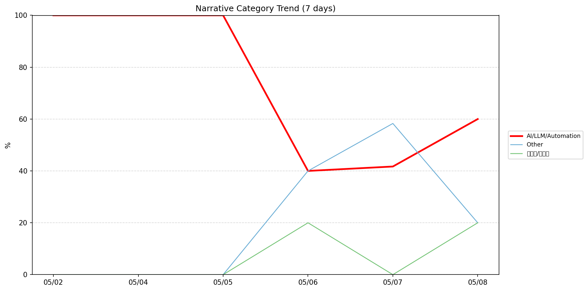
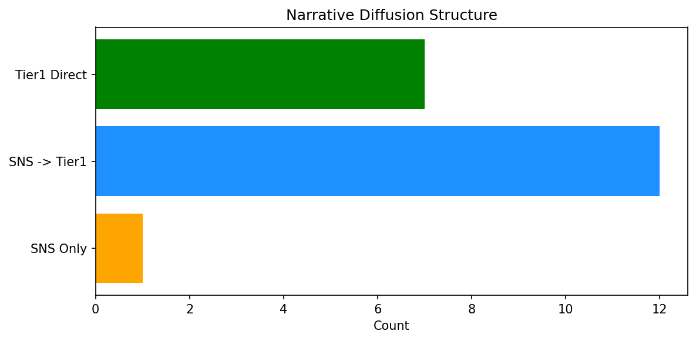

# 週次メタ分析レポート - 2026-05-09

> 分析期間: 過去7日間

---

## ショックタイプ分布

| ショックタイプ | 件数 |
|----------------|------|
| ナラティブシフト | 10 |
| 業績シグナル | 9 |
| テクノロジーショック | 6 |
| ビジネスモデルショック | 3 |

---

## ナラティブ推移

### 2026-05-02
- AI/LLM/自動化: 100%

### 2026-05-04
- AI/LLM/自動化: 100%

### 2026-05-05
- AI/LLM/自動化: 100%

### 2026-05-06
- その他: 40%
- AI/LLM/自動化: 40%
- 半導体/供給網: 20%

### 2026-05-07
- その他: 58%
- AI/LLM/自動化: 42%

### 2026-05-08
- AI/LLM/自動化: 60%
- その他: 20%
- 半導体/供給網: 20%

---

## ナラティブ伝播構造

| 伝播パターン | 件数 |
|--------------|------|
| SNS→Tier1 | 12 |
| Tier1直接 | 7 |
| カバレッジなし | 8 |
| SNSのみ | 1 |

---

## 過熱警告事後検証

> ※ "過熱警告を出したか"と"AI偏重が実際に続いたか"の検証

| 指標 | 値 |
|------|-----|
| 検証対象数 | 7 |
| 正警告（TP） | 0 |
| 過剰警告（FP） | 0 |
| 正常判定（TN） | 4 |
| 見逃し（FN） | 3 |
| Recall | 0.0% |

- **2026-05-02**: 見逃し — Missed overheat: AI events continued without price backing. An alert should have been raised.
- **2026-05-03**: 見逃し — Missed overheat: AI events continued without price backing. An alert should have been raised.
- **2026-05-04**: 正常判定 — No overheat and conditions normal: ai_continued=True, price_sustained=True.
- **2026-05-05**: 見逃し — Missed overheat: AI events continued without price backing. An alert should have been raised.
- **2026-05-06**: 正常判定 — No overheat and conditions normal: ai_continued=True, price_sustained=True.
- **2026-05-07**: 正常判定 — No overheat and conditions normal: ai_continued=True, price_sustained=True.
- **2026-05-08**: 正常判定 — No overheat and conditions normal: ai_continued=False, price_sustained=False.

---

## 非AIハイライト（週次）

### 1. NVDA
- **サマリー**: 5件の言及（通常の3.2倍）
- **スコア**: 0.56
- **ナラティブ分類**: 半導体/供給網
- **ショックタイプ**: ナラティブシフト
- **AI関連度**: 13%

### 2. MDB
- **サマリー**: 出来高が平均の2.44倍
- **スコア**: 0.46
- **ナラティブ分類**: その他
- **ショックタイプ**: ナラティブシフト
- **AI関連度**: 0%

### 3. CRWD
- **サマリー**: 出来高が平均の1.95倍
- **スコア**: 0.34
- **ナラティブ分類**: その他
- **ショックタイプ**: ナラティブシフト
- **AI関連度**: 0%

### 4. MDB
- **サマリー**: 前日比+10.62%の価格変動
- **スコア**: 0.32
- **ナラティブ分類**: その他
- **ショックタイプ**: 業績シグナル
- **AI関連度**: 0%

### 5. JPM
- **サマリー**: 出来高が平均の1.53倍
- **スコア**: 0.32
- **ナラティブ分類**: その他
- **ショックタイプ**: ナラティブシフト
- **AI関連度**: 0%

---

## 構造持続確率 Top3

| 順位 | 銘柄 | SPP | ショックタイプ | 伝播パターン | サマリー |
|------|------|-----|----------------|--------------|----------|
| 1 | DDOG | 0.72 | ナラティブシフト | Tier1直接 | 出来高が平均の5.25倍 |
| 2 | JPM | 0.62 | ナラティブシフト | Tier1直接 | 出来高が平均の1.53倍 |
| 3 | XOM | 0.57 | 業績シグナル | なし | 前日比-4.0%の価格変動 |

---

## イベント持続性

| 銘柄 | 出現日数/観測日数 | SPP推移 | 最新SPP |
|------|------------------|---------|---------|
| NVDA | 3/6日 | 横ばい | 0.56 |
| NET | 3/6日 | 上昇 | 0.50 |
| DDOG | 2/6日 | 上昇 | 0.72 |
| JPM | 2/6日 | 下降 | 0.62 |
| MSFT | 2/6日 | 横ばい | 0.57 |
| PLTR | 2/6日 | 上昇 | 0.56 |
| GOOGL | 2/6日 | 横ばい | 0.55 |
| XOM | 1/6日 | 横ばい | 0.57 |
| SNOW | 1/6日 | 横ばい | 0.48 |
| MDB | 1/6日 | 横ばい | 0.42 |
| CRWD | 1/6日 | 横ばい | 0.42 |

---

## 転換点候補

- 「その他」が2026-05-05→2026-05-06で40ポイント上昇（0% → 40%）

---

## 組織インパクト仮説

### 1. 「その他」ナラティブの急上昇は、この分野への注目シフトを示唆。関連するリスク管理体制の見直しが必要かもしれません。
- **根拠**: 「その他」が2026-05-05→2026-05-06で40ポイント上昇（0% → 40%）

### 2. NVDA（AI/LLM/自動化）: 言及急増 + テクノロジーショック + 3日間持続 + 高ボラ環境 → 構造的な市場関心の変化の可能性
- **根拠**: 出現: 3/6日, SPP推移: 横ばい
- **根拠要素**:
- 言及急増
- テクノロジーショック型
- ナラティブシフト型
- 3日間持続観測
- SPP横ばい（0.56）
- 高ボラレジーム下
- 関連: Wall Street sees 'changing of the guard in AI' as Intel, AMD shares soar while Nvidia lags
- 関連: IREN inks AI infrastructure deal with Nvidia
- **データ期間**: 2026-05-02〜2026-05-08 (6日間)
- **信頼度注記**: 観測データに基づく示唆であり、因果関係を示すものではありません

### 3. NET（AI/LLM/自動化）: 出来高急増・価格変動 + ビジネスモデルショック + 3日間持続 + 高ボラ環境 → 構造的な市場関心の変化の可能性、SPP上昇中
- **根拠**: 出現: 3/6日, SPP推移: 上昇
- **根拠要素**:
- 出来高急増
- 価格変動
- 言及急増
- ビジネスモデルショック型
- ナラティブシフト型
- 3日間持続観測
- SPP上昇（0.22→0.50）
- 高ボラレジーム下
- 関連: Cloudflare says AI made 1,100 jobs obsolete, even as revenue hit a record high
- 関連: Cloudflare to cut 20% of staff in a big bet on AI. Investors aren’t sold.
- **データ期間**: 2026-05-02〜2026-05-08 (6日間)
- **信頼度注記**: 観測データに基づく示唆であり、因果関係を示すものではありません

---

## 市場レジーム推移

| 日付 | レジーム | ボラティリティ | 下落比率 | 信頼度 |
|------|----------|---------------|----------|--------|
| 2026-05-08 | 高ボラ | 52.5% | 40% | 82% |
| 2026-05-07 | 高ボラ | 50.6% | 33% | 90% |
| 2026-05-06 | 高ボラ | 46.3% | 33% | 90% |
| 2026-05-05 | 高ボラ | 46.7% | 33% | 90% |
| 2026-05-04 | 高ボラ | 47.0% | 33% | 90% |
| 2026-05-03 | 高ボラ | 47.7% | 33% | 90% |
| 2026-05-02 | 高ボラ | 46.9% | 33% | 90% |

---

## 前週比較

> 比較期間: 2026-04-25〜2026-05-02 (7日分)

**イベント件数**: 今週 28 件 / 前週 27 件（差分 +1）

**支配的レジーム**: 高ボラ（変化なし）

### ショックタイプ増減

| ショックタイプ | 今週 | 前週 | 差分 |
|----------------|------|------|------|
| テクノロジーショック | 6 | 1 | +5 |
| ナラティブシフト | 10 | 14 | -4 |
| ビジネスモデルショック | 3 | 2 | +1 |
| 業績シグナル | 9 | 8 | +1 |
| 規制ショック | 0 | 2 | -2 |

### ナラティブ比率変化

| カテゴリ | 今週平均 | 前週平均 | 差分(pt) |
|----------|----------|----------|----------|
| AI/LLM/自動化 | 74% | 63% | +10 |
| その他 | 20% | 19% | +1 |
| ガバナンス/経営 | 0% | 1% | -1 |
| 半導体/供給網 | 7% | 7% | -0 |
| 金融/金利/流動性 | 0% | 10% | -10 |

---

## レジーム・ナラティブ同時変動

> ※ 同時期の観測であり、因果関係を示すものではありません

- **2026-05-04**: レジーム異常（高ボラ）と「AI/LLM/自動化」ナラティブ集中（100%）が共起
- **2026-05-05**: レジーム異常（高ボラ）と「AI/LLM/自動化」ナラティブ集中（100%）が共起

---

## 来週の監視比重提案

### 1. 「規制/政策/地政学」の監視比重を維持・注視
- **根拠**: 週平均ナラティブ比率0%と低く、イベント未検出だが、構造的に重要なカテゴリのため意図的な監視継続を推奨。
- **週平均ナラティブ比率**: 0%

### 2. 「金融/金利/流動性」の監視比重を維持・注視
- **根拠**: 週平均ナラティブ比率0%と低く、イベント未検出だが、構造的に重要なカテゴリのため意図的な監視継続を推奨。
- **週平均ナラティブ比率**: 0%

### 3. 「エネルギー/資源」の監視比重を維持・注視
- **根拠**: 週平均ナラティブ比率0%と低く、イベント未検出だが、構造的に重要なカテゴリのため意図的な監視継続を推奨。
- **週平均ナラティブ比率**: 0%

### 4. 「AI/LLM/自動化」の過集中に注意
- **根拠**: 週平均ナラティブ比率74%と高く、他カテゴリの構造変化を見落とすリスクがあります。
- **週平均ナラティブ比率**: 74%

---

*レポート生成日時: 2026-05-09 02:46:11*
