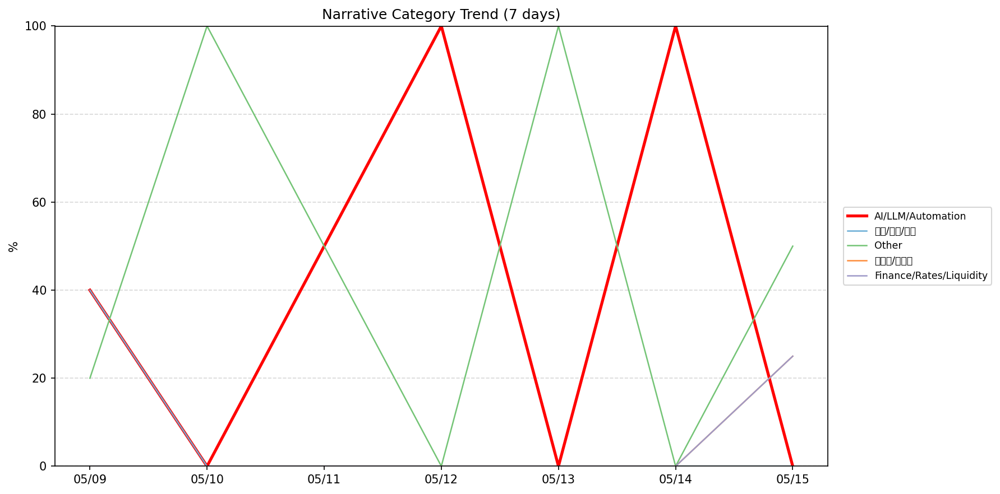
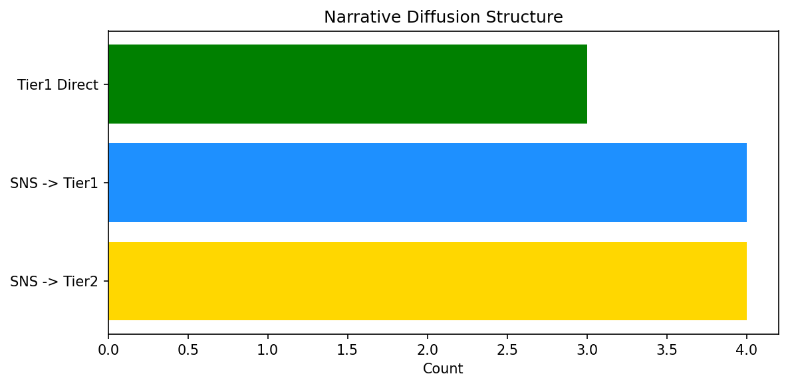

# 週次メタ分析レポート - 2026-05-16

> 分析期間: 過去7日間

---

## ショックタイプ分布

| ショックタイプ | 件数 |
|----------------|------|
| ナラティブシフト | 10 |
| ビジネスモデルショック | 3 |
| 業績シグナル | 2 |
| テクノロジーショック | 2 |

---

## ナラティブ推移

### 2026-05-09
- AI/LLM/自動化: 40%
- 社会/労働/教育: 40%
- その他: 20%

### 2026-05-10
- その他: 100%

### 2026-05-11
- その他: 50%
- AI/LLM/自動化: 50%

### 2026-05-12
- AI/LLM/自動化: 100%

### 2026-05-13
- その他: 100%

### 2026-05-14
- AI/LLM/自動化: 100%

### 2026-05-15
- その他: 50%
- 半導体/供給網: 25%
- 金融/金利/流動性: 25%

---

## ナラティブ伝播構造

| 伝播パターン | 件数 |
|--------------|------|
| SNS→Tier1 | 4 |
| Tier1直接 | 3 |
| カバレッジなし | 6 |
| SNS→Tier2 | 4 |

---

## 過熱警告事後検証

> ※ "過熱警告を出したか"と"AI偏重が実際に続いたか"の検証

| 指標 | 値 |
|------|-----|
| 検証対象数 | 7 |
| 正警告（TP） | 0 |
| 過剰警告（FP） | 0 |
| 正常判定（TN） | 5 |
| 見逃し（FN） | 2 |
| Recall | 0.0% |

- **2026-05-09**: 正常判定 — No overheat and conditions normal: ai_continued=False, price_sustained=True.
- **2026-05-10**: 見逃し — Missed overheat: AI events continued without price backing. An alert should have been raised.
- **2026-05-11**: 見逃し — Missed overheat: AI events continued without price backing. An alert should have been raised.
- **2026-05-12**: 正常判定 — No overheat and conditions normal: ai_continued=False, price_sustained=False.
- **2026-05-13**: 正常判定 — No overheat and conditions normal: ai_continued=False, price_sustained=True.
- **2026-05-14**: 正常判定 — No overheat and conditions normal: ai_continued=False, price_sustained=False.
- **2026-05-15**: 正常判定 — No overheat and conditions normal: ai_continued=False, price_sustained=False.

---

## 非AIハイライト（週次）

### 1. NET
- **サマリー**: 出来高が平均の5.14倍
- **スコア**: 0.72
- **ナラティブ分類**: 社会/労働/教育
- **ショックタイプ**: ビジネスモデルショック
- **AI関連度**: 26%

### 2. NET
- **サマリー**: 5件の言及（通常の5.6倍）
- **スコア**: 0.65
- **ナラティブ分類**: 社会/労働/教育
- **ショックタイプ**: ビジネスモデルショック
- **AI関連度**: 26%

### 3. PLTR
- **サマリー**: 5件の言及（通常の5.6倍）
- **スコア**: 0.59
- **ナラティブ分類**: その他
- **ショックタイプ**: ナラティブシフト
- **AI関連度**: 0%

### 4. PLTR
- **サマリー**: 4件の言及（通常の5.0倍）
- **スコア**: 0.46
- **ナラティブ分類**: その他
- **ショックタイプ**: ナラティブシフト
- **AI関連度**: 0%

### 5. NET
- **サマリー**: 出来高が平均の5.2倍
- **スコア**: 0.42
- **ナラティブ分類**: その他
- **ショックタイプ**: ナラティブシフト
- **AI関連度**: 0%

---

## 構造持続確率 Top3

| 順位 | 銘柄 | SPP | ショックタイプ | 伝播パターン | サマリー |
|------|------|-----|----------------|--------------|----------|
| 1 | GOOGL | 0.59 | テクノロジーショック | SNS→Tier1 | 26件の言及（通常の3.3倍） |
| 2 | XOM | 0.59 | ナラティブシフト | Tier1直接 | 出来高が平均の1.96倍 |
| 3 | NVDA | 0.59 | ナラティブシフト | Tier1直接 | 7件の言及（通常の3.2倍） |

---

## イベント持続性

| 銘柄 | 出現日数/観測日数 | SPP推移 | 最新SPP |
|------|------------------|---------|---------|
| GOOGL | 2/7日 | 上昇 | 0.59 |
| NVDA | 2/7日 | 上昇 | 0.59 |
| JPM | 2/7日 | 横ばい | 0.51 |
| PATH | 2/7日 | 上昇 | 0.48 |
| PLTR | 2/7日 | 上昇 | 0.45 |
| NET | 2/7日 | 下降 | 0.45 |
| XOM | 1/7日 | 横ばい | 0.59 |
| MSFT | 1/7日 | 横ばい | 0.43 |

---

## 転換点候補

転換点候補は検出されませんでした。

---

## 組織インパクト仮説

### 1. 今週の構造変化は「ナラティブシフト」に集中（59%）。この領域の専門知識・人材の重要性が高まっている可能性。
- **根拠**: ショックタイプ分布: ナラティブシフトが10件

---

## 市場レジーム推移

| 日付 | レジーム | ボラティリティ | 下落比率 | 信頼度 |
|------|----------|---------------|----------|--------|
| 2026-05-15 | 高ボラ | 46.7% | 27% | 98% |
| 2026-05-14 | 高ボラ | 46.9% | 27% | 98% |
| 2026-05-13 | 高ボラ | 47.0% | 33% | 90% |
| 2026-05-12 | 高ボラ | 47.5% | 27% | 98% |
| 2026-05-11 | 高ボラ | 47.8% | 20% | 100% |
| 2026-05-10 | 高ボラ | 49.2% | 27% | 98% |
| 2026-05-09 | 高ボラ | 50.3% | 27% | 98% |

---

## 前週比較

> 比較期間: 2026-05-02〜2026-05-09 (7日分)

**イベント件数**: 今週 17 件 / 前週 33 件（差分 -16）

**支配的レジーム**: 高ボラ（変化なし）

### ショックタイプ増減

| ショックタイプ | 今週 | 前週 | 差分 |
|----------------|------|------|------|
| テクノロジーショック | 2 | 6 | -4 |
| ナラティブシフト | 10 | 12 | -2 |
| ビジネスモデルショック | 3 | 6 | -3 |
| 業績シグナル | 2 | 9 | -7 |

### ナラティブ比率変化

| カテゴリ | 今週平均 | 前週平均 | 差分(pt) |
|----------|----------|----------|----------|
| AI/LLM/自動化 | 41% | 69% | -27 |
| その他 | 46% | 20% | +26 |
| 半導体/供給網 | 4% | 6% | -2 |
| 社会/労働/教育 | 6% | 6% | +0 |
| 金融/金利/流動性 | 4% | 0% | +4 |

---

## レジーム・ナラティブ同時変動

> ※ 同時期の観測であり、因果関係を示すものではありません

- **2026-05-10**: レジーム異常（高ボラ）と「その他」ナラティブ集中（100%）が共起
- **2026-05-12**: レジーム異常（高ボラ）と「AI/LLM/自動化」ナラティブ集中（100%）が共起
- **2026-05-13**: レジーム異常（高ボラ）と「その他」ナラティブ集中（100%）が共起
- **2026-05-14**: レジーム異常（高ボラ）と「AI/LLM/自動化」ナラティブ集中（100%）が共起

---

## 来週の監視比重提案

### 1. 「規制/政策/地政学」の監視比重を維持・注視
- **根拠**: 週平均ナラティブ比率0%と低く、イベント未検出だが、構造的に重要なカテゴリのため意図的な監視継続を推奨。
- **週平均ナラティブ比率**: 0%

### 2. 「エネルギー/資源」の監視比重を維持・注視
- **根拠**: 週平均ナラティブ比率0%と低く、イベント未検出だが、構造的に重要なカテゴリのため意図的な監視継続を推奨。
- **週平均ナラティブ比率**: 0%

### 3. 「金融/金利/流動性」の監視比重を引き上げ
- **根拠**: 週平均ナラティブ比率4%と低いが、過去7日で1件のイベントが検出されており、見落としリスクがあります。
- **週平均ナラティブ比率**: 4%
- **⚡ 急変フラグ**: 直近25%へ急変 — 動向注視を推奨

### 4. 「半導体/供給網」の監視比重を引き上げ
- **根拠**: 週平均ナラティブ比率4%と低いが、過去7日で1件のイベントが検出されており、見落としリスクがあります。
- **週平均ナラティブ比率**: 4%
- **⚡ 急変フラグ**: 直近25%へ急変 — 動向注視を推奨

### 5. 「社会/労働/教育」の監視比重を引き上げ
- **根拠**: 週平均ナラティブ比率6%と低いが、過去7日で2件のイベントが検出されており、見落としリスクがあります。
- **週平均ナラティブ比率**: 6%

### 6. 「その他」の過集中に注意
- **根拠**: 週平均ナラティブ比率46%と高く、他カテゴリの構造変化を見落とすリスクがあります。
- **週平均ナラティブ比率**: 46%

### 7. 「AI/LLM/自動化」の過集中に注意
- **根拠**: 週平均ナラティブ比率41%と高く、他カテゴリの構造変化を見落とすリスクがあります。
- **週平均ナラティブ比率**: 41%
- **⚡ 急変フラグ**: 直近0%へ急変 — 動向注視を推奨

---

*レポート生成日時: 2026-05-16 02:51:37*
