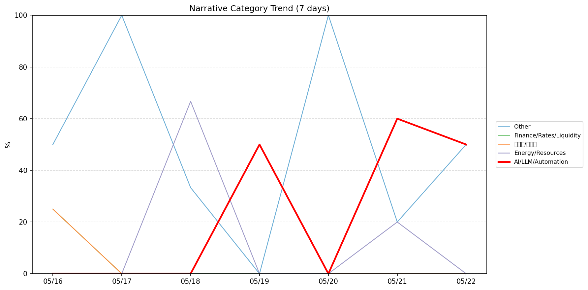
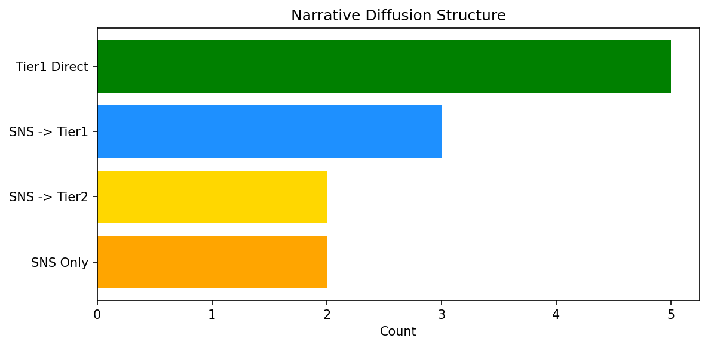

# 週次メタ分析レポート - 2026-05-23

> 分析期間: 過去7日間

---

## ショックタイプ分布

| ショックタイプ | 件数 |
|----------------|------|
| ナラティブシフト | 11 |
| テクノロジーショック | 4 |
| 業績シグナル | 2 |
| ビジネスモデルショック | 2 |

---

## ナラティブ推移

### 2026-05-16
- その他: 50%
- 金融/金利/流動性: 25%
- 半導体/供給網: 25%

### 2026-05-17
- その他: 100%

### 2026-05-18
- エネルギー/資源: 67%
- その他: 33%

### 2026-05-19
- 半導体/供給網: 50%
- AI/LLM/自動化: 50%

### 2026-05-20
- その他: 100%

### 2026-05-21
- AI/LLM/自動化: 60%
- その他: 20%
- エネルギー/資源: 20%

### 2026-05-22
- その他: 50%
- AI/LLM/自動化: 50%

---

## ナラティブ伝播構造

| 伝播パターン | 件数 |
|--------------|------|
| SNS→Tier2 | 2 |
| Tier1直接 | 5 |
| SNS→Tier1 | 3 |
| SNSのみ | 2 |
| カバレッジなし | 7 |

---

## 過熱警告事後検証

> ※ "過熱警告を出したか"と"AI偏重が実際に続いたか"の検証

| 指標 | 値 |
|------|-----|
| 検証対象数 | 7 |
| 正警告（TP） | 0 |
| 過剰警告（FP） | 0 |
| 正常判定（TN） | 3 |
| 見逃し（FN） | 4 |
| Recall | 0.0% |

- **2026-05-16**: 正常判定 — No overheat and conditions normal: ai_continued=False, price_sustained=True.
- **2026-05-17**: 正常判定 — No overheat and conditions normal: ai_continued=False, price_sustained=True.
- **2026-05-18**: 見逃し — Missed overheat: AI events continued without price backing. An alert should have been raised.
- **2026-05-19**: 見逃し — Missed overheat: AI events continued without price backing. An alert should have been raised.
- **2026-05-20**: 見逃し — Missed overheat: AI events continued without price backing. An alert should have been raised.
- **2026-05-21**: 見逃し — Missed overheat: AI events continued without price backing. An alert should have been raised.
- **2026-05-22**: 正常判定 — No overheat and conditions normal: ai_continued=False, price_sustained=False.

---

## 非AIハイライト（週次）

### 1. NVDA
- **サマリー**: 8件の言及（通常の3.3倍）
- **スコア**: 0.73
- **ナラティブ分類**: エネルギー/資源
- **ショックタイプ**: 業績シグナル
- **AI関連度**: 9%

### 2. PLTR
- **サマリー**: 5件の言及（通常の5.6倍）
- **スコア**: 0.59
- **ナラティブ分類**: その他
- **ショックタイプ**: ナラティブシフト
- **AI関連度**: 0%

### 3. NEE
- **サマリー**: 出来高が平均の4.92倍
- **スコア**: 0.57
- **ナラティブ分類**: エネルギー/資源
- **ショックタイプ**: ビジネスモデルショック
- **AI関連度**: 0%

### 4. NVDA
- **サマリー**: 7件の言及（通常の3.3倍）
- **スコア**: 0.38
- **ナラティブ分類**: 半導体/供給網
- **ショックタイプ**: ナラティブシフト
- **AI関連度**: 20%

### 5. XOM
- **サマリー**: 出来高が平均の1.96倍
- **スコア**: 0.38
- **ナラティブ分類**: 金融/金利/流動性
- **ショックタイプ**: ナラティブシフト
- **AI関連度**: 0%

---

## 構造持続確率 Top3

| 順位 | 銘柄 | SPP | ショックタイプ | 伝播パターン | サマリー |
|------|------|-----|----------------|--------------|----------|
| 1 | XOM | 0.66 | 業績シグナル | なし | 前日比-3.86%の価格変動 |
| 2 | NVDA | 0.59 | 業績シグナル | Tier1直接 | 8件の言及（通常の3.3倍） |
| 3 | PATH | 0.54 | ナラティブシフト | なし | 出来高が平均の1.7倍 |

---

## イベント持続性

| 銘柄 | 出現日数/観測日数 | SPP推移 | 最新SPP |
|------|------------------|---------|---------|
| XOM | 3/7日 | 横ばい | 0.66 |
| GOOGL | 3/7日 | 横ばい | 0.50 |
| NVDA | 2/7日 | 上昇 | 0.59 |
| PATH | 2/7日 | 横ばい | 0.54 |
| JPM | 2/7日 | 横ばい | 0.44 |
| PLTR | 1/7日 | 横ばい | 0.48 |
| NEE | 1/7日 | 横ばい | 0.44 |
| MSFT | 1/7日 | 横ばい | 0.43 |
| CRWD | 1/7日 | 横ばい | 0.42 |
| DDOG | 1/7日 | 横ばい | 0.26 |
| NET | 1/7日 | 横ばい | 0.20 |

---

## 転換点候補

転換点候補は検出されませんでした。

---

## 組織インパクト仮説

### 1. 今週の構造変化は「ナラティブシフト」に集中（58%）。この領域の専門知識・人材の重要性が高まっている可能性。
- **根拠**: ショックタイプ分布: ナラティブシフトが11件

### 2. XOM（その他）: 価格変動・出来高急増 + 業績シグナル + 3日間持続 + 高ボラ環境 → 構造的な市場関心の変化の可能性
- **根拠**: 出現: 3/7日, SPP推移: 横ばい
- **根拠要素**:
- 価格変動
- 出来高急増
- 業績シグナル型
- ナラティブシフト型
- 3日間持続観測
- SPP横ばい（0.66）
- 高ボラレジーム下
- **データ期間**: 2026-05-16〜2026-05-22 (7日間)
- **信頼度注記**: 観測データに基づく示唆であり、因果関係を示すものではありません

### 3. GOOGL（AI/LLM/自動化）: 言及急増 + テクノロジーショック + 3日間持続 + 高ボラ環境 → 構造的な市場関心の変化の可能性
- **根拠**: 出現: 3/7日, SPP推移: 横ばい
- **根拠要素**:
- 言及急増
- テクノロジーショック型
- 3日間持続観測
- SPP横ばい（0.50）
- 高ボラレジーム下
- 関連: Google goes for the glitter with disco-ball icons: ‘Are y’all sure you still want this?’
- 関連: Google&#8217;s AI search is so broken it can &#8216;disregard&#8217; what you&#8217;re looking for
- **データ期間**: 2026-05-16〜2026-05-22 (7日間)
- **信頼度注記**: 観測データに基づく示唆であり、因果関係を示すものではありません

---

## 市場レジーム推移

| 日付 | レジーム | ボラティリティ | 下落比率 | 信頼度 |
|------|----------|---------------|----------|--------|
| 2026-05-22 | 高ボラ | 46.9% | 33% | 90% |
| 2026-05-21 | 高ボラ | 47.1% | 40% | 82% |
| 2026-05-20 | 高ボラ | 47.6% | 27% | 98% |
| 2026-05-19 | 高ボラ | 47.9% | 40% | 82% |
| 2026-05-18 | 高ボラ | 48.8% | 33% | 90% |
| 2026-05-17 | 高ボラ | 48.2% | 40% | 82% |
| 2026-05-16 | 高ボラ | 47.5% | 27% | 98% |

---

## 前週比較

> 比較期間: 2026-05-09〜2026-05-16 (8日分)

**イベント件数**: 今週 19 件 / 前週 21 件（差分 -2）

**支配的レジーム**: 高ボラ（変化なし）

### ショックタイプ増減

| ショックタイプ | 今週 | 前週 | 差分 |
|----------------|------|------|------|
| テクノロジーショック | 4 | 2 | +2 |
| ナラティブシフト | 11 | 14 | -3 |
| ビジネスモデルショック | 2 | 3 | -1 |
| 業績シグナル | 2 | 2 | +0 |

### ナラティブ比率変化

| カテゴリ | 今週平均 | 前週平均 | 差分(pt) |
|----------|----------|----------|----------|
| AI/LLM/自動化 | 23% | 36% | -13 |
| その他 | 50% | 46% | +4 |
| エネルギー/資源 | 12% | 0% | +12 |
| 半導体/供給網 | 11% | 6% | +4 |
| 社会/労働/教育 | 0% | 5% | -5 |
| 金融/金利/流動性 | 4% | 6% | -3 |

---

## レジーム・ナラティブ同時変動

> ※ 同時期の観測であり、因果関係を示すものではありません

- **2026-05-17**: レジーム異常（高ボラ）と「その他」ナラティブ集中（100%）が共起
- **2026-05-18**: レジーム異常（高ボラ）と「エネルギー/資源」ナラティブ集中（67%）が共起
- **2026-05-20**: レジーム異常（高ボラ）と「その他」ナラティブ集中（100%）が共起

---

## 来週の監視比重提案

### 1. 「規制/政策/地政学」の監視比重を維持・注視
- **根拠**: 週平均ナラティブ比率0%と低く、イベント未検出だが、構造的に重要なカテゴリのため意図的な監視継続を推奨。
- **週平均ナラティブ比率**: 0%

### 2. 「金融/金利/流動性」の監視比重を引き上げ
- **根拠**: 週平均ナラティブ比率4%と低いが、過去7日で1件のイベントが検出されており、見落としリスクがあります。
- **週平均ナラティブ比率**: 4%

### 3. 「その他」の過集中に注意
- **根拠**: 週平均ナラティブ比率50%と高く、他カテゴリの構造変化を見落とすリスクがあります。
- **週平均ナラティブ比率**: 50%

---

*レポート生成日時: 2026-05-23 02:53:09*
