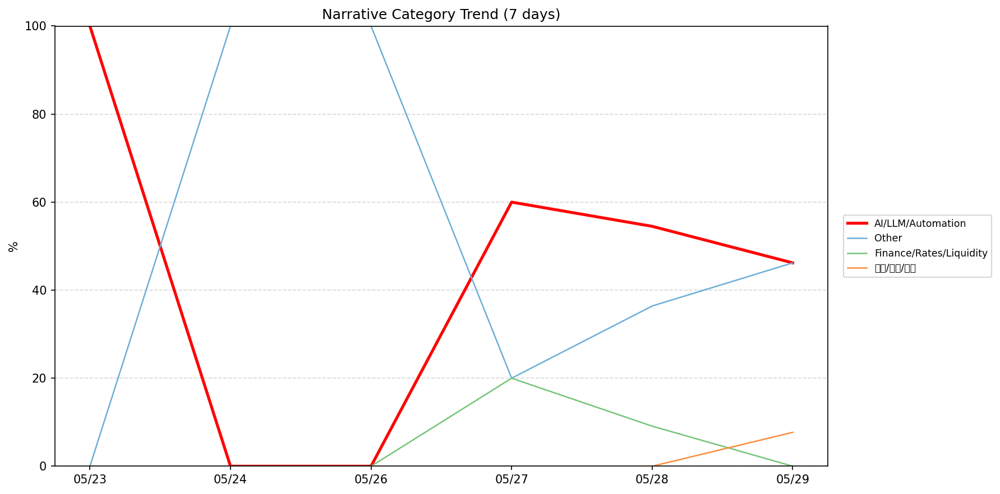
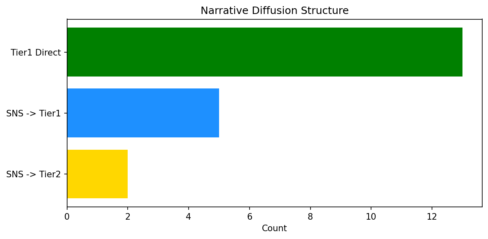

# 週次メタ分析レポート - 2026-05-30

> 分析期間: 過去7日間

---

## ショックタイプ分布

| ショックタイプ | 件数 |
|----------------|------|
| ナラティブシフト | 20 |
| 業績シグナル | 7 |
| テクノロジーショック | 6 |

---

## ナラティブ推移

### 2026-05-23
- AI/LLM/自動化: 100%

### 2026-05-24
- その他: 100%

### 2026-05-26
- その他: 100%

### 2026-05-27
- AI/LLM/自動化: 60%
- その他: 20%
- 金融/金利/流動性: 20%

### 2026-05-28
- AI/LLM/自動化: 55%
- その他: 36%
- 金融/金利/流動性: 9%

### 2026-05-29
- その他: 46%
- AI/LLM/自動化: 46%
- 社会/労働/教育: 8%

---

## ナラティブ伝播構造

| 伝播パターン | 件数 |
|--------------|------|
| SNS→Tier1 | 5 |
| Tier1直接 | 13 |
| SNS→Tier2 | 2 |
| カバレッジなし | 13 |

---

## 過熱警告事後検証

> ※ "過熱警告を出したか"と"AI偏重が実際に続いたか"の検証

| 指標 | 値 |
|------|-----|
| 検証対象数 | 7 |
| 正警告（TP） | 0 |
| 過剰警告（FP） | 0 |
| 正常判定（TN） | 5 |
| 見逃し（FN） | 2 |
| Recall | 0.0% |

- **2026-05-23**: 正常判定 — No overheat and conditions normal: ai_continued=False, price_sustained=False.
- **2026-05-24**: 見逃し — Missed overheat: AI events continued without price backing. An alert should have been raised.
- **2026-05-25**: 見逃し — Missed overheat: AI events continued without price backing. An alert should have been raised.
- **2026-05-26**: 正常判定 — No overheat and conditions normal: ai_continued=True, price_sustained=True.
- **2026-05-27**: 正常判定 — No overheat and conditions normal: ai_continued=True, price_sustained=True.
- **2026-05-28**: 正常判定 — No overheat and conditions normal: ai_continued=True, price_sustained=True.
- **2026-05-29**: 正常判定 — No overheat and conditions normal: ai_continued=False, price_sustained=False.

---

## 非AIハイライト（週次）

### 1. GOOGL
- **サマリー**: 出来高が平均の1.74倍
- **スコア**: 0.64
- **ナラティブ分類**: 社会/労働/教育
- **ショックタイプ**: テクノロジーショック
- **AI関連度**: 1%

### 2. MDB
- **サマリー**: 出来高が平均の3.66倍
- **スコア**: 0.49
- **ナラティブ分類**: その他
- **ショックタイプ**: ナラティブシフト
- **AI関連度**: 0%

### 3. JPM
- **サマリー**: 5件の言及（通常の6.7倍）
- **スコア**: 0.45
- **ナラティブ分類**: 金融/金利/流動性
- **ショックタイプ**: ナラティブシフト
- **AI関連度**: 0%

### 4. MDB
- **サマリー**: 出来高が平均の4.96倍
- **スコア**: 0.42
- **ナラティブ分類**: その他
- **ショックタイプ**: ナラティブシフト
- **AI関連度**: 0%

### 5. PATH
- **サマリー**: 出来高が平均の2.06倍
- **スコア**: 0.41
- **ナラティブ分類**: その他
- **ショックタイプ**: ナラティブシフト
- **AI関連度**: 0%

---

## 構造持続確率 Top3

| 順位 | 銘柄 | SPP | ショックタイプ | 伝播パターン | サマリー |
|------|------|-----|----------------|--------------|----------|
| 1 | NVDA | 0.73 | ナラティブシフト | Tier1直接 | 出来高が平均の1.46倍 |
| 2 | CRWD | 0.60 | 業績シグナル | なし | 前日比+8.94%の価格変動 |
| 3 | JPM | 0.57 | ナラティブシフト | Tier1直接 | 5件の言及（通常の6.7倍） |

---

## イベント持続性

| 銘柄 | 出現日数/観測日数 | SPP推移 | 最新SPP |
|------|------------------|---------|---------|
| NVDA | 3/6日 | 上昇 | 0.73 |
| JPM | 3/6日 | 上昇 | 0.57 |
| MDB | 3/6日 | 上昇 | 0.48 |
| PATH | 3/6日 | 上昇 | 0.48 |
| SNOW | 3/6日 | 横ばい | 0.47 |
| CRWD | 2/6日 | 下降 | 0.60 |
| GOOGL | 2/6日 | 横ばい | 0.57 |
| MSFT | 2/6日 | 下降 | 0.54 |
| PLTR | 2/6日 | 下降 | 0.45 |
| UNH | 1/6日 | 横ばい | 0.42 |

---

## 転換点候補

転換点候補は検出されませんでした。

---

## 組織インパクト仮説

### 1. 今週の構造変化は「ナラティブシフト」に集中（61%）。この領域の専門知識・人材の重要性が高まっている可能性。
- **根拠**: ショックタイプ分布: ナラティブシフトが20件

### 2. NVDA（AI/LLM/自動化）: 出来高急増・言及急増 + ナラティブシフト + 3日間持続 + 高ボラ環境 → 構造的な市場関心の変化の可能性、SPP上昇中
- **根拠**: 出現: 3/6日, SPP推移: 上昇
- **根拠要素**:
- 出来高急増
- 言及急増
- ナラティブシフト型
- 3日間持続観測
- SPP上昇（0.45→0.73）
- 高ボラレジーム下
- 関連: Nvidia, Microsoft, and Arm are all teasing Nvidia’s new N1X laptop processors
- 関連: After Nvidia’s $20B not-acqui-hire, AI chip startup Groq reportedly raising $650M
- **データ期間**: 2026-05-23〜2026-05-29 (6日間)
- **信頼度注記**: 観測データに基づく示唆であり、因果関係を示すものではありません

### 3. JPM（金融/金利/流動性）: 出来高急増・言及急増 + ナラティブシフト + 3日間持続 + 高ボラ環境 → 構造的な市場関心の変化の可能性、SPP上昇中
- **根拠**: 出現: 3/6日, SPP推移: 上昇
- **根拠要素**:
- 出来高急増
- 言及急増
- ナラティブシフト型
- 3日間持続観測
- SPP上昇（0.51→0.57）
- 高ボラレジーム下
- 関連: Jamie Dimon says JPMorgan Chase could spend $20 billion on acquisition: 'We are on the lookout'
- 関連: JPMorgan says it's time to buy these unloved safe stocks that pay dividends
- **データ期間**: 2026-05-23〜2026-05-29 (6日間)
- **信頼度注記**: 観測データに基づく示唆であり、因果関係を示すものではありません

### 4. MDB（その他）: 出来高急増・価格変動 + 業績シグナル + 3日間持続 + 高ボラ環境 → 構造的な市場関心の変化の可能性、SPP上昇中
- **根拠**: 出現: 3/6日, SPP推移: 上昇
- **根拠要素**:
- 出来高急増
- 価格変動
- 業績シグナル型
- ナラティブシフト型
- 3日間持続観測
- SPP上昇（0.42→0.48）
- 高ボラレジーム下
- **データ期間**: 2026-05-23〜2026-05-29 (6日間)
- **信頼度注記**: 観測データに基づく示唆であり、因果関係を示すものではありません

---

## 市場レジーム推移

| 日付 | レジーム | ボラティリティ | 下落比率 | 信頼度 |
|------|----------|---------------|----------|--------|
| 2026-05-29 | 高ボラ | 52.5% | 20% | 100% |
| 2026-05-28 | 高ボラ | 51.0% | 27% | 98% |
| 2026-05-27 | 高ボラ | 45.2% | 47% | 74% |
| 2026-05-26 | 高ボラ | 45.4% | 33% | 90% |
| 2026-05-25 | 高ボラ | 45.8% | 33% | 90% |
| 2026-05-24 | 高ボラ | 44.9% | 27% | 98% |
| 2026-05-23 | 高ボラ | 44.7% | 20% | 100% |

---

## 前週比較

> 比較期間: 2026-05-16〜2026-05-23 (8日分)

**イベント件数**: 今週 33 件 / 前週 20 件（差分 +13）

**支配的レジーム**: 高ボラ（変化なし）

### ショックタイプ増減

| ショックタイプ | 今週 | 前週 | 差分 |
|----------------|------|------|------|
| テクノロジーショック | 6 | 5 | +1 |
| ナラティブシフト | 20 | 11 | +9 |
| ビジネスモデルショック | 0 | 2 | -2 |
| 業績シグナル | 7 | 2 | +5 |

### ナラティブ比率変化

| カテゴリ | 今週平均 | 前週平均 | 差分(pt) |
|----------|----------|----------|----------|
| AI/LLM/自動化 | 43% | 32% | +11 |
| その他 | 50% | 44% | +6 |
| エネルギー/資源 | 0% | 11% | -11 |
| 半導体/供給網 | 0% | 9% | -9 |
| 社会/労働/教育 | 1% | 0% | +1 |
| 金融/金利/流動性 | 5% | 3% | +2 |

---

## レジーム・ナラティブ同時変動

> ※ 同時期の観測であり、因果関係を示すものではありません

- **2026-05-24**: レジーム異常（高ボラ）と「その他」ナラティブ集中（100%）が共起
- **2026-05-26**: レジーム異常（高ボラ）と「その他」ナラティブ集中（100%）が共起

---

## 来週の監視比重提案

### 1. 「規制/政策/地政学」の監視比重を維持・注視
- **根拠**: 週平均ナラティブ比率0%と低く、イベント未検出だが、構造的に重要なカテゴリのため意図的な監視継続を推奨。
- **週平均ナラティブ比率**: 0%

### 2. 「エネルギー/資源」の監視比重を維持・注視
- **根拠**: 週平均ナラティブ比率0%と低く、イベント未検出だが、構造的に重要なカテゴリのため意図的な監視継続を推奨。
- **週平均ナラティブ比率**: 0%

### 3. 「社会/労働/教育」の監視比重を引き上げ
- **根拠**: 週平均ナラティブ比率1%と低いが、過去7日で1件のイベントが検出されており、見落としリスクがあります。
- **週平均ナラティブ比率**: 1%

### 4. 「金融/金利/流動性」の監視比重を引き上げ
- **根拠**: 週平均ナラティブ比率5%と低いが、過去7日で2件のイベントが検出されており、見落としリスクがあります。
- **週平均ナラティブ比率**: 5%

### 5. 「その他」の過集中に注意
- **根拠**: 週平均ナラティブ比率50%と高く、他カテゴリの構造変化を見落とすリスクがあります。
- **週平均ナラティブ比率**: 50%

### 6. 「AI/LLM/自動化」の過集中に注意
- **根拠**: 週平均ナラティブ比率43%と高く、他カテゴリの構造変化を見落とすリスクがあります。
- **週平均ナラティブ比率**: 44%

---

*レポート生成日時: 2026-05-30 02:58:12*
