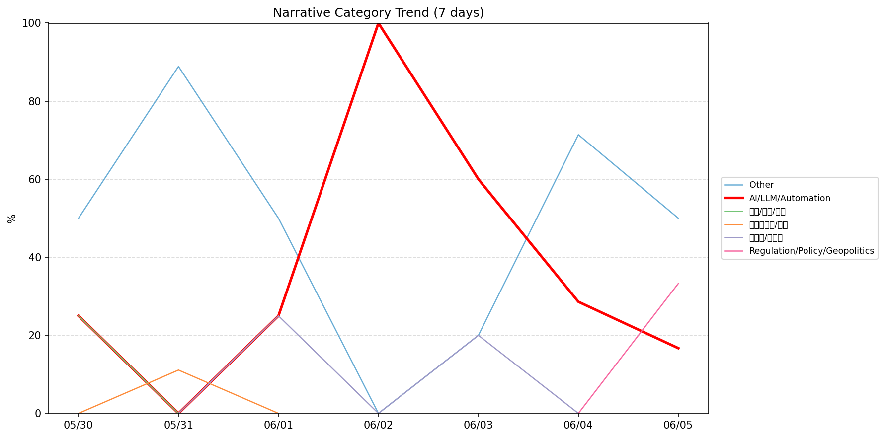
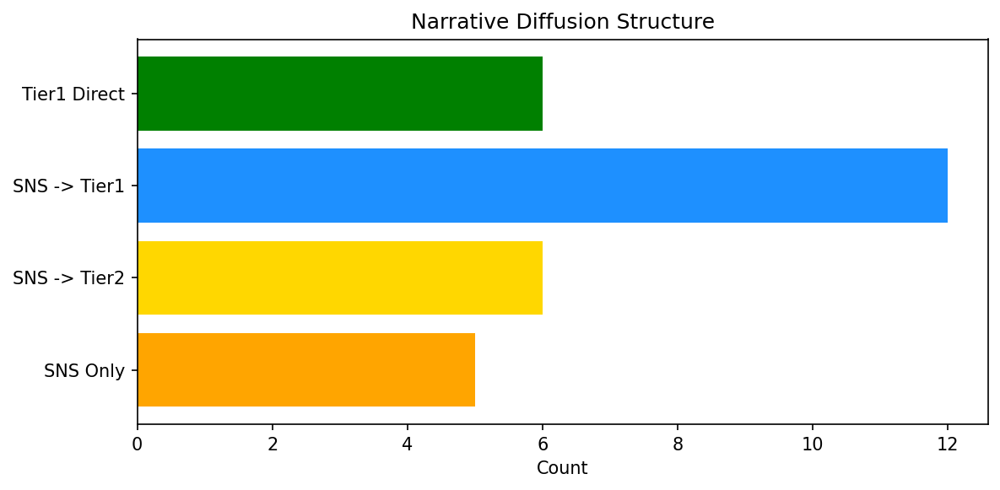

# 週次メタ分析レポート - 2026-06-06

> 分析期間: 過去7日間

---

## ショックタイプ分布

| ショックタイプ | 件数 |
|----------------|------|
| ナラティブシフト | 23 |
| テクノロジーショック | 15 |
| 業績シグナル | 12 |

---

## ナラティブ推移

### 2026-05-30
- その他: 50%
- AI/LLM/自動化: 25%
- 社会/労働/教育: 25%

### 2026-05-31
- その他: 89%
- ガバナンス/経営: 11%

### 2026-06-01
- その他: 50%
- AI/LLM/自動化: 25%
- 半導体/供給網: 25%

### 2026-06-02
- AI/LLM/自動化: 100%

### 2026-06-03
- AI/LLM/自動化: 60%
- その他: 20%
- 半導体/供給網: 20%

### 2026-06-04
- その他: 71%
- AI/LLM/自動化: 29%

### 2026-06-05
- その他: 50%
- 規制/政策/地政学: 33%
- AI/LLM/自動化: 17%

---

## ナラティブ伝播構造

| 伝播パターン | 件数 |
|--------------|------|
| SNS→Tier1 | 12 |
| Tier1直接 | 6 |
| SNSのみ | 5 |
| カバレッジなし | 21 |
| SNS→Tier2 | 6 |

---

## 過熱警告事後検証

> ※ "過熱警告を出したか"と"AI偏重が実際に続いたか"の検証

| 指標 | 値 |
|------|-----|
| 検証対象数 | 7 |
| 正警告（TP） | 0 |
| 過剰警告（FP） | 0 |
| 正常判定（TN） | 7 |
| 見逃し（FN） | 0 |

- **2026-05-30**: 正常判定 — No overheat and conditions normal: ai_continued=False, price_sustained=True.
- **2026-05-31**: 正常判定 — No overheat and conditions normal: ai_continued=True, price_sustained=True.
- **2026-06-01**: 正常判定 — No overheat and conditions normal: ai_continued=True, price_sustained=True.
- **2026-06-02**: 正常判定 — No overheat and conditions normal: ai_continued=False, price_sustained=True.
- **2026-06-03**: 正常判定 — No overheat and conditions normal: ai_continued=False, price_sustained=True.
- **2026-06-04**: 正常判定 — No overheat and conditions normal: ai_continued=False, price_sustained=True.
- **2026-06-05**: 正常判定 — No overheat and conditions normal: ai_continued=False, price_sustained=False.

---

## 非AIハイライト（週次）

### 1. MSFT
- **サマリー**: 15件の言及（通常の4.8倍）
- **スコア**: 0.92
- **ナラティブ分類**: 社会/労働/教育
- **ショックタイプ**: テクノロジーショック
- **AI関連度**: 1%

### 2. MSFT
- **サマリー**: 出来高が平均の2.41倍
- **スコア**: 0.92
- **ナラティブ分類**: 社会/労働/教育
- **ショックタイプ**: テクノロジーショック
- **AI関連度**: 1%

### 3. MSFT
- **サマリー**: 前日比+5.45%の価格変動
- **スコア**: 0.75
- **ナラティブ分類**: 社会/労働/教育
- **ショックタイプ**: テクノロジーショック
- **AI関連度**: 1%

### 4. NVDA
- **サマリー**: 22件の言及（通常の6.0倍）
- **スコア**: 0.72
- **ナラティブ分類**: 半導体/供給網
- **ショックタイプ**: テクノロジーショック
- **AI関連度**: 22%

### 5. MSFT
- **サマリー**: 出来高が平均の2.37倍
- **スコア**: 0.63
- **ナラティブ分類**: その他
- **ショックタイプ**: ナラティブシフト
- **AI関連度**: 0%

---

## 構造持続確率 Top3

| 順位 | 銘柄 | SPP | ショックタイプ | 伝播パターン | サマリー |
|------|------|-----|----------------|--------------|----------|
| 1 | MDB | 0.78 | 業績シグナル | なし | 前日比+20.36%の価格変動 |
| 2 | PATH | 0.77 | 業績シグナル | なし | 前日比+11.77%の価格変動 |
| 3 | NVDA | 0.75 | ナラティブシフト | Tier1直接 | 出来高が平均の1.28倍 |

---

## イベント持続性

| 銘柄 | 出現日数/観測日数 | SPP推移 | 最新SPP |
|------|------------------|---------|---------|
| MSFT | 6/7日 | 上昇 | 0.58 |
| GOOGL | 6/7日 | 下降 | 0.52 |
| NVDA | 5/7日 | 横ばい | 0.75 |
| UNH | 4/7日 | 上昇 | 0.75 |
| MDB | 3/7日 | 上昇 | 0.78 |
| PATH | 3/7日 | 上昇 | 0.77 |
| CRWD | 3/7日 | 横ばい | 0.66 |
| JPM | 2/7日 | 上昇 | 0.67 |
| PLTR | 2/7日 | 横ばい | 0.51 |
| LMT | 2/7日 | 下降 | 0.45 |
| NET | 2/7日 | 横ばい | 0.22 |
| DDOG | 1/7日 | 横ばい | 0.58 |

---

## 転換点候補

- 「その他」が2026-06-03→2026-06-04で51ポイント上昇（20% → 71%）
- 「AI/LLM/自動化」が2026-06-01→2026-06-02で75ポイント上昇（25% → 100%）

---

## 組織インパクト仮説

### 1. 今週の構造変化は「ナラティブシフト」に集中（46%）。この領域の専門知識・人材の重要性が高まっている可能性。
- **根拠**: ショックタイプ分布: ナラティブシフトが23件

### 2. 「その他」ナラティブの急上昇は、この分野への注目シフトを示唆。関連するリスク管理体制の見直しが必要かもしれません。
- **根拠**: 「その他」が2026-06-03→2026-06-04で51ポイント上昇（20% → 71%）

### 3. 「AI/LLM/自動化」ナラティブの急上昇は、この分野への注目シフトを示唆。関連するリスク管理体制の見直しが必要かもしれません。
- **根拠**: 「AI/LLM/自動化」が2026-06-01→2026-06-02で75ポイント上昇（25% → 100%）

### 4. MSFT（社会/労働/教育）: 出来高急増・価格変動 + テクノロジーショック + 6日間持続 + 高ボラ環境 → 構造的な市場関心の変化の可能性、SPP上昇中
- **根拠**: 出現: 6/7日, SPP推移: 上昇
- **根拠要素**:
- 出来高急増
- 価格変動
- 言及急増
- テクノロジーショック型
- ナラティブシフト型
- 業績シグナル型
- 6日間持続観測
- SPP上昇（0.51→0.58）
- 高ボラレジーム下
- 関連: Reid Hoffman is leaving Microsoft’s board to go ‘founder mode’ with  startup Manus
- 関連: Helion, the Sam Altman-backed fusion startup, raises $465M to build a power plant for Microsoft
- **データ期間**: 2026-05-30〜2026-06-05 (7日間)
- **信頼度注記**: 観測データに基づく示唆であり、因果関係を示すものではありません

### 5. GOOGL（AI/LLM/自動化）: 出来高急増・価格変動 + テクノロジーショック + 6日間持続 + 高ボラ環境 → 構造的な市場関心の変化の可能性、SPP下降中
- **根拠**: 出現: 6/7日, SPP推移: 下降
- **根拠要素**:
- 出来高急増
- 価格変動
- 言及急増
- テクノロジーショック型
- ナラティブシフト型
- 6日間持続観測
- SPP下降（0.63→0.52）
- 高ボラレジーム下
- 関連: First Google, now Meta? Big Tech may increasingly sell stock to bankroll $820 billion AI boom.
- 関連: Google to pay SpaceX $920 million a month for compute capacity at xAI data centers
- **データ期間**: 2026-05-30〜2026-06-05 (7日間)
- **信頼度注記**: 観測データに基づく示唆であり、因果関係を示すものではありません

### 6. NVDA（AI/LLM/自動化）: 価格変動・言及急増 + テクノロジーショック + 5日間持続 + 高ボラ環境 → 構造的な市場関心の変化の可能性
- **根拠**: 出現: 5/7日, SPP推移: 横ばい
- **根拠要素**:
- 価格変動
- 言及急増
- 出来高急増
- テクノロジーショック型
- ナラティブシフト型
- 業績シグナル型
- 5日間持続観測
- SPP横ばい（0.75）
- 高ボラレジーム下
- 関連: Warren invites Nvidia CEO Jensen Huang to Senate hearing on China AI chip sales
- 関連: Nvidia is already planning N2X and N3X chips — the goal is the Star Trek computer
- **データ期間**: 2026-05-30〜2026-06-05 (7日間)
- **信頼度注記**: 観測データに基づく示唆であり、因果関係を示すものではありません

---

## 市場レジーム推移

| 日付 | レジーム | ボラティリティ | 下落比率 | 信頼度 |
|------|----------|---------------|----------|--------|
| 2026-06-05 | 高ボラ | 59.6% | 27% | 98% |
| 2026-06-04 | 高ボラ | 58.4% | 20% | 100% |
| 2026-06-03 | 高ボラ | 58.1% | 40% | 82% |
| 2026-06-02 | 高ボラ | 57.2% | 33% | 90% |
| 2026-06-01 | 高ボラ | 56.5% | 33% | 90% |
| 2026-05-31 | 高ボラ | 52.1% | 27% | 98% |
| 2026-05-30 | 高ボラ | 51.2% | 27% | 98% |

---

## 前週比較

> 比較期間: 2026-05-23〜2026-05-30 (7日分)

**イベント件数**: 今週 50 件 / 前週 45 件（差分 +5）

**支配的レジーム**: 高ボラ（変化なし）

### ショックタイプ増減

| ショックタイプ | 今週 | 前週 | 差分 |
|----------------|------|------|------|
| テクノロジーショック | 15 | 10 | +5 |
| ナラティブシフト | 23 | 26 | -3 |
| 業績シグナル | 12 | 9 | +3 |

### ナラティブ比率変化

| カテゴリ | 今週平均 | 前週平均 | 差分(pt) |
|----------|----------|----------|----------|
| AI/LLM/自動化 | 36% | 41% | -4 |
| その他 | 47% | 50% | -3 |
| ガバナンス/経営 | 2% | 0% | +2 |
| 半導体/供給網 | 6% | 0% | +6 |
| 社会/労働/教育 | 4% | 5% | -1 |
| 規制/政策/地政学 | 5% | 0% | +5 |
| 金融/金利/流動性 | 0% | 4% | -4 |

---

## レジーム・ナラティブ同時変動

> ※ 同時期の観測であり、因果関係を示すものではありません

- **2026-05-31**: レジーム異常（高ボラ）と「その他」ナラティブ集中（89%）が共起
- **2026-06-02**: レジーム異常（高ボラ）と「AI/LLM/自動化」ナラティブ集中（100%）が共起
- **2026-06-04**: レジーム異常（高ボラ）と「その他」ナラティブ集中（71%）が共起

---

## 来週の監視比重提案

### 1. 「金融/金利/流動性」の監視比重を維持・注視
- **根拠**: 週平均ナラティブ比率0%と低く、イベント未検出だが、構造的に重要なカテゴリのため意図的な監視継続を推奨。
- **週平均ナラティブ比率**: 0%

### 2. 「エネルギー/資源」の監視比重を維持・注視
- **根拠**: 週平均ナラティブ比率0%と低く、イベント未検出だが、構造的に重要なカテゴリのため意図的な監視継続を推奨。
- **週平均ナラティブ比率**: 0%

### 3. 「ガバナンス/経営」の監視比重を引き上げ
- **根拠**: 週平均ナラティブ比率2%と低いが、過去7日で1件のイベントが検出されており、見落としリスクがあります。
- **週平均ナラティブ比率**: 2%

### 4. 「社会/労働/教育」の監視比重を引き上げ
- **根拠**: 週平均ナラティブ比率4%と低いが、過去7日で3件のイベントが検出されており、見落としリスクがあります。
- **週平均ナラティブ比率**: 4%

### 5. 「規制/政策/地政学」の監視比重を引き上げ
- **根拠**: 週平均ナラティブ比率5%と低いが、過去7日で2件のイベントが検出されており、見落としリスクがあります。
- **週平均ナラティブ比率**: 5%
- **⚡ 急変フラグ**: 直近33%へ急変 — 動向注視を推奨

### 6. 「その他」の過集中に注意
- **根拠**: 週平均ナラティブ比率47%と高く、他カテゴリの構造変化を見落とすリスクがあります。
- **週平均ナラティブ比率**: 47%

### 7. 「AI/LLM/自動化」の過集中に注意
- **根拠**: 週平均ナラティブ比率36%と高く、他カテゴリの構造変化を見落とすリスクがあります。
- **週平均ナラティブ比率**: 36%
- **⚡ 急変フラグ**: 直近17%へ急変 — 動向注視を推奨

---

*レポート生成日時: 2026-06-06 03:24:25*
