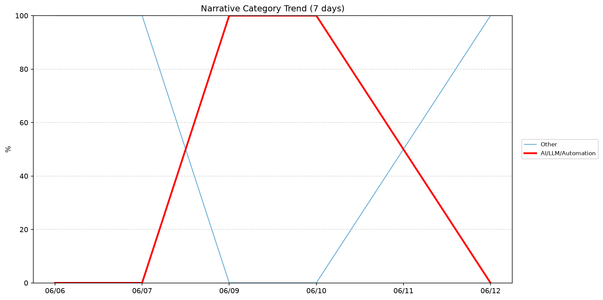
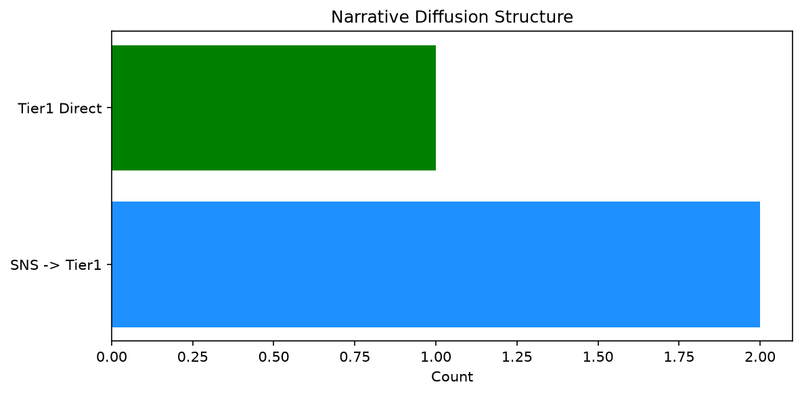

# 週次メタ分析レポート - 2026-06-13

> 分析期間: 過去7日間

---

## ショックタイプ分布

| ショックタイプ | 件数 |
|----------------|------|
| ナラティブシフト | 4 |
| テクノロジーショック | 2 |
| 業績シグナル | 2 |

---

## ナラティブ推移

### 2026-06-06
- その他: 100%

### 2026-06-07
- その他: 100%

### 2026-06-09
- AI/LLM/自動化: 100%

### 2026-06-10
- AI/LLM/自動化: 100%

### 2026-06-11
- その他: 50%
- AI/LLM/自動化: 50%

### 2026-06-12
- その他: 100%

---

## ナラティブ伝播構造

| 伝播パターン | 件数 |
|--------------|------|
| カバレッジなし | 5 |
| SNS→Tier1 | 2 |
| Tier1直接 | 1 |

---

## 過熱警告事後検証

> ※ "過熱警告を出したか"と"AI偏重が実際に続いたか"の検証

| 指標 | 値 |
|------|-----|
| 検証対象数 | 7 |
| 正警告（TP） | 0 |
| 過剰警告（FP） | 0 |
| 正常判定（TN） | 4 |
| 見逃し（FN） | 3 |
| Recall | 0.0% |

- **2026-06-06**: 正常判定 — No overheat and conditions normal: ai_continued=True, price_sustained=True.
- **2026-06-07**: 見逃し — Missed overheat: AI events continued without price backing. An alert should have been raised.
- **2026-06-08**: 見逃し — Missed overheat: AI events continued without price backing. An alert should have been raised.
- **2026-06-09**: 見逃し — Missed overheat: AI events continued without price backing. An alert should have been raised.
- **2026-06-10**: 正常判定 — No overheat and conditions normal: ai_continued=False, price_sustained=False.
- **2026-06-11**: 正常判定 — No overheat and conditions normal: ai_continued=False, price_sustained=False.
- **2026-06-12**: 正常判定 — No overheat and conditions normal: ai_continued=False, price_sustained=False.

---

## 非AIハイライト（週次）

### 1. LMT
- **サマリー**: 前日比+4.51%の価格変動
- **スコア**: 0.20
- **ナラティブ分類**: その他
- **ショックタイプ**: 業績シグナル
- **AI関連度**: 0%

### 2. NVDA
- **サマリー**: 出来高が平均の0.62倍
- **スコア**: 0.18
- **ナラティブ分類**: その他
- **ショックタイプ**: ナラティブシフト
- **AI関連度**: 0%

### 3. UNH
- **サマリー**: 出来高が平均の1.67倍
- **スコア**: 0.15
- **ナラティブ分類**: その他
- **ショックタイプ**: ナラティブシフト
- **AI関連度**: 0%

### 4. UNH
- **サマリー**: 出来高が平均の1.64倍
- **スコア**: 0.15
- **ナラティブ分類**: その他
- **ショックタイプ**: ナラティブシフト
- **AI関連度**: 0%

### 5. NET
- **サマリー**: 前日比-6.9%の価格変動
- **スコア**: 0.15
- **ナラティブ分類**: その他
- **ショックタイプ**: 業績シグナル
- **AI関連度**: 0%

---

## 構造持続確率 Top3

| 順位 | 銘柄 | SPP | ショックタイプ | 伝播パターン | サマリー |
|------|------|-----|----------------|--------------|----------|
| 1 | LMT | 0.65 | 業績シグナル | なし | 前日比+4.51%の価格変動 |
| 2 | NET | 0.60 | 業績シグナル | なし | 前日比-6.9%の価格変動 |
| 3 | UNH | 0.54 | ナラティブシフト | なし | 出来高が平均の1.67倍 |

---

## イベント持続性

| 銘柄 | 出現日数/観測日数 | SPP推移 | 最新SPP |
|------|------------------|---------|---------|
| UNH | 2/6日 | 横ばい | 0.54 |
| GOOGL | 2/6日 | 横ばい | 0.49 |
| LMT | 1/6日 | 横ばい | 0.65 |
| NET | 1/6日 | 横ばい | 0.60 |
| JPM | 1/6日 | 横ばい | 0.48 |
| NVDA | 1/6日 | 横ばい | 0.45 |

---

## 転換点候補

転換点候補は検出されませんでした。

---

## 組織インパクト仮説

### 1. 今週の構造変化は「ナラティブシフト」に集中（50%）。この領域の専門知識・人材の重要性が高まっている可能性。
- **根拠**: ショックタイプ分布: ナラティブシフトが4件

---

## 市場レジーム推移

| 日付 | レジーム | ボラティリティ | 下落比率 | 信頼度 |
|------|----------|---------------|----------|--------|
| 2026-06-12 | 高ボラ | 52.4% | 40% | 82% |
| 2026-06-11 | 高ボラ | 52.8% | 40% | 82% |
| 2026-06-10 | 高ボラ | 52.6% | 33% | 90% |
| 2026-06-09 | 高ボラ | 53.3% | 40% | 82% |
| 2026-06-08 | 高ボラ | 53.8% | 33% | 90% |
| 2026-06-07 | 高ボラ | 54.1% | 27% | 98% |
| 2026-06-06 | 高ボラ | 56.8% | 40% | 82% |

---

## 前週比較

> 比較期間: 2026-05-30〜2026-06-06 (8日分)

**イベント件数**: 今週 8 件 / 前週 52 件（差分 -44）

**支配的レジーム**: 高ボラ（変化なし）

### ショックタイプ増減

| ショックタイプ | 今週 | 前週 | 差分 |
|----------------|------|------|------|
| テクノロジーショック | 2 | 15 | -13 |
| ナラティブシフト | 4 | 24 | -20 |
| 業績シグナル | 2 | 13 | -11 |

### ナラティブ比率変化

| カテゴリ | 今週平均 | 前週平均 | 差分(pt) |
|----------|----------|----------|----------|
| AI/LLM/自動化 | 42% | 32% | +10 |
| その他 | 58% | 54% | +5 |
| ガバナンス/経営 | 0% | 1% | -1 |
| 半導体/供給網 | 0% | 6% | -6 |
| 社会/労働/教育 | 0% | 3% | -3 |
| 規制/政策/地政学 | 0% | 4% | -4 |

---

## レジーム・ナラティブ同時変動

> ※ 同時期の観測であり、因果関係を示すものではありません

- **2026-06-07**: レジーム異常（高ボラ）と「その他」ナラティブ集中（100%）が共起
- **2026-06-09**: レジーム異常（高ボラ）と「AI/LLM/自動化」ナラティブ集中（100%）が共起
- **2026-06-10**: レジーム異常（高ボラ）と「AI/LLM/自動化」ナラティブ集中（100%）が共起
- **2026-06-12**: レジーム異常（高ボラ）と「その他」ナラティブ集中（100%）が共起

---

## 来週の監視比重提案

### 1. 「規制/政策/地政学」の監視比重を維持・注視
- **根拠**: 週平均ナラティブ比率0%と低く、イベント未検出だが、構造的に重要なカテゴリのため意図的な監視継続を推奨。
- **週平均ナラティブ比率**: 0%

### 2. 「金融/金利/流動性」の監視比重を維持・注視
- **根拠**: 週平均ナラティブ比率0%と低く、イベント未検出だが、構造的に重要なカテゴリのため意図的な監視継続を推奨。
- **週平均ナラティブ比率**: 0%

### 3. 「エネルギー/資源」の監視比重を維持・注視
- **根拠**: 週平均ナラティブ比率0%と低く、イベント未検出だが、構造的に重要なカテゴリのため意図的な監視継続を推奨。
- **週平均ナラティブ比率**: 0%

### 4. 「その他」の過集中に注意
- **根拠**: 週平均ナラティブ比率58%と高く、他カテゴリの構造変化を見落とすリスクがあります。
- **週平均ナラティブ比率**: 58%
- **⚡ 急変フラグ**: 直近100%へ急変 — 動向注視を推奨

### 5. 「AI/LLM/自動化」の過集中に注意
- **根拠**: 週平均ナラティブ比率42%と高く、他カテゴリの構造変化を見落とすリスクがあります。
- **週平均ナラティブ比率**: 42%
- **⚡ 急変フラグ**: 直近0%へ急変 — 動向注視を推奨

---

*レポート生成日時: 2026-06-13 03:38:38*
