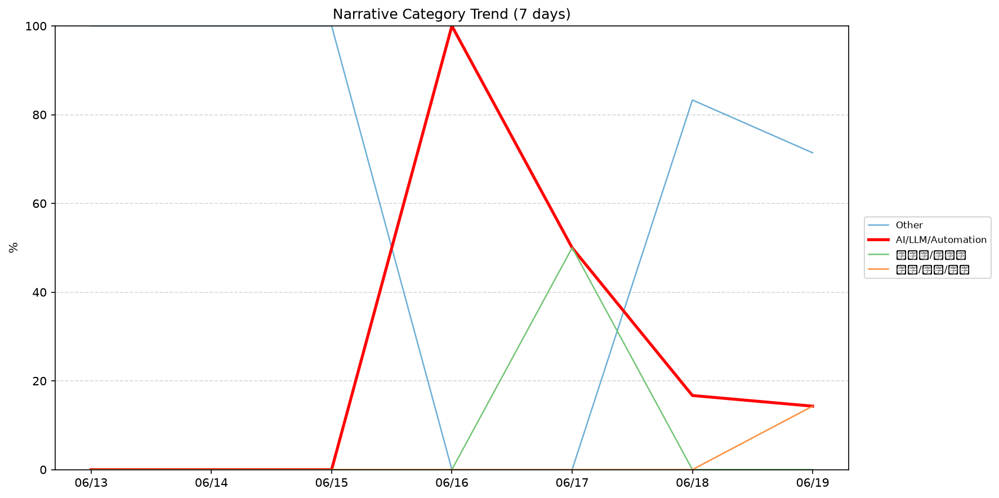
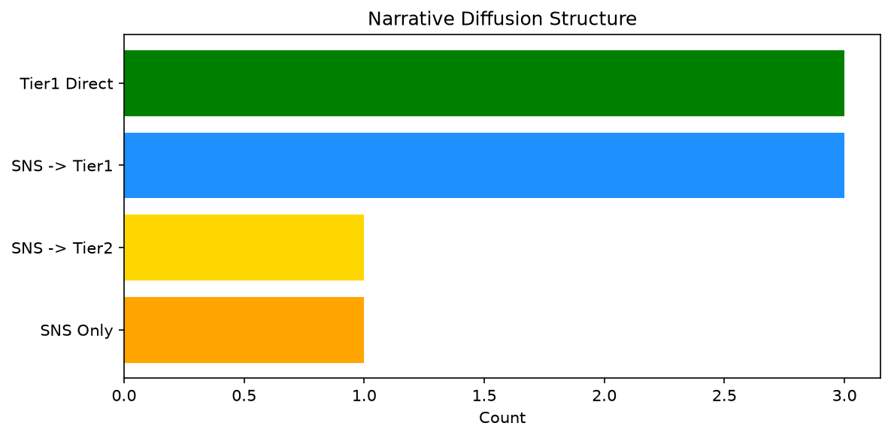

# 週次メタ分析レポート - 2026-06-20

> 分析期間: 過去7日間

---

## ショックタイプ分布

| ショックタイプ | 件数 |
|----------------|------|
| ナラティブシフト | 17 |
| テクノロジーショック | 3 |
| ビジネスモデルショック | 1 |

---

## ナラティブ推移

### 2026-06-13
- その他: 100%

### 2026-06-14
- その他: 100%

### 2026-06-15
- その他: 100%

### 2026-06-16
- AI/LLM/自動化: 100%

### 2026-06-17
- 半導体/供給網: 50%
- AI/LLM/自動化: 50%

### 2026-06-18
- その他: 83%
- AI/LLM/自動化: 17%

### 2026-06-19
- その他: 71%
- 社会/労働/教育: 14%
- AI/LLM/自動化: 14%

---

## ナラティブ伝播構造

| 伝播パターン | 件数 |
|--------------|------|
| カバレッジなし | 13 |
| SNS→Tier1 | 3 |
| SNSのみ | 1 |
| Tier1直接 | 3 |
| SNS→Tier2 | 1 |

---

## 過熱警告事後検証

> ※ "過熱警告を出したか"と"AI偏重が実際に続いたか"の検証

| 指標 | 値 |
|------|-----|
| 検証対象数 | 7 |
| 正警告（TP） | 0 |
| 過剰警告（FP） | 0 |
| 正常判定（TN） | 7 |
| 見逃し（FN） | 0 |

- **2026-06-13**: 正常判定 — No overheat and conditions normal: ai_continued=False, price_sustained=True.
- **2026-06-14**: 正常判定 — No overheat and conditions normal: ai_continued=True, price_sustained=True.
- **2026-06-15**: 正常判定 — No overheat and conditions normal: ai_continued=False, price_sustained=True.
- **2026-06-16**: 正常判定 — No overheat and conditions normal: ai_continued=False, price_sustained=False.
- **2026-06-17**: 正常判定 — No overheat and conditions normal: ai_continued=False, price_sustained=True.
- **2026-06-18**: 正常判定 — No overheat and conditions normal: ai_continued=False, price_sustained=True.
- **2026-06-19**: 正常判定 — No overheat and conditions normal: ai_continued=False, price_sustained=False.

---

## 非AIハイライト（週次）

### 1. JPM
- **サマリー**: 出来高が平均の1.72倍
- **スコア**: 0.43
- **ナラティブ分類**: 半導体/供給網
- **ショックタイプ**: ナラティブシフト
- **AI関連度**: 9%

### 2. XOM
- **サマリー**: 出来高が平均の3.37倍
- **スコア**: 0.42
- **ナラティブ分類**: その他
- **ショックタイプ**: ナラティブシフト
- **AI関連度**: 0%

### 3. XOM
- **サマリー**: 出来高が平均の3.37倍
- **スコア**: 0.42
- **ナラティブ分類**: その他
- **ショックタイプ**: ナラティブシフト
- **AI関連度**: 0%

### 4. LMT
- **サマリー**: 出来高が平均の2.15倍
- **スコア**: 0.36
- **ナラティブ分類**: その他
- **ショックタイプ**: ナラティブシフト
- **AI関連度**: 0%

### 5. JPM
- **サマリー**: 出来高が平均の2.71倍
- **スコア**: 0.36
- **ナラティブ分類**: その他
- **ショックタイプ**: ナラティブシフト
- **AI関連度**: 0%

---

## 構造持続確率 Top3

| 順位 | 銘柄 | SPP | ショックタイプ | 伝播パターン | サマリー |
|------|------|-----|----------------|--------------|----------|
| 1 | NVDA | 0.79 | テクノロジーショック | SNS→Tier1 | 出来高が平均の1.49倍 |
| 2 | GOOGL | 0.59 | テクノロジーショック | SNS→Tier1 | 20件の言及（通常の3.4倍） |
| 3 | XOM | 0.50 | ナラティブシフト | なし | 出来高が平均の3.37倍 |

---

## イベント持続性

| 銘柄 | 出現日数/観測日数 | SPP推移 | 最新SPP |
|------|------------------|---------|---------|
| NVDA | 4/7日 | 上昇 | 0.79 |
| XOM | 4/7日 | 上昇 | 0.50 |
| JPM | 4/7日 | 上昇 | 0.50 |
| GOOGL | 2/7日 | 上昇 | 0.59 |
| LMT | 2/7日 | 横ばい | 0.42 |
| UNH | 2/7日 | 上昇 | 0.42 |
| NEE | 2/7日 | 上昇 | 0.41 |
| NET | 1/7日 | 横ばい | 0.15 |

---

## 転換点候補

転換点候補は検出されませんでした。

---

## 組織インパクト仮説

### 1. 今週の構造変化は「ナラティブシフト」に集中（81%）。この領域の専門知識・人材の重要性が高まっている可能性。
- **根拠**: ショックタイプ分布: ナラティブシフトが17件

### 2. NVDA（AI/LLM/自動化）: 出来高急増 + テクノロジーショック + 4日間持続 + 引き締め環境 → 構造的な市場関心の変化の可能性、SPP上昇中
- **根拠**: 出現: 4/7日, SPP推移: 上昇
- **根拠要素**:
- 出来高急増
- テクノロジーショック型
- ナラティブシフト型
- 4日間持続観測
- SPP上昇（0.67→0.79）
- 引き締めレジーム下
- 関連: Amazon hopes to challenge Nvidia more directly by selling its AI chips
- 関連: The AI trade could shift back in Nvidia's favor. Here's why
- **データ期間**: 2026-06-13〜2026-06-19 (7日間)
- **信頼度注記**: 観測データに基づく示唆であり、因果関係を示すものではありません

### 3. XOM（その他）: 出来高急増 + ナラティブシフト + 4日間持続 + 引き締め環境 → 構造的な市場関心の変化の可能性、SPP上昇中
- **根拠**: 出現: 4/7日, SPP推移: 上昇
- **根拠要素**:
- 出来高急増
- ナラティブシフト型
- 4日間持続観測
- SPP上昇（0.42→0.50）
- 引き締めレジーム下
- **データ期間**: 2026-06-13〜2026-06-19 (7日間)
- **信頼度注記**: 観測データに基づく示唆であり、因果関係を示すものではありません

### 4. JPM（その他）: 出来高急増・言及急増 + ビジネスモデルショック + 4日間持続 + 引き締め環境 → 構造的な市場関心の変化の可能性、SPP上昇中
- **根拠**: 出現: 4/7日, SPP推移: 上昇
- **根拠要素**:
- 出来高急増
- 言及急増
- ビジネスモデルショック型
- ナラティブシフト型
- 4日間持続観測
- SPP上昇（0.44→0.50）
- 引き締めレジーム下
- 関連: JPMorgan says clients should be 'aggressive buyers' of this chip stock
- 関連: This Chinese consumer stock could double if its global industrial pivot succeeds, JPMorgan says
- **データ期間**: 2026-06-13〜2026-06-19 (7日間)
- **信頼度注記**: 観測データに基づく示唆であり、因果関係を示すものではありません

---

## 市場レジーム推移

| 日付 | レジーム | ボラティリティ | 下落比率 | 信頼度 |
|------|----------|---------------|----------|--------|
| 2026-06-19 | 引き締め | 53.2% | 53% | 65% |
| 2026-06-18 | 引き締め | 52.5% | 60% | 76% |
| 2026-06-17 | 高ボラ | 52.2% | 47% | 74% |
| 2026-06-16 | 高ボラ | 53.0% | 47% | 74% |
| 2026-06-15 | 高ボラ | 53.8% | 40% | 82% |
| 2026-06-14 | 高ボラ | 53.7% | 40% | 82% |
| 2026-06-13 | 高ボラ | 53.2% | 40% | 82% |

---

## 前週比較

> 比較期間: 2026-06-06〜2026-06-13 (7日分)

**イベント件数**: 今週 21 件 / 前週 9 件（差分 +12）

**支配的レジーム**: 高ボラ（変化なし）

### ショックタイプ増減

| ショックタイプ | 今週 | 前週 | 差分 |
|----------------|------|------|------|
| テクノロジーショック | 3 | 2 | +1 |
| ナラティブシフト | 17 | 5 | +12 |
| ビジネスモデルショック | 1 | 0 | +1 |
| 業績シグナル | 0 | 2 | -2 |

### ナラティブ比率変化

| カテゴリ | 今週平均 | 前週平均 | 差分(pt) |
|----------|----------|----------|----------|
| AI/LLM/自動化 | 26% | 36% | -10 |
| その他 | 65% | 64% | +1 |
| 半導体/供給網 | 7% | 0% | +7 |
| 社会/労働/教育 | 2% | 0% | +2 |

---

## レジーム・ナラティブ同時変動

> ※ 同時期の観測であり、因果関係を示すものではありません

- **2026-06-14**: レジーム異常（高ボラ）と「その他」ナラティブ集中（100%）が共起
- **2026-06-15**: レジーム異常（高ボラ）と「その他」ナラティブ集中（100%）が共起
- **2026-06-16**: レジーム異常（高ボラ）と「AI/LLM/自動化」ナラティブ集中（100%）が共起
- **2026-06-18**: レジーム変化（高ボラ→引き締め）と「AI/LLM/自動化」の33pt減少が同時期に観測
- **2026-06-18**: レジーム変化（高ボラ→引き締め）と「その他」の83pt増加が同時期に観測
- **2026-06-18**: レジーム変化（高ボラ→引き締め）と「半導体/供給網」の50pt減少が同時期に観測
- **2026-06-18**: レジーム異常（引き締め）と「その他」ナラティブ集中（83%）が共起
- **2026-06-19**: レジーム異常（引き締め）と「その他」ナラティブ集中（71%）が共起

---

## 来週の監視比重提案

### 1. 「規制/政策/地政学」の監視比重を維持・注視
- **根拠**: 週平均ナラティブ比率0%と低く、イベント未検出だが、構造的に重要なカテゴリのため意図的な監視継続を推奨。
- **週平均ナラティブ比率**: 0%

### 2. 「金融/金利/流動性」の監視比重を維持・注視
- **根拠**: 週平均ナラティブ比率0%と低く、イベント未検出だが、構造的に重要なカテゴリのため意図的な監視継続を推奨。
- **週平均ナラティブ比率**: 0%

### 3. 「エネルギー/資源」の監視比重を維持・注視
- **根拠**: 週平均ナラティブ比率0%と低く、イベント未検出だが、構造的に重要なカテゴリのため意図的な監視継続を推奨。
- **週平均ナラティブ比率**: 0%

### 4. 「社会/労働/教育」の監視比重を引き上げ
- **根拠**: 週平均ナラティブ比率2%と低いが、過去7日で1件のイベントが検出されており、見落としリスクがあります。
- **週平均ナラティブ比率**: 2%

### 5. 「その他」の過集中に注意
- **根拠**: 週平均ナラティブ比率65%と高く、他カテゴリの構造変化を見落とすリスクがあります。
- **週平均ナラティブ比率**: 65%

### 6. 「AI/LLM/自動化」の過集中に注意
- **根拠**: 週平均ナラティブ比率26%と高く、他カテゴリの構造変化を見落とすリスクがあります。
- **週平均ナラティブ比率**: 26%

---

*レポート生成日時: 2026-06-20 03:36:18*
