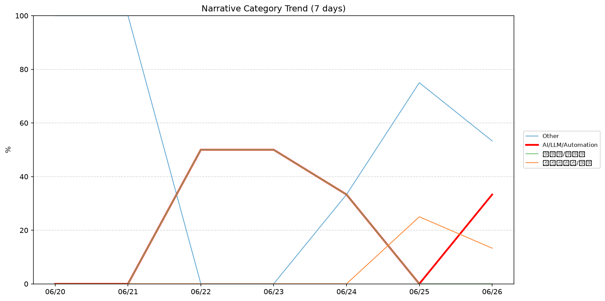
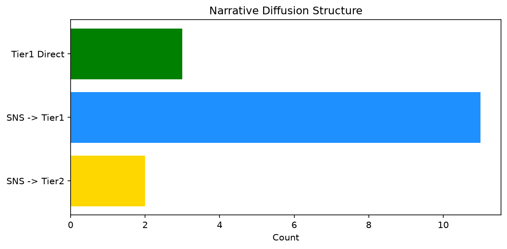

# 週次メタ分析レポート - 2026-06-27

> 分析期間: 過去7日間

---

## ショックタイプ分布

| ショックタイプ | 件数 |
|----------------|------|
| ナラティブシフト | 27 |
| 業績シグナル | 6 |
| テクノロジーショック | 4 |

---

## ナラティブ推移

### 2026-06-20
- その他: 100%

### 2026-06-21
- その他: 100%

### 2026-06-22
- AI/LLM/自動化: 50%
- 半導体/供給網: 50%

### 2026-06-23
- AI/LLM/自動化: 50%
- 半導体/供給網: 50%

### 2026-06-24
- その他: 33%
- 半導体/供給網: 33%
- AI/LLM/自動化: 33%

### 2026-06-25
- その他: 75%
- ガバナンス/経営: 25%

### 2026-06-26
- その他: 53%
- AI/LLM/自動化: 33%
- ガバナンス/経営: 13%

---

## ナラティブ伝播構造

| 伝播パターン | 件数 |
|--------------|------|
| SNS→Tier2 | 2 |
| SNS→Tier1 | 11 |
| カバレッジなし | 21 |
| Tier1直接 | 3 |

---

## 過熱警告事後検証

> ※ "過熱警告を出したか"と"AI偏重が実際に続いたか"の検証

| 指標 | 値 |
|------|-----|
| 検証対象数 | 7 |
| 正警告（TP） | 0 |
| 過剰警告（FP） | 0 |
| 正常判定（TN） | 6 |
| 見逃し（FN） | 1 |
| Recall | 0.0% |

- **2026-06-20**: 正常判定 — No overheat and conditions normal: ai_continued=False, price_sustained=True.
- **2026-06-21**: 見逃し — Missed overheat: AI events continued without price backing. An alert should have been raised.
- **2026-06-22**: 正常判定 — No overheat and conditions normal: ai_continued=False, price_sustained=False.
- **2026-06-23**: 正常判定 — No overheat and conditions normal: ai_continued=False, price_sustained=True.
- **2026-06-24**: 正常判定 — No overheat and conditions normal: ai_continued=False, price_sustained=True.
- **2026-06-25**: 正常判定 — No overheat and conditions normal: ai_continued=False, price_sustained=True.
- **2026-06-26**: 正常判定 — No overheat and conditions normal: ai_continued=False, price_sustained=False.

---

## 非AIハイライト（週次）

### 1. NVDA
- **サマリー**: 9件の言及（通常の5.1倍）
- **スコア**: 0.65
- **ナラティブ分類**: 半導体/供給網
- **ショックタイプ**: ナラティブシフト
- **AI関連度**: 27%

### 2. NVDA
- **サマリー**: 9件の言及（通常の4.4倍）
- **スコア**: 0.64
- **ナラティブ分類**: 半導体/供給網
- **ショックタイプ**: ナラティブシフト
- **AI関連度**: 27%

### 3. MSFT
- **サマリー**: 8件の言及（通常の2.9倍）
- **スコア**: 0.52
- **ナラティブ分類**: その他
- **ショックタイプ**: ナラティブシフト
- **AI関連度**: 2%

### 4. MSFT
- **サマリー**: 出来高が平均の1.65倍
- **スコア**: 0.52
- **ナラティブ分類**: その他
- **ショックタイプ**: ナラティブシフト
- **AI関連度**: 2%

### 5. SNOW
- **サマリー**: 出来高が平均の3.46倍
- **スコア**: 0.47
- **ナラティブ分類**: その他
- **ショックタイプ**: ナラティブシフト
- **AI関連度**: 0%

---

## 構造持続確率 Top3

| 順位 | 銘柄 | SPP | ショックタイプ | 伝播パターン | サマリー |
|------|------|-----|----------------|--------------|----------|
| 1 | JPM | 0.80 | ナラティブシフト | Tier1直接 | 出来高が平均の2.15倍 |
| 2 | NVDA | 0.72 | ナラティブシフト | SNS→Tier1 | 9件の言及（通常の5.1倍） |
| 3 | MSFT | 0.70 | ナラティブシフト | SNS→Tier1 | 出来高が平均の4.59倍 |

---

## イベント持続性

| 銘柄 | 出現日数/観測日数 | SPP推移 | 最新SPP |
|------|------------------|---------|---------|
| JPM | 4/7日 | 上昇 | 0.80 |
| NVDA | 4/7日 | 上昇 | 0.72 |
| GOOGL | 4/7日 | 上昇 | 0.61 |
| MSFT | 3/7日 | 上昇 | 0.70 |
| LMT | 3/7日 | 上昇 | 0.55 |
| PATH | 2/7日 | 上昇 | 0.65 |
| PLTR | 2/7日 | 上昇 | 0.64 |
| XOM | 2/7日 | 横ばい | 0.58 |
| UNH | 2/7日 | 横ばい | 0.46 |
| DDOG | 1/7日 | 横ばい | 0.59 |
| MDB | 1/7日 | 横ばい | 0.57 |
| NEE | 1/7日 | 横ばい | 0.45 |
| SNOW | 1/7日 | 横ばい | 0.42 |

---

## 転換点候補

転換点候補は検出されませんでした。

---

## 組織インパクト仮説

### 1. 今週の構造変化は「ナラティブシフト」に集中（73%）。この領域の専門知識・人材の重要性が高まっている可能性。
- **根拠**: ショックタイプ分布: ナラティブシフトが27件

### 2. JPM（その他）: 言及急増・出来高急増 + ナラティブシフト + 4日間持続 + 高ボラ環境 → 構造的な市場関心の変化の可能性、SPP上昇中
- **根拠**: 出現: 4/7日, SPP推移: 上昇
- **根拠要素**:
- 言及急増
- 出来高急増
- ナラティブシフト型
- 4日間持続観測
- SPP上昇（0.54→0.80）
- 高ボラレジーム下
- 関連: JPMorgan names Doug Petno and Troy Rohrbaugh co-presidents as longtime exec Marianne Lake exits
- 関連: JPMorgan Chase unveils $50 billion buyback, Goldman Sachs raises dividend after Fed stress test
- **データ期間**: 2026-06-20〜2026-06-26 (7日間)
- **信頼度注記**: 観測データに基づく示唆であり、因果関係を示すものではありません

### 3. NVDA（その他）: 出来高急増・言及急増 + ナラティブシフト + 4日間持続 + 高ボラ環境 → 構造的な市場関心の変化の可能性、SPP上昇中
- **根拠**: 出現: 4/7日, SPP推移: 上昇
- **根拠要素**:
- 出来高急増
- 言及急増
- ナラティブシフト型
- 4日間持続観測
- SPP上昇（0.49→0.72）
- 高ボラレジーム下
- 関連: Why everyone from OpenAI to SpaceX is building their own chips (and turning up the heat on Nvidia)
- 関連: Can Qualcomm actually compete with Nvidia? Inside its bold data-center gamble.
- **データ期間**: 2026-06-20〜2026-06-26 (7日間)
- **信頼度注記**: 観測データに基づく示唆であり、因果関係を示すものではありません

### 4. GOOGL（AI/LLM/自動化）: 言及急増・出来高急増 + ナラティブシフト + 4日間持続 + 高ボラ環境 → 構造的な市場関心の変化の可能性、SPP上昇中
- **根拠**: 出現: 4/7日, SPP推移: 上昇
- **根拠要素**:
- 言及急増
- 出来高急増
- ナラティブシフト型
- テクノロジーショック型
- 4日間持続観測
- SPP上昇（0.51→0.61）
- 高ボラレジーム下
- 関連: Google finally releases a Finance Android app, promises iOS version later in 2026
- 関連: Google Finance gets a dedicated app for Android
- **データ期間**: 2026-06-20〜2026-06-26 (7日間)
- **信頼度注記**: 観測データに基づく示唆であり、因果関係を示すものではありません

---

## 市場レジーム推移

| 日付 | レジーム | ボラティリティ | 下落比率 | 信頼度 |
|------|----------|---------------|----------|--------|
| 2026-06-26 | 高ボラ | 54.7% | 47% | 74% |
| 2026-06-25 | 引き締め | 53.2% | 60% | 76% |
| 2026-06-24 | 引き締め | 54.0% | 67% | 87% |
| 2026-06-23 | 引き締め | 55.0% | 60% | 76% |
| 2026-06-22 | 引き締め | 56.1% | 60% | 76% |
| 2026-06-21 | 引き締め | 55.6% | 53% | 65% |
| 2026-06-20 | 引き締め | 54.4% | 53% | 65% |

---

## 前週比較

> 比較期間: 2026-06-13〜2026-06-20 (8日分)

**イベント件数**: 今週 37 件 / 前週 27 件（差分 +10）

**支配的レジーム**: 高ボラ → 引き締め（変化あり）

### ショックタイプ増減

| ショックタイプ | 今週 | 前週 | 差分 |
|----------------|------|------|------|
| テクノロジーショック | 4 | 3 | +1 |
| ナラティブシフト | 27 | 23 | +4 |
| ビジネスモデルショック | 0 | 1 | -1 |
| 業績シグナル | 6 | 0 | +6 |

### ナラティブ比率変化

| カテゴリ | 今週平均 | 前週平均 | 差分(pt) |
|----------|----------|----------|----------|
| AI/LLM/自動化 | 24% | 23% | +1 |
| その他 | 52% | 69% | -18 |
| ガバナンス/経営 | 5% | 0% | +5 |
| 半導体/供給網 | 19% | 6% | +13 |
| 社会/労働/教育 | 0% | 2% | -2 |

---

## レジーム・ナラティブ同時変動

> ※ 同時期の観測であり、因果関係を示すものではありません

- **2026-06-21**: レジーム異常（引き締め）と「その他」ナラティブ集中（100%）が共起
- **2026-06-25**: レジーム異常（引き締め）と「その他」ナラティブ集中（75%）が共起
- **2026-06-26**: レジーム変化（引き締め→高ボラ）と「AI/LLM/自動化」の33pt増加が同時期に観測
- **2026-06-26**: レジーム変化（引き締め→高ボラ）と「その他」の22pt減少が同時期に観測
- **2026-06-26**: レジーム変化（引き締め→高ボラ）と「ガバナンス/経営」の12pt減少が同時期に観測

---

## 来週の監視比重提案

### 1. 「規制/政策/地政学」の監視比重を維持・注視
- **根拠**: 週平均ナラティブ比率0%と低く、イベント未検出だが、構造的に重要なカテゴリのため意図的な監視継続を推奨。
- **週平均ナラティブ比率**: 0%

### 2. 「金融/金利/流動性」の監視比重を維持・注視
- **根拠**: 週平均ナラティブ比率0%と低く、イベント未検出だが、構造的に重要なカテゴリのため意図的な監視継続を推奨。
- **週平均ナラティブ比率**: 0%

### 3. 「エネルギー/資源」の監視比重を維持・注視
- **根拠**: 週平均ナラティブ比率0%と低く、イベント未検出だが、構造的に重要なカテゴリのため意図的な監視継続を推奨。
- **週平均ナラティブ比率**: 0%

### 4. 「ガバナンス/経営」の監視比重を引き上げ
- **根拠**: 週平均ナラティブ比率5%と低いが、過去7日で3件のイベントが検出されており、見落としリスクがあります。
- **週平均ナラティブ比率**: 6%

### 5. 「その他」の過集中に注意
- **根拠**: 週平均ナラティブ比率52%と高く、他カテゴリの構造変化を見落とすリスクがあります。
- **週平均ナラティブ比率**: 52%

---

*レポート生成日時: 2026-06-27 03:22:22*
