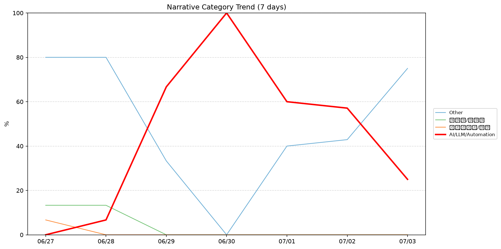
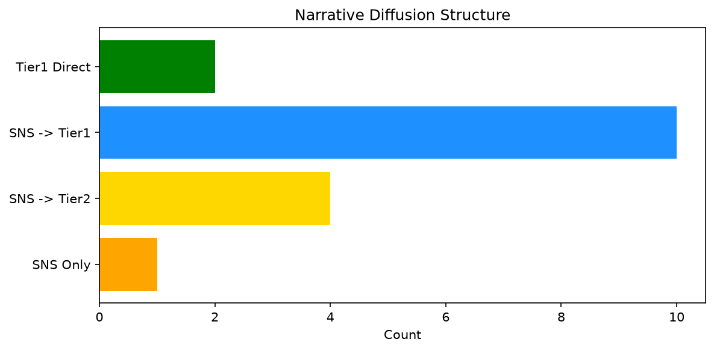

# 週次メタ分析レポート - 2026-07-04

> 分析期間: 過去7日間

---

## ショックタイプ分布

| ショックタイプ | 件数 |
|----------------|------|
| ナラティブシフト | 24 |
| 業績シグナル | 20 |
| テクノロジーショック | 6 |

---

## ナラティブ推移

### 2026-06-27
- その他: 80%
- 半導体/供給網: 13%
- ガバナンス/経営: 7%

### 2026-06-28
- その他: 80%
- 半導体/供給網: 13%
- AI/LLM/自動化: 7%

### 2026-06-29
- AI/LLM/自動化: 67%
- その他: 33%

### 2026-06-30
- AI/LLM/自動化: 100%

### 2026-07-01
- AI/LLM/自動化: 60%
- その他: 40%

### 2026-07-02
- AI/LLM/自動化: 57%
- その他: 43%

### 2026-07-03
- その他: 75%
- AI/LLM/自動化: 25%

---

## ナラティブ伝播構造

| 伝播パターン | 件数 |
|--------------|------|
| SNS→Tier1 | 10 |
| カバレッジなし | 33 |
| SNS→Tier2 | 4 |
| Tier1直接 | 2 |
| SNSのみ | 1 |

---

## 過熱警告事後検証

> ※ "過熱警告を出したか"と"AI偏重が実際に続いたか"の検証

| 指標 | 値 |
|------|-----|
| 検証対象数 | 7 |
| 正警告（TP） | 0 |
| 過剰警告（FP） | 0 |
| 正常判定（TN） | 5 |
| 見逃し（FN） | 2 |
| Recall | 0.0% |

- **2026-06-27**: 正常判定 — No overheat and conditions normal: ai_continued=False, price_sustained=True.
- **2026-06-28**: 正常判定 — No overheat and conditions normal: ai_continued=True, price_sustained=True.
- **2026-06-29**: 見逃し — Missed overheat: AI events continued without price backing. An alert should have been raised.
- **2026-06-30**: 見逃し — Missed overheat: AI events continued without price backing. An alert should have been raised.
- **2026-07-01**: 正常判定 — No overheat and conditions normal: ai_continued=True, price_sustained=True.
- **2026-07-02**: 正常判定 — No overheat and conditions normal: ai_continued=False, price_sustained=True.
- **2026-07-03**: 正常判定 — No overheat and conditions normal: ai_continued=False, price_sustained=False.

---

## 非AIハイライト（週次）

### 1. MSFT
- **サマリー**: 出来高が平均の4.66倍
- **スコア**: 0.72
- **ナラティブ分類**: 半導体/供給網
- **ショックタイプ**: ナラティブシフト
- **AI関連度**: 15%

### 2. GOOGL
- **サマリー**: 出来高が平均の3.06倍
- **スコア**: 0.57
- **ナラティブ分類**: ガバナンス/経営
- **ショックタイプ**: テクノロジーショック
- **AI関連度**: 1%

### 3. MSFT
- **サマリー**: 前日比+5.71%の価格変動
- **スコア**: 0.56
- **ナラティブ分類**: 半導体/供給網
- **ショックタイプ**: 業績シグナル
- **AI関連度**: 15%

### 4. SNOW
- **サマリー**: 出来高が平均の4.13倍
- **スコア**: 0.49
- **ナラティブ分類**: その他
- **ショックタイプ**: ナラティブシフト
- **AI関連度**: 0%

### 5. SNOW
- **サマリー**: 出来高が平均の3.86倍
- **スコア**: 0.49
- **ナラティブ分類**: その他
- **ショックタイプ**: ナラティブシフト
- **AI関連度**: 0%

---

## 構造持続確率 Top3

| 順位 | 銘柄 | SPP | ショックタイプ | 伝播パターン | サマリー |
|------|------|-----|----------------|--------------|----------|
| 1 | NEE | 0.63 | 業績シグナル | なし | 前日比+2.28%の価格変動 |
| 2 | MDB | 0.61 | 業績シグナル | なし | 前日比+7.7%の価格変動 |
| 3 | PATH | 0.61 | 業績シグナル | なし | 前日比+6.26%の価格変動 |

---

## イベント持続性

| 銘柄 | 出現日数/観測日数 | SPP推移 | 最新SPP |
|------|------------------|---------|---------|
| GOOGL | 5/7日 | 横ばい | 0.52 |
| PLTR | 4/7日 | 上昇 | 0.59 |
| MSFT | 4/7日 | 下降 | 0.56 |
| NET | 4/7日 | 上昇 | 0.35 |
| NEE | 3/7日 | 上昇 | 0.63 |
| MDB | 3/7日 | 上昇 | 0.61 |
| PATH | 3/7日 | 横ばい | 0.61 |
| DDOG | 2/7日 | 上昇 | 0.60 |
| LMT | 2/7日 | 横ばい | 0.50 |
| JPM | 2/7日 | 横ばい | 0.50 |
| CRWD | 2/7日 | 上昇 | 0.45 |
| SNOW | 2/7日 | 横ばい | 0.42 |

---

## 転換点候補

- 「その他」が2026-06-28→2026-06-29で47ポイント下降（80% → 33%）
- 「AI/LLM/自動化」が2026-06-28→2026-06-29で60ポイント上昇（7% → 67%）

---

## 組織インパクト仮説

### 1. 今週の構造変化は「ナラティブシフト」に集中（48%）。この領域の専門知識・人材の重要性が高まっている可能性。
- **根拠**: ショックタイプ分布: ナラティブシフトが24件

### 2. 「その他」ナラティブの下降は、市場の関心が他分野に移行中であることを示唆。この分野の見落としリスクに注意が必要です。
- **根拠**: 「その他」が2026-06-28→2026-06-29で47ポイント下降（80% → 33%）

### 3. 「AI/LLM/自動化」ナラティブの急上昇は、この分野への注目シフトを示唆。関連するリスク管理体制の見直しが必要かもしれません。
- **根拠**: 「AI/LLM/自動化」が2026-06-28→2026-06-29で60ポイント上昇（7% → 67%）

### 4. GOOGL（ガバナンス/経営）: 言及急増・出来高急増 + 業績シグナル + 5日間持続 + 高ボラ環境 → 構造的な市場関心の変化の可能性
- **根拠**: 出現: 5/7日, SPP推移: 横ばい
- **根拠要素**:
- 言及急増
- 出来高急増
- 価格変動
- 業績シグナル型
- ナラティブシフト型
- テクノロジーショック型
- 5日間持続観測
- SPP横ばい（0.52）
- 高ボラレジーム下
- 関連: A warning sign about AI’s real cost, courtesy of Google and Amazon
- 関連: Google loses long-running appeal of record EU fine, will have to cough up $4.7 billion
- **データ期間**: 2026-06-27〜2026-07-03 (7日間)
- **信頼度注記**: 観測データに基づく示唆であり、因果関係を示すものではありません

### 5. PLTR（その他）: 言及急増・出来高急増 + 業績シグナル + 4日間持続 + 高ボラ環境 → 構造的な市場関心の変化の可能性、SPP上昇中
- **根拠**: 出現: 4/7日, SPP推移: 上昇
- **根拠要素**:
- 言及急増
- 出来高急増
- 価格変動
- 業績シグナル型
- ナラティブシフト型
- テクノロジーショック型
- 4日間持続観測
- SPP上昇（0.41→0.59）
- 高ボラレジーム下
- 関連: Palantir's Karp bashes OpenAI, Anthropic token model: 'Something has gone completely wrong'
- **データ期間**: 2026-06-27〜2026-07-03 (7日間)
- **信頼度注記**: 観測データに基づく示唆であり、因果関係を示すものではありません

### 6. MSFT（半導体/供給網）: 言及急増・出来高急増 + 業績シグナル + 4日間持続 + 高ボラ環境 → 構造的な市場関心の変化の可能性、SPP下降中
- **根拠**: 出現: 4/7日, SPP推移: 下降
- **根拠要素**:
- 言及急増
- 出来高急増
- 価格変動
- 業績シグナル型
- ナラティブシフト型
- 4日間持続観測
- SPP下降（0.71→0.56）
- 高ボラレジーム下
- 関連: Microsoft launches its own AI deployment company with $2.5 billion commitment
- 関連: Microsoft commits $2.5 billion and 6,000 employees to new AI implementation unit
- **データ期間**: 2026-06-27〜2026-07-03 (7日間)
- **信頼度注記**: 観測データに基づく示唆であり、因果関係を示すものではありません

---

## 市場レジーム推移

| 日付 | レジーム | ボラティリティ | 下落比率 | 信頼度 |
|------|----------|---------------|----------|--------|
| 2026-07-03 | 高ボラ | 70.1% | 47% | 74% |
| 2026-07-02 | 引き締め | 70.5% | 73% | 97% |
| 2026-07-01 | 引き締め | 42.6% | 73% | 97% |
| 2026-06-30 | 引き締め | 41.8% | 80% | 100% |
| 2026-06-29 | 引き締め | 42.1% | 80% | 100% |
| 2026-06-28 | 引き締め | 48.5% | 80% | 100% |
| 2026-06-27 | 引き締め | 50.2% | 53% | 65% |

---

## 前週比較

> 比較期間: 2026-06-20〜2026-06-27 (8日分)

**イベント件数**: 今週 50 件 / 前週 52 件（差分 -2）

**支配的レジーム**: 引き締め（変化なし）

### ショックタイプ増減

| ショックタイプ | 今週 | 前週 | 差分 |
|----------------|------|------|------|
| テクノロジーショック | 6 | 5 | +1 |
| ナラティブシフト | 24 | 35 | -11 |
| 業績シグナル | 20 | 12 | +8 |

### ナラティブ比率変化

| カテゴリ | 今週平均 | 前週平均 | 差分(pt) |
|----------|----------|----------|----------|
| AI/LLM/自動化 | 45% | 21% | +24 |
| その他 | 50% | 55% | -5 |
| ガバナンス/経営 | 1% | 6% | -5 |
| 半導体/供給網 | 4% | 18% | -15 |

---

## レジーム・ナラティブ同時変動

> ※ 同時期の観測であり、因果関係を示すものではありません

- **2026-06-28**: レジーム異常（引き締め）と「その他」ナラティブ集中（80%）が共起
- **2026-06-29**: レジーム異常（引き締め）と「AI/LLM/自動化」ナラティブ集中（67%）が共起
- **2026-06-30**: レジーム異常（引き締め）と「AI/LLM/自動化」ナラティブ集中（100%）が共起
- **2026-07-03**: レジーム変化（引き締め→高ボラ）と「その他」の32pt増加が同時期に観測
- **2026-07-03**: レジーム変化（引き締め→高ボラ）と「AI/LLM/自動化」の32pt減少が同時期に観測
- **2026-07-03**: レジーム異常（高ボラ）と「その他」ナラティブ集中（75%）が共起

---

## 来週の監視比重提案

### 1. 「規制/政策/地政学」の監視比重を維持・注視
- **根拠**: 週平均ナラティブ比率0%と低く、イベント未検出だが、構造的に重要なカテゴリのため意図的な監視継続を推奨。
- **週平均ナラティブ比率**: 0%

### 2. 「金融/金利/流動性」の監視比重を維持・注視
- **根拠**: 週平均ナラティブ比率0%と低く、イベント未検出だが、構造的に重要なカテゴリのため意図的な監視継続を推奨。
- **週平均ナラティブ比率**: 0%

### 3. 「エネルギー/資源」の監視比重を維持・注視
- **根拠**: 週平均ナラティブ比率0%と低く、イベント未検出だが、構造的に重要なカテゴリのため意図的な監視継続を推奨。
- **週平均ナラティブ比率**: 0%

### 4. 「ガバナンス/経営」の監視比重を引き上げ
- **根拠**: 週平均ナラティブ比率1%と低いが、過去7日で1件のイベントが検出されており、見落としリスクがあります。
- **週平均ナラティブ比率**: 1%

### 5. 「半導体/供給網」の監視比重を引き上げ
- **根拠**: 週平均ナラティブ比率4%と低いが、過去7日で4件のイベントが検出されており、見落としリスクがあります。
- **週平均ナラティブ比率**: 4%

### 6. 「その他」の過集中に注意
- **根拠**: 週平均ナラティブ比率50%と高く、他カテゴリの構造変化を見落とすリスクがあります。
- **週平均ナラティブ比率**: 50%
- **⚡ 急変フラグ**: 直近75%へ急変 — 動向注視を推奨

### 7. 「AI/LLM/自動化」の過集中に注意
- **根拠**: 週平均ナラティブ比率45%と高く、他カテゴリの構造変化を見落とすリスクがあります。
- **週平均ナラティブ比率**: 45%
- **⚡ 急変フラグ**: 直近25%へ急変 — 動向注視を推奨

---

*レポート生成日時: 2026-07-04 02:49:29*
