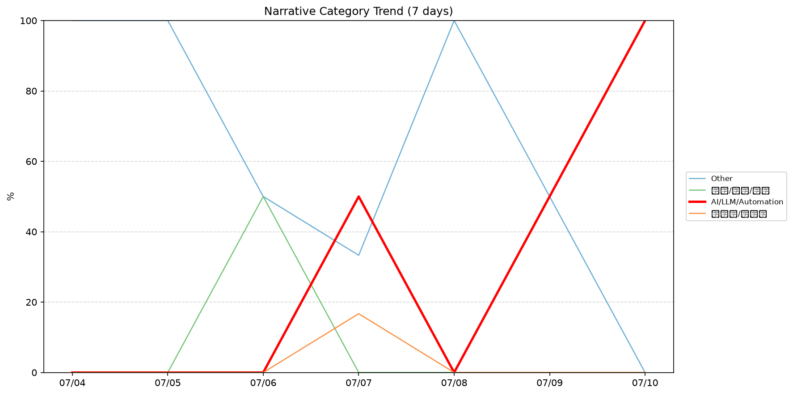
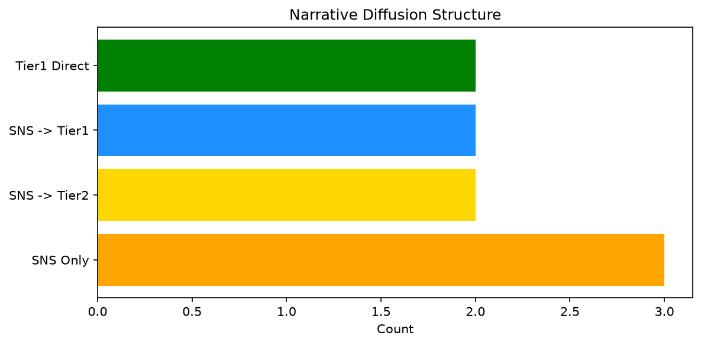

# 週次メタ分析レポート - 2026-07-11

> 分析期間: 過去7日間

---

## ショックタイプ分布

| ショックタイプ | 件数 |
|----------------|------|
| ナラティブシフト | 10 |
| 業績シグナル | 6 |
| テクノロジーショック | 3 |

---

## ナラティブ推移

### 2026-07-04
- その他: 100%

### 2026-07-05
- その他: 100%

### 2026-07-06
- その他: 50%
- 社会/労働/教育: 50%

### 2026-07-07
- AI/LLM/自動化: 50%
- その他: 33%
- 半導体/供給網: 17%

### 2026-07-08
- その他: 100%

### 2026-07-09
- その他: 50%
- AI/LLM/自動化: 50%

### 2026-07-10
- AI/LLM/自動化: 100%

---

## ナラティブ伝播構造

| 伝播パターン | 件数 |
|--------------|------|
| SNS→Tier2 | 2 |
| Tier1直接 | 2 |
| カバレッジなし | 10 |
| SNSのみ | 3 |
| SNS→Tier1 | 2 |

---

## 過熱警告事後検証

> ※ "過熱警告を出したか"と"AI偏重が実際に続いたか"の検証

| 指標 | 値 |
|------|-----|
| 検証対象数 | 7 |
| 正警告（TP） | 0 |
| 過剰警告（FP） | 0 |
| 正常判定（TN） | 4 |
| 見逃し（FN） | 3 |
| Recall | 0.0% |

- **2026-07-04**: 正常判定 — No overheat and conditions normal: ai_continued=False, price_sustained=True.
- **2026-07-05**: 正常判定 — No overheat and conditions normal: ai_continued=False, price_sustained=True.
- **2026-07-06**: 正常判定 — No overheat and conditions normal: ai_continued=True, price_sustained=True.
- **2026-07-07**: 見逃し — Missed overheat: AI events continued without price backing. An alert should have been raised.
- **2026-07-08**: 見逃し — Missed overheat: AI events continued without price backing. An alert should have been raised.
- **2026-07-09**: 見逃し — Missed overheat: AI events continued without price backing. An alert should have been raised.
- **2026-07-10**: 正常判定 — No overheat and conditions normal: ai_continued=False, price_sustained=False.

---

## 非AIハイライト（週次）

### 1. MSFT
- **サマリー**: 11件の言及（通常の3.9倍）
- **スコア**: 0.57
- **ナラティブ分類**: 社会/労働/教育
- **ショックタイプ**: ナラティブシフト
- **AI関連度**: 6%

### 2. NVDA
- **サマリー**: 6件の言及（通常の3.4倍）
- **スコア**: 0.44
- **ナラティブ分類**: 半導体/供給網
- **ショックタイプ**: ナラティブシフト
- **AI関連度**: 19%

### 3. CRWD
- **サマリー**: 出来高が平均の3.08倍
- **スコア**: 0.42
- **ナラティブ分類**: その他
- **ショックタイプ**: ナラティブシフト
- **AI関連度**: 0%

### 4. CRWD
- **サマリー**: 出来高が平均の3.02倍
- **スコア**: 0.42
- **ナラティブ分類**: その他
- **ショックタイプ**: ナラティブシフト
- **AI関連度**: 0%

### 5. CRWD
- **サマリー**: 前日比-74.9%の価格変動
- **スコア**: 0.34
- **ナラティブ分類**: その他
- **ショックタイプ**: 業績シグナル
- **AI関連度**: 0%

---

## 構造持続確率 Top3

| 順位 | 銘柄 | SPP | ショックタイプ | 伝播パターン | サマリー |
|------|------|-----|----------------|--------------|----------|
| 1 | NEE | 0.69 | 業績シグナル | なし | 前日比+2.28%の価格変動 |
| 2 | MSFT | 0.59 | テクノロジーショック | SNS→Tier1 | 18件の言及（通常の5.7倍） |
| 3 | XOM | 0.58 | 業績シグナル | なし | 前日比+3.85%の価格変動 |

---

## イベント持続性

| 銘柄 | 出現日数/観測日数 | SPP推移 | 最新SPP |
|------|------------------|---------|---------|
| CRWD | 4/7日 | 上昇 | 0.57 |
| NEE | 2/7日 | 上昇 | 0.69 |
| MSFT | 2/7日 | 上昇 | 0.59 |
| GOOGL | 2/7日 | 横ばい | 0.41 |
| NET | 2/7日 | 下降 | 0.28 |
| XOM | 1/7日 | 横ばい | 0.58 |
| NVDA | 1/7日 | 横ばい | 0.48 |
| JPM | 1/7日 | 横ばい | 0.43 |
| PATH | 1/7日 | 横ばい | 0.42 |

---

## 転換点候補

転換点候補は検出されませんでした。

---

## 組織インパクト仮説

### 1. 今週の構造変化は「ナラティブシフト」に集中（53%）。この領域の専門知識・人材の重要性が高まっている可能性。
- **根拠**: ショックタイプ分布: ナラティブシフトが10件

### 2. CRWD（その他）: 出来高急増・価格変動 + 業績シグナル + 4日間持続 + 高ボラ環境 → 構造的な市場関心の変化の可能性、SPP上昇中
- **根拠**: 出現: 4/7日, SPP推移: 上昇
- **根拠要素**:
- 出来高急増
- 価格変動
- 業績シグナル型
- ナラティブシフト型
- 4日間持続観測
- SPP上昇（0.42→0.57）
- 高ボラレジーム下
- **データ期間**: 2026-07-04〜2026-07-10 (7日間)
- **信頼度注記**: 観測データに基づく示唆であり、因果関係を示すものではありません

### 3. レジームが引き締め→高ボラに変化 — リスク管理基準の見直しを検討する契機
- **根拠**: 前週: 引き締め, 今週: 高ボラ
- **根拠要素**:
- 前週レジーム: 引き締め
- 今週レジーム: 高ボラ
- **データ期間**: 2026-07-04〜2026-07-10 (7日間)
- **信頼度注記**: 観測データに基づく示唆であり、因果関係を示すものではありません

---

## 市場レジーム推移

| 日付 | レジーム | ボラティリティ | 下落比率 | 信頼度 |
|------|----------|---------------|----------|--------|
| 2026-07-10 | 高ボラ | 68.5% | 40% | 82% |
| 2026-07-09 | 高ボラ | 68.5% | 47% | 74% |
| 2026-07-08 | 高ボラ | 68.9% | 40% | 82% |
| 2026-07-07 | 高ボラ | 70.1% | 33% | 90% |
| 2026-07-06 | 高ボラ | 71.0% | 40% | 82% |
| 2026-07-05 | 高ボラ | 71.0% | 47% | 74% |
| 2026-07-04 | 引き締め | 71.0% | 53% | 65% |

---

## 前週比較

> 比較期間: 2026-06-27〜2026-07-04 (8日分)

**イベント件数**: 今週 19 件 / 前週 53 件（差分 -34）

**支配的レジーム**: 引き締め → 高ボラ（変化あり）

### ショックタイプ増減

| ショックタイプ | 今週 | 前週 | 差分 |
|----------------|------|------|------|
| テクノロジーショック | 3 | 6 | -3 |
| ナラティブシフト | 10 | 25 | -15 |
| 業績シグナル | 6 | 22 | -16 |

### ナラティブ比率変化

| カテゴリ | 今週平均 | 前週平均 | 差分(pt) |
|----------|----------|----------|----------|
| AI/LLM/自動化 | 29% | 39% | -11 |
| その他 | 62% | 56% | +6 |
| ガバナンス/経営 | 0% | 1% | -1 |
| 半導体/供給網 | 2% | 3% | -1 |
| 社会/労働/教育 | 7% | 0% | +7 |

---

## レジーム・ナラティブ同時変動

> ※ 同時期の観測であり、因果関係を示すものではありません

- **2026-07-05**: レジーム異常（高ボラ）と「その他」ナラティブ集中（100%）が共起
- **2026-07-08**: レジーム異常（高ボラ）と「その他」ナラティブ集中（100%）が共起
- **2026-07-10**: レジーム異常（高ボラ）と「AI/LLM/自動化」ナラティブ集中（100%）が共起

---

## 来週の監視比重提案

### 1. 「規制/政策/地政学」の監視比重を維持・注視
- **根拠**: 週平均ナラティブ比率0%と低く、イベント未検出だが、構造的に重要なカテゴリのため意図的な監視継続を推奨。
- **週平均ナラティブ比率**: 0%

### 2. 「金融/金利/流動性」の監視比重を維持・注視
- **根拠**: 週平均ナラティブ比率0%と低く、イベント未検出だが、構造的に重要なカテゴリのため意図的な監視継続を推奨。
- **週平均ナラティブ比率**: 0%

### 3. 「エネルギー/資源」の監視比重を維持・注視
- **根拠**: 週平均ナラティブ比率0%と低く、イベント未検出だが、構造的に重要なカテゴリのため意図的な監視継続を推奨。
- **週平均ナラティブ比率**: 0%

### 4. 「半導体/供給網」の監視比重を引き上げ
- **根拠**: 週平均ナラティブ比率2%と低いが、過去7日で1件のイベントが検出されており、見落としリスクがあります。
- **週平均ナラティブ比率**: 2%

### 5. 「その他」の過集中に注意
- **根拠**: 週平均ナラティブ比率62%と高く、他カテゴリの構造変化を見落とすリスクがあります。
- **週平均ナラティブ比率**: 62%
- **⚡ 急変フラグ**: 直近0%へ急変 — 動向注視を推奨

### 6. 「AI/LLM/自動化」の過集中に注意
- **根拠**: 週平均ナラティブ比率29%と高く、他カテゴリの構造変化を見落とすリスクがあります。
- **週平均ナラティブ比率**: 29%
- **⚡ 急変フラグ**: 直近100%へ急変 — 動向注視を推奨

---

*レポート生成日時: 2026-07-11 02:33:26*
