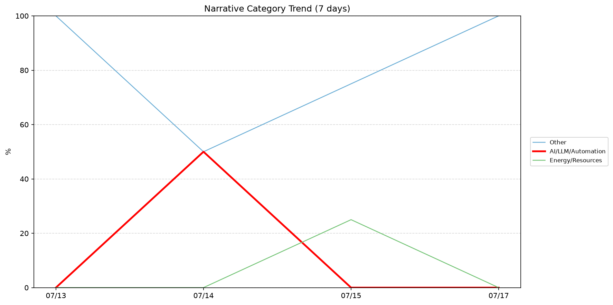
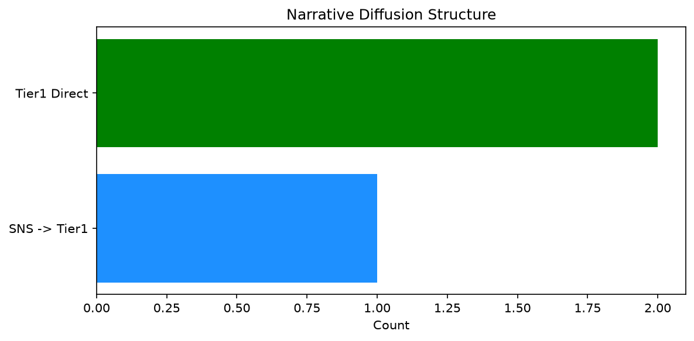

# 週次メタ分析レポート - 2026-07-18

> 分析期間: 過去7日間

---

## ショックタイプ分布

| ショックタイプ | 件数 |
|----------------|------|
| ナラティブシフト | 7 |
| テクノロジーショック | 1 |
| 業績シグナル | 1 |

---

## ナラティブ推移

### 2026-07-13
- その他: 100%

### 2026-07-14
- その他: 50%
- AI/LLM/自動化: 50%

### 2026-07-15
- その他: 75%
- エネルギー/資源: 25%

### 2026-07-17
- その他: 100%

---

## ナラティブ伝播構造

| 伝播パターン | 件数 |
|--------------|------|
| カバレッジなし | 6 |
| Tier1直接 | 2 |
| SNS→Tier1 | 1 |

---

## 過熱警告事後検証

> ※ "過熱警告を出したか"と"AI偏重が実際に続いたか"の検証

| 指標 | 値 |
|------|-----|
| 検証対象数 | 6 |
| 正警告（TP） | 0 |
| 過剰警告（FP） | 0 |
| 正常判定（TN） | 6 |
| 見逃し（FN） | 0 |

- **2026-07-11**: 正常判定 — No overheat and conditions normal: ai_continued=False, price_sustained=False.
- **2026-07-12**: 正常判定 — No overheat and conditions normal: ai_continued=False, price_sustained=False.
- **2026-07-13**: 正常判定 — No overheat and conditions normal: ai_continued=False, price_sustained=False.
- **2026-07-14**: 正常判定 — No overheat and conditions normal: ai_continued=False, price_sustained=False.
- **2026-07-15**: 正常判定 — No overheat and conditions normal: ai_continued=False, price_sustained=False.
- **2026-07-17**: 正常判定 — No overheat and conditions normal: ai_continued=False, price_sustained=False.

---

## 非AIハイライト（週次）

### 1. JPM
- **サマリー**: 5件の言及（通常の4.8倍）
- **スコア**: 0.42
- **ナラティブ分類**: その他
- **ショックタイプ**: ナラティブシフト
- **AI関連度**: 0%

### 2. GOOGL
- **サマリー**: 11件の言及（通常の1.8倍）
- **スコア**: 0.38
- **ナラティブ分類**: エネルギー/資源
- **ショックタイプ**: テクノロジーショック
- **AI関連度**: 4%

### 3. PATH
- **サマリー**: 出来高が平均の1.87倍
- **スコア**: 0.34
- **ナラティブ分類**: その他
- **ショックタイプ**: ナラティブシフト
- **AI関連度**: 0%

### 4. NEE
- **サマリー**: 出来高が平均の0.43倍
- **スコア**: 0.23
- **ナラティブ分類**: その他
- **ショックタイプ**: ナラティブシフト
- **AI関連度**: 0%

### 5. XOM
- **サマリー**: 前日比+4.05%の価格変動
- **スコア**: 0.23
- **ナラティブ分類**: その他
- **ショックタイプ**: 業績シグナル
- **AI関連度**: 0%

---

## 構造持続確率 Top3

| 順位 | 銘柄 | SPP | ショックタイプ | 伝播パターン | サマリー |
|------|------|-----|----------------|--------------|----------|
| 1 | XOM | 0.60 | 業績シグナル | なし | 前日比+4.05%の価格変動 |
| 2 | GOOGL | 0.52 | テクノロジーショック | SNS→Tier1 | 11件の言及（通常の1.8倍） |
| 3 | JPM | 0.48 | ナラティブシフト | Tier1直接 | 5件の言及（通常の4.8倍） |

---

## イベント持続性

| 銘柄 | 出現日数/観測日数 | SPP推移 | 最新SPP |
|------|------------------|---------|---------|
| JPM | 2/4日 | 横ばい | 0.48 |
| XOM | 1/4日 | 横ばい | 0.60 |
| GOOGL | 1/4日 | 横ばい | 0.52 |
| PATH | 1/4日 | 横ばい | 0.48 |
| CRWD | 1/4日 | 横ばい | 0.48 |
| PLTR | 1/4日 | 横ばい | 0.42 |
| NEE | 1/4日 | 横ばい | 0.42 |
| UNH | 1/4日 | 横ばい | 0.42 |

---

## 転換点候補

転換点候補は検出されませんでした。

---

## 組織インパクト仮説

### 1. 今週の構造変化は「ナラティブシフト」に集中（78%）。この領域の専門知識・人材の重要性が高まっている可能性。
- **根拠**: ショックタイプ分布: ナラティブシフトが7件

---

## 市場レジーム推移

| 日付 | レジーム | ボラティリティ | 下落比率 | 信頼度 |
|------|----------|---------------|----------|--------|
| 2026-07-17 | 高ボラ | 67.9% | 33% | 90% |
| 2026-07-15 | 高ボラ | 68.5% | 33% | 90% |
| 2026-07-14 | 高ボラ | 69.6% | 47% | 74% |
| 2026-07-13 | 高ボラ | 70.5% | 47% | 74% |
| 2026-07-12 | 高ボラ | 71.0% | 47% | 74% |
| 2026-07-11 | 高ボラ | 69.5% | 47% | 74% |

---

## 前週比較

> 比較期間: 2026-07-04〜2026-07-10 (7日分)

**イベント件数**: 今週 9 件 / 前週 19 件（差分 -10）

**支配的レジーム**: 高ボラ（変化なし）

### ショックタイプ増減

| ショックタイプ | 今週 | 前週 | 差分 |
|----------------|------|------|------|
| テクノロジーショック | 1 | 3 | -2 |
| ナラティブシフト | 7 | 10 | -3 |
| 業績シグナル | 1 | 6 | -5 |

### ナラティブ比率変化

| カテゴリ | 今週平均 | 前週平均 | 差分(pt) |
|----------|----------|----------|----------|
| AI/LLM/自動化 | 12% | 29% | -16 |
| その他 | 81% | 62% | +19 |
| エネルギー/資源 | 6% | 0% | +6 |
| 半導体/供給網 | 0% | 2% | -2 |
| 社会/労働/教育 | 0% | 7% | -7 |

---

## レジーム・ナラティブ同時変動

> ※ 同時期の観測であり、因果関係を示すものではありません

- **2026-07-15**: レジーム異常（高ボラ）と「その他」ナラティブ集中（75%）が共起
- **2026-07-17**: レジーム異常（高ボラ）と「その他」ナラティブ集中（100%）が共起

---

## 来週の監視比重提案

### 1. 「規制/政策/地政学」の監視比重を維持・注視
- **根拠**: 週平均ナラティブ比率0%と低く、イベント未検出だが、構造的に重要なカテゴリのため意図的な監視継続を推奨。
- **週平均ナラティブ比率**: 0%

### 2. 「金融/金利/流動性」の監視比重を維持・注視
- **根拠**: 週平均ナラティブ比率0%と低く、イベント未検出だが、構造的に重要なカテゴリのため意図的な監視継続を推奨。
- **週平均ナラティブ比率**: 0%

### 3. 「その他」の過集中に注意
- **根拠**: 週平均ナラティブ比率81%と高く、他カテゴリの構造変化を見落とすリスクがあります。
- **週平均ナラティブ比率**: 81%
- **⚡ 急変フラグ**: 直近100%へ急変 — 動向注視を推奨

---

*レポート生成日時: 2026-07-18 02:24:02*
