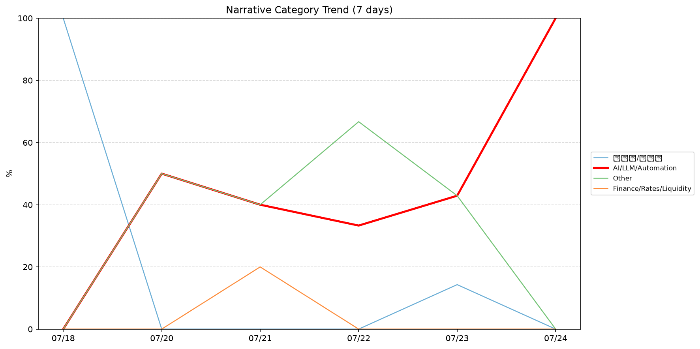
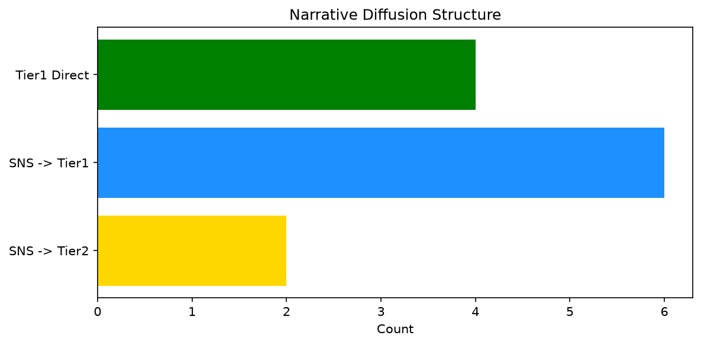

# 週次メタ分析レポート - 2026-07-25

> 分析期間: 過去7日間

---

## ショックタイプ分布

| ショックタイプ | 件数 |
|----------------|------|
| ナラティブシフト | 11 |
| 業績シグナル | 5 |
| テクノロジーショック | 3 |

---

## ナラティブ推移

### 2026-07-18
- 半導体/供給網: 100%

### 2026-07-20
- AI/LLM/自動化: 50%
- その他: 50%

### 2026-07-21
- その他: 40%
- AI/LLM/自動化: 40%
- 金融/金利/流動性: 20%

### 2026-07-22
- その他: 67%
- AI/LLM/自動化: 33%

### 2026-07-23
- その他: 43%
- AI/LLM/自動化: 43%
- 半導体/供給網: 14%

### 2026-07-24
- AI/LLM/自動化: 100%

---

## ナラティブ伝播構造

| 伝播パターン | 件数 |
|--------------|------|
| SNS→Tier1 | 6 |
| SNS→Tier2 | 2 |
| Tier1直接 | 4 |
| カバレッジなし | 7 |

---

## 過熱警告事後検証

> ※ "過熱警告を出したか"と"AI偏重が実際に続いたか"の検証

| 指標 | 値 |
|------|-----|
| 検証対象数 | 7 |
| 正警告（TP） | 0 |
| 過剰警告（FP） | 0 |
| 正常判定（TN） | 5 |
| 見逃し（FN） | 2 |
| Recall | 0.0% |

- **2026-07-18**: 見逃し — Missed overheat: AI events continued without price backing. An alert should have been raised.
- **2026-07-19**: 正常判定 — No overheat and conditions normal: ai_continued=False, price_sustained=False.
- **2026-07-20**: 正常判定 — No overheat and conditions normal: ai_continued=False, price_sustained=True.
- **2026-07-21**: 正常判定 — No overheat and conditions normal: ai_continued=True, price_sustained=True.
- **2026-07-22**: 正常判定 — No overheat and conditions normal: ai_continued=True, price_sustained=True.
- **2026-07-23**: 見逃し — Missed overheat: AI events continued without price backing. An alert should have been raised.
- **2026-07-24**: 正常判定 — No overheat and conditions normal: ai_continued=False, price_sustained=False.

---

## 非AIハイライト（週次）

### 1. NVDA
- **サマリー**: 6件の言及（通常の3.5倍）
- **スコア**: 0.60
- **ナラティブ分類**: 半導体/供給網
- **ショックタイプ**: ナラティブシフト
- **AI関連度**: 16%

### 2. GOOGL
- **サマリー**: 11件の言及（通常の1.9倍）
- **スコア**: 0.58
- **ナラティブ分類**: 半導体/供給網
- **ショックタイプ**: テクノロジーショック
- **AI関連度**: 12%

### 3. JPM
- **サマリー**: 7件の言及（通常の5.0倍）
- **スコア**: 0.56
- **ナラティブ分類**: 金融/金利/流動性
- **ショックタイプ**: ナラティブシフト
- **AI関連度**: 4%

### 4. MSFT
- **サマリー**: 7件の言及（通常の2.4倍）
- **スコア**: 0.45
- **ナラティブ分類**: その他
- **ショックタイプ**: テクノロジーショック
- **AI関連度**: 2%

### 5. LMT
- **サマリー**: 出来高が平均の3.76倍
- **スコア**: 0.42
- **ナラティブ分類**: その他
- **ショックタイプ**: ナラティブシフト
- **AI関連度**: 0%

---

## 構造持続確率 Top3

| 順位 | 銘柄 | SPP | ショックタイプ | 伝播パターン | サマリー |
|------|------|-----|----------------|--------------|----------|
| 1 | PATH | 0.73 | 業績シグナル | なし | 前日比-11.13%の価格変動 |
| 2 | PLTR | 0.64 | 業績シグナル | なし | 前日比-6.1%の価格変動 |
| 3 | UNH | 0.64 | 業績シグナル | なし | 前日比+3.51%の価格変動 |

---

## イベント持続性

| 銘柄 | 出現日数/観測日数 | SPP推移 | 最新SPP |
|------|------------------|---------|---------|
| GOOGL | 4/6日 | 上昇 | 0.59 |
| NVDA | 4/6日 | 下降 | 0.47 |
| PATH | 3/6日 | 上昇 | 0.73 |
| PLTR | 1/6日 | 横ばい | 0.64 |
| UNH | 1/6日 | 横ばい | 0.64 |
| JPM | 1/6日 | 横ばい | 0.52 |
| MSFT | 1/6日 | 横ばい | 0.47 |
| LMT | 1/6日 | 横ばい | 0.42 |

---

## 転換点候補

- 「AI/LLM/自動化」が2026-07-23→2026-07-24で57ポイント上昇（43% → 100%）

---

## 組織インパクト仮説

### 1. 今週の構造変化は「ナラティブシフト」に集中（58%）。この領域の専門知識・人材の重要性が高まっている可能性。
- **根拠**: ショックタイプ分布: ナラティブシフトが11件

### 2. 「AI/LLM/自動化」ナラティブの急上昇は、この分野への注目シフトを示唆。関連するリスク管理体制の見直しが必要かもしれません。
- **根拠**: 「AI/LLM/自動化」が2026-07-23→2026-07-24で57ポイント上昇（43% → 100%）

### 3. GOOGL（半導体/供給網）: 価格変動・言及急増 + 業績シグナル + 4日間持続 + 高ボラ環境 → 構造的な市場関心の変化の可能性、SPP上昇中
- **根拠**: 出現: 4/6日, SPP推移: 上昇
- **根拠要素**:
- 価格変動
- 言及急増
- 出来高急増
- 業績シグナル型
- ナラティブシフト型
- テクノロジーショック型
- 4日間持続観測
- SPP上昇（0.47→0.59）
- 高ボラレジーム下
- 関連: Moody's says 'unprecedented' AI spending threatens credit quality of Amazon, Meta, Alphabet and others
- 関連: Trump defends DOJ subpoenas of NY Times reporters; Google also was targeted
- **データ期間**: 2026-07-18〜2026-07-24 (6日間)
- **信頼度注記**: 観測データに基づく示唆であり、因果関係を示すものではありません

### 4. NVDA（半導体/供給網）: 言及急増・出来高急増 + ナラティブシフト + 4日間持続 + 高ボラ環境 → 構造的な市場関心の変化の可能性、SPP下降中
- **根拠**: 出現: 4/6日, SPP推移: 下降
- **根拠要素**:
- 言及急増
- 出来高急増
- ナラティブシフト型
- 4日間持続観測
- SPP下降（0.62→0.47）
- 高ボラレジーム下
- 関連: Nvidia, Microsoft, Meta warn against 'premature restrictions' of open-weight models
- 関連: AMD’s rivalry with Nvidia is increasingly moving into a new realm
- **データ期間**: 2026-07-18〜2026-07-24 (6日間)
- **信頼度注記**: 観測データに基づく示唆であり、因果関係を示すものではありません

### 5. PATH（その他）: 価格変動・出来高急増 + 業績シグナル + 3日間持続 + 高ボラ環境 → 構造的な市場関心の変化の可能性、SPP上昇中
- **根拠**: 出現: 3/6日, SPP推移: 上昇
- **根拠要素**:
- 価格変動
- 出来高急増
- 業績シグナル型
- ナラティブシフト型
- 3日間持続観測
- SPP上昇（0.48→0.73）
- 高ボラレジーム下
- **データ期間**: 2026-07-18〜2026-07-24 (6日間)
- **信頼度注記**: 観測データに基づく示唆であり、因果関係を示すものではありません

---

## 市場レジーム推移

| 日付 | レジーム | ボラティリティ | 下落比率 | 信頼度 |
|------|----------|---------------|----------|--------|
| 2026-07-24 | 高ボラ | 68.6% | 20% | 100% |
| 2026-07-23 | 高ボラ | 69.0% | 20% | 100% |
| 2026-07-22 | 高ボラ | 67.2% | 20% | 100% |
| 2026-07-21 | 高ボラ | 66.6% | 27% | 98% |
| 2026-07-20 | 高ボラ | 67.5% | 13% | 100% |
| 2026-07-19 | 高ボラ | 69.0% | 27% | 98% |
| 2026-07-18 | 高ボラ | 68.9% | 33% | 90% |

---

## 前週比較

> 比較期間: 2026-07-13〜2026-07-18 (5日分)

**イベント件数**: 今週 19 件 / 前週 10 件（差分 +9）

**支配的レジーム**: 高ボラ（変化なし）

### ショックタイプ増減

| ショックタイプ | 今週 | 前週 | 差分 |
|----------------|------|------|------|
| テクノロジーショック | 3 | 2 | +1 |
| ナラティブシフト | 11 | 7 | +4 |
| 業績シグナル | 5 | 1 | +4 |

### ナラティブ比率変化

| カテゴリ | 今週平均 | 前週平均 | 差分(pt) |
|----------|----------|----------|----------|
| AI/LLM/自動化 | 44% | 10% | +34 |
| その他 | 33% | 65% | -32 |
| エネルギー/資源 | 0% | 5% | -5 |
| 半導体/供給網 | 19% | 20% | -1 |
| 金融/金利/流動性 | 3% | 0% | +3 |

---

## レジーム・ナラティブ同時変動

> ※ 同時期の観測であり、因果関係を示すものではありません

- **2026-07-22**: レジーム異常（高ボラ）と「その他」ナラティブ集中（67%）が共起
- **2026-07-24**: レジーム異常（高ボラ）と「AI/LLM/自動化」ナラティブ集中（100%）が共起

---

## 来週の監視比重提案

### 1. 「規制/政策/地政学」の監視比重を維持・注視
- **根拠**: 週平均ナラティブ比率0%と低く、イベント未検出だが、構造的に重要なカテゴリのため意図的な監視継続を推奨。
- **週平均ナラティブ比率**: 0%

### 2. 「エネルギー/資源」の監視比重を維持・注視
- **根拠**: 週平均ナラティブ比率0%と低く、イベント未検出だが、構造的に重要なカテゴリのため意図的な監視継続を推奨。
- **週平均ナラティブ比率**: 0%

### 3. 「金融/金利/流動性」の監視比重を引き上げ
- **根拠**: 週平均ナラティブ比率3%と低いが、過去7日で1件のイベントが検出されており、見落としリスクがあります。
- **週平均ナラティブ比率**: 3%

### 4. 「AI/LLM/自動化」の過集中に注意
- **根拠**: 週平均ナラティブ比率44%と高く、他カテゴリの構造変化を見落とすリスクがあります。
- **週平均ナラティブ比率**: 44%
- **⚡ 急変フラグ**: 直近100%へ急変 — 動向注視を推奨

### 5. 「その他」の過集中に注意
- **根拠**: 週平均ナラティブ比率33%と高く、他カテゴリの構造変化を見落とすリスクがあります。
- **週平均ナラティブ比率**: 33%
- **⚡ 急変フラグ**: 直近0%へ急変 — 動向注視を推奨

---

*レポート生成日時: 2026-07-25 02:32:59*
