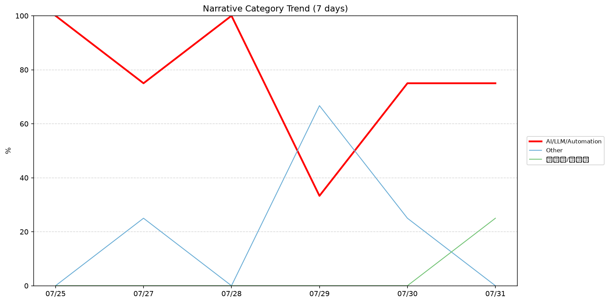
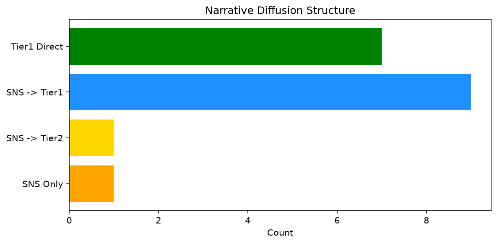

# 週次メタ分析レポート - 2026-08-01

> 分析期間: 過去7日間

---

## ショックタイプ分布

| ショックタイプ | 件数 |
|----------------|------|
| 業績シグナル | 12 |
| ナラティブシフト | 7 |
| テクノロジーショック | 3 |
| 規制ショック | 1 |

---

## ナラティブ推移

### 2026-07-25
- AI/LLM/自動化: 100%

### 2026-07-27
- AI/LLM/自動化: 75%
- その他: 25%

### 2026-07-28
- AI/LLM/自動化: 100%

### 2026-07-29
- その他: 67%
- AI/LLM/自動化: 33%

### 2026-07-30
- AI/LLM/自動化: 75%
- その他: 25%

### 2026-07-31
- AI/LLM/自動化: 75%
- 半導体/供給網: 25%

---

## ナラティブ伝播構造

| 伝播パターン | 件数 |
|--------------|------|
| SNS→Tier1 | 9 |
| SNSのみ | 1 |
| カバレッジなし | 5 |
| Tier1直接 | 7 |
| SNS→Tier2 | 1 |

---

## 過熱警告事後検証

> ※ "過熱警告を出したか"と"AI偏重が実際に続いたか"の検証

| 指標 | 値 |
|------|-----|
| 検証対象数 | 7 |
| 正警告（TP） | 0 |
| 過剰警告（FP） | 0 |
| 正常判定（TN） | 4 |
| 見逃し（FN） | 3 |
| Recall | 0.0% |

- **2026-07-25**: 正常判定 — No overheat and conditions normal: ai_continued=True, price_sustained=True.
- **2026-07-26**: 見逃し — Missed overheat: AI events continued without price backing. An alert should have been raised.
- **2026-07-27**: 見逃し — Missed overheat: AI events continued without price backing. An alert should have been raised.
- **2026-07-28**: 正常判定 — No overheat and conditions normal: ai_continued=True, price_sustained=True.
- **2026-07-29**: 正常判定 — No overheat and conditions normal: ai_continued=True, price_sustained=True.
- **2026-07-30**: 見逃し — Missed overheat: AI events continued without price backing. An alert should have been raised.
- **2026-07-31**: 正常判定 — No overheat and conditions normal: ai_continued=False, price_sustained=False.

---

## 非AIハイライト（週次）

### 1. NVDA
- **サマリー**: 5件の言及（通常の2.4倍）
- **スコア**: 0.51
- **ナラティブ分類**: 半導体/供給網
- **ショックタイプ**: テクノロジーショック
- **AI関連度**: 27%

### 2. SNOW
- **サマリー**: 出来高が平均の2.25倍
- **スコア**: 0.49
- **ナラティブ分類**: その他
- **ショックタイプ**: ナラティブシフト
- **AI関連度**: 0%

### 3. DDOG
- **サマリー**: 出来高が平均の1.75倍
- **スコア**: 0.34
- **ナラティブ分類**: その他
- **ショックタイプ**: ナラティブシフト
- **AI関連度**: 0%

### 4. JPM
- **サマリー**: 前日比-3.53%の価格変動
- **スコア**: 0.32
- **ナラティブ分類**: その他
- **ショックタイプ**: 業績シグナル
- **AI関連度**: 0%

### 5. SNOW
- **サマリー**: 前日比+4.64%の価格変動
- **スコア**: 0.29
- **ナラティブ分類**: その他
- **ショックタイプ**: 業績シグナル
- **AI関連度**: 0%

---

## 構造持続確率 Top3

| 順位 | 銘柄 | SPP | ショックタイプ | 伝播パターン | サマリー |
|------|------|-----|----------------|--------------|----------|
| 1 | JPM | 0.75 | 業績シグナル | Tier1直接 | 前日比-3.53%の価格変動 |
| 2 | PLTR | 0.65 | 業績シグナル | なし | 前日比+7.0%の価格変動 |
| 3 | SNOW | 0.64 | 業績シグナル | なし | 前日比+5.37%の価格変動 |

---

## イベント持続性

| 銘柄 | 出現日数/観測日数 | SPP推移 | 最新SPP |
|------|------------------|---------|---------|
| GOOGL | 4/6日 | 横ばい | 0.59 |
| MSFT | 4/6日 | 横ばい | 0.54 |
| NVDA | 4/6日 | 下降 | 0.38 |
| SNOW | 2/6日 | 上昇 | 0.64 |
| JPM | 1/6日 | 横ばい | 0.75 |
| PLTR | 1/6日 | 横ばい | 0.65 |
| DDOG | 1/6日 | 横ばい | 0.42 |

---

## 転換点候補

転換点候補は検出されませんでした。

---

## 組織インパクト仮説

### 1. 今週の構造変化は「業績シグナル」に集中（52%）。この領域の専門知識・人材の重要性が高まっている可能性。
- **根拠**: ショックタイプ分布: 業績シグナルが12件

### 2. GOOGL（AI/LLM/自動化）: 言及急増・価格変動 + 業績シグナル + 4日間持続 + 高ボラ環境 → 構造的な市場関心の変化の可能性
- **根拠**: 出現: 4/6日, SPP推移: 横ばい
- **根拠要素**:
- 言及急増
- 価格変動
- 業績シグナル型
- 規制ショック型
- テクノロジーショック型
- ナラティブシフト型
- 4日間持続観測
- SPP横ばい（0.59）
- 高ボラレジーム下
- 関連: Google plans to exempt sanctioned nations from Android developer verification
- 関連: Reddit keeps its strange DMCA fight over Google search results alive
- **データ期間**: 2026-07-25〜2026-07-31 (6日間)
- **信頼度注記**: 観測データに基づく示唆であり、因果関係を示すものではありません

### 3. MSFT（AI/LLM/自動化）: 出来高急増・言及急増 + 業績シグナル + 4日間持続 + 高ボラ環境 → 構造的な市場関心の変化の可能性
- **根拠**: 出現: 4/6日, SPP推移: 横ばい
- **根拠要素**:
- 出来高急増
- 言及急増
- 価格変動
- 業績シグナル型
- 4日間持続観測
- SPP横ばい（0.54）
- 高ボラレジーム下
- 関連: Alphabet, Amazon and Microsoft added nearly $1.5 trillion in combined value this week
- 関連: Microsoft shares are surging. Here’s how to still make money, says Mike Khouw
- **データ期間**: 2026-07-25〜2026-07-31 (6日間)
- **信頼度注記**: 観測データに基づく示唆であり、因果関係を示すものではありません

### 4. NVDA（AI/LLM/自動化）: 出来高急増・言及急増 + ナラティブシフト + 4日間持続 + 高ボラ環境 → 構造的な市場関心の変化の可能性、SPP下降中
- **根拠**: 出現: 4/6日, SPP推移: 下降
- **根拠要素**:
- 出来高急増
- 言及急増
- ナラティブシフト型
- テクノロジーショック型
- 4日間持続観測
- SPP下降（0.54→0.38）
- 高ボラレジーム下
- 関連: Did China build a top-tier AI model by itself? A new report suggests Nvidia chips played a role.
- 関連: Nvidia’s potential new deal with OpenAI would revive a spooky tech-bubble habit, analyst warns
- **データ期間**: 2026-07-25〜2026-07-31 (6日間)
- **信頼度注記**: 観測データに基づく示唆であり、因果関係を示すものではありません

---

## 市場レジーム推移

| 日付 | レジーム | ボラティリティ | 下落比率 | 信頼度 |
|------|----------|---------------|----------|--------|
| 2026-07-31 | 高ボラ | 68.6% | 33% | 90% |
| 2026-07-30 | 高ボラ | 69.1% | 27% | 98% |
| 2026-07-29 | 高ボラ | 66.8% | 33% | 90% |
| 2026-07-28 | 高ボラ | 67.0% | 20% | 100% |
| 2026-07-27 | 高ボラ | 68.0% | 27% | 98% |
| 2026-07-26 | 高ボラ | 67.8% | 27% | 98% |
| 2026-07-25 | 高ボラ | 69.4% | 13% | 100% |

---

## 前週比較

> 比較期間: 2026-07-18〜2026-07-25 (7日分)

**イベント件数**: 今週 23 件 / 前週 21 件（差分 +2）

**支配的レジーム**: 高ボラ（変化なし）

### ショックタイプ増減

| ショックタイプ | 今週 | 前週 | 差分 |
|----------------|------|------|------|
| テクノロジーショック | 3 | 3 | +0 |
| ナラティブシフト | 7 | 12 | -5 |
| 業績シグナル | 12 | 5 | +7 |
| 規制ショック | 1 | 1 | +0 |

### ナラティブ比率変化

| カテゴリ | 今週平均 | 前週平均 | 差分(pt) |
|----------|----------|----------|----------|
| AI/LLM/自動化 | 76% | 52% | +24 |
| その他 | 19% | 29% | -9 |
| 半導体/供給網 | 4% | 16% | -12 |
| 金融/金利/流動性 | 0% | 3% | -3 |

---

## レジーム・ナラティブ同時変動

> ※ 同時期の観測であり、因果関係を示すものではありません

- **2026-07-27**: レジーム異常（高ボラ）と「AI/LLM/自動化」ナラティブ集中（75%）が共起
- **2026-07-28**: レジーム異常（高ボラ）と「AI/LLM/自動化」ナラティブ集中（100%）が共起
- **2026-07-29**: レジーム異常（高ボラ）と「その他」ナラティブ集中（67%）が共起
- **2026-07-30**: レジーム異常（高ボラ）と「AI/LLM/自動化」ナラティブ集中（75%）が共起
- **2026-07-31**: レジーム異常（高ボラ）と「AI/LLM/自動化」ナラティブ集中（75%）が共起

---

## 来週の監視比重提案

### 1. 「規制/政策/地政学」の監視比重を維持・注視
- **根拠**: 週平均ナラティブ比率0%と低く、イベント未検出だが、構造的に重要なカテゴリのため意図的な監視継続を推奨。
- **週平均ナラティブ比率**: 0%

### 2. 「金融/金利/流動性」の監視比重を維持・注視
- **根拠**: 週平均ナラティブ比率0%と低く、イベント未検出だが、構造的に重要なカテゴリのため意図的な監視継続を推奨。
- **週平均ナラティブ比率**: 0%

### 3. 「エネルギー/資源」の監視比重を維持・注視
- **根拠**: 週平均ナラティブ比率0%と低く、イベント未検出だが、構造的に重要なカテゴリのため意図的な監視継続を推奨。
- **週平均ナラティブ比率**: 0%

### 4. 「半導体/供給網」の監視比重を引き上げ
- **根拠**: 週平均ナラティブ比率4%と低いが、過去7日で1件のイベントが検出されており、見落としリスクがあります。
- **週平均ナラティブ比率**: 4%
- **⚡ 急変フラグ**: 直近25%へ急変 — 動向注視を推奨

### 5. 「AI/LLM/自動化」の過集中に注意
- **根拠**: 週平均ナラティブ比率76%と高く、他カテゴリの構造変化を見落とすリスクがあります。
- **週平均ナラティブ比率**: 76%

---

*レポート生成日時: 2026-08-01 02:41:37*
