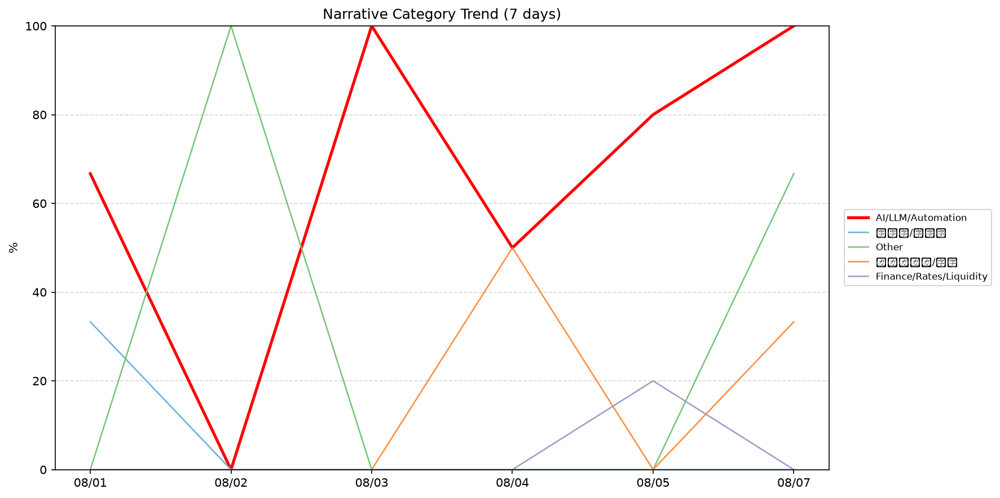
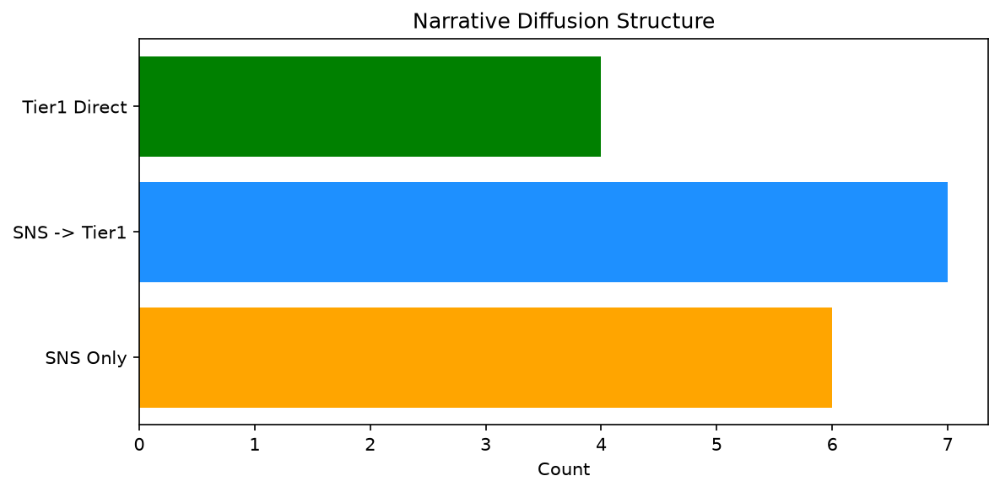

# 週次メタ分析レポート - 2026-08-08

> 分析期間: 過去7日間

---

## ショックタイプ分布

| ショックタイプ | 件数 |
|----------------|------|
| ナラティブシフト | 8 |
| 業績シグナル | 7 |
| テクノロジーショック | 6 |
| ビジネスモデルショック | 1 |

---

## ナラティブ推移

### 2026-08-01
- AI/LLM/自動化: 67%
- 半導体/供給網: 33%

### 2026-08-02
- その他: 100%

### 2026-08-03
- AI/LLM/自動化: 100%

### 2026-08-04
- AI/LLM/自動化: 50%
- ガバナンス/経営: 50%

### 2026-08-05
- AI/LLM/自動化: 80%
- 金融/金利/流動性: 20%

### 2026-08-07
- AI/LLM/自動化: 100%
- その他: 67%
- ガバナンス/経営: 33%

---

## ナラティブ伝播構造

| 伝播パターン | 件数 |
|--------------|------|
| カバレッジなし | 5 |
| SNSのみ | 6 |
| Tier1直接 | 4 |
| SNS→Tier1 | 7 |

---

## 過熱警告事後検証

> ※ "過熱警告を出したか"と"AI偏重が実際に続いたか"の検証

| 指標 | 値 |
|------|-----|
| 検証対象数 | 6 |
| 正警告（TP） | 1 |
| 過剰警告（FP） | 0 |
| 正常判定（TN） | 4 |
| 見逃し（FN） | 1 |
| Precision | 100.0% |
| Recall | 50.0% |

- **2026-08-01**: 正常判定 — No overheat and conditions normal: ai_continued=True, price_sustained=True.
- **2026-08-02**: 見逃し — Missed overheat: AI events continued without price backing. An alert should have been raised.
- **2026-08-03**: 正常判定 — No overheat and conditions normal: ai_continued=True, price_sustained=True.
- **2026-08-04**: 正常判定 — No overheat and conditions normal: ai_continued=True, price_sustained=True.
- **2026-08-05**: 正常判定 — No overheat and conditions normal: ai_continued=True, price_sustained=True.
- **2026-08-07**: 正警告 — Overheat correctly warned: AI narrative faded and price signals did not sustain. The alert was justified.

---

## 非AIハイライト（週次）

### 1. PLTR
- **サマリー**: 出来高が平均の5.1倍
- **スコア**: 0.57
- **ナラティブ分類**: ガバナンス/経営
- **ショックタイプ**: ナラティブシフト
- **AI関連度**: 4%

### 2. NVDA
- **サマリー**: 5件の言及（通常の2.4倍）
- **スコア**: 0.51
- **ナラティブ分類**: 半導体/供給網
- **ショックタイプ**: テクノロジーショック
- **AI関連度**: 27%

### 3. PLTR
- **サマリー**: 前日比+29.45%の価格変動
- **スコア**: 0.47
- **ナラティブ分類**: ガバナンス/経営
- **ショックタイプ**: 業績シグナル
- **AI関連度**: 4%

### 4. NEE
- **サマリー**: 出来高が平均の1.78倍
- **スコア**: 0.46
- **ナラティブ分類**: ガバナンス/経営
- **ショックタイプ**: ビジネスモデルショック
- **AI関連度**: 0%

### 5. DDOG
- **サマリー**: 出来高が平均の3.8倍
- **スコア**: 0.42
- **ナラティブ分類**: その他
- **ショックタイプ**: ナラティブシフト
- **AI関連度**: 0%

---

## 構造持続確率 Top3

| 順位 | 銘柄 | SPP | ショックタイプ | 伝播パターン | サマリー |
|------|------|-----|----------------|--------------|----------|
| 1 | NEE | 0.61 | ビジネスモデルショック | Tier1直接 | 出来高が平均の1.78倍 |
| 2 | NVDA | 0.56 | ナラティブシフト | SNS→Tier1 | 6件の言及（通常の2.6倍） |
| 3 | NET | 0.51 | テクノロジーショック | なし | 出来高が平均の2.82倍 |

---

## イベント持続性

| 銘柄 | 出現日数/観測日数 | SPP推移 | 最新SPP |
|------|------------------|---------|---------|
| GOOGL | 4/6日 | 下降 | 0.45 |
| NET | 3/6日 | 上昇 | 0.51 |
| PLTR | 3/6日 | 下降 | 0.32 |
| NVDA | 2/6日 | 上昇 | 0.56 |
| NEE | 1/6日 | 横ばい | 0.61 |
| JPM | 1/6日 | 横ばい | 0.47 |
| DDOG | 1/6日 | 横ばい | 0.42 |

---

## 転換点候補

転換点候補は検出されませんでした。

---

## 組織インパクト仮説

### 1. GOOGL（AI/LLM/自動化）: 言及急増・価格変動 + テクノロジーショック + 4日間持続 + 高ボラ環境 → 構造的な市場関心の変化の可能性、SPP下降中
- **根拠**: 出現: 4/6日, SPP推移: 下降
- **根拠要素**:
- 言及急増
- 価格変動
- テクノロジーショック型
- 業績シグナル型
- 4日間持続観測
- SPP下降（0.57→0.45）
- 高ボラレジーム下
- 関連: What&#8217;s behind the Google AI shake-up
- 関連: Remembering the pre-Google web, when search was an experiment
- **データ期間**: 2026-08-01〜2026-08-07 (6日間)
- **信頼度注記**: 観測データに基づく示唆であり、因果関係を示すものではありません

### 2. NET（AI/LLM/自動化）: 出来高急増・言及急増 + テクノロジーショック + 3日間持続 + 高ボラ環境 → 構造的な市場関心の変化の可能性、SPP上昇中
- **根拠**: 出現: 3/6日, SPP推移: 上昇
- **根拠要素**:
- 出来高急増
- 言及急増
- 価格変動
- テクノロジーショック型
- ナラティブシフト型
- 業績シグナル型
- 3日間持続観測
- SPP上昇（0.37→0.51）
- 高ボラレジーム下
- 関連: Cloudflare launches Kitesurf, a browser built for AI agents
- 関連: Cloudflare open-sources vibe-coding platform for people who aren't coders
- **データ期間**: 2026-08-01〜2026-08-07 (6日間)
- **信頼度注記**: 観測データに基づく示唆であり、因果関係を示すものではありません

### 3. PLTR（AI/LLM/自動化）: 出来高急増・言及急増 + ナラティブシフト + 3日間持続 + 高ボラ環境 → 構造的な市場関心の変化の可能性、SPP下降中
- **根拠**: 出現: 3/6日, SPP推移: 下降
- **根拠要素**:
- 出来高急増
- 言及急増
- 価格変動
- ナラティブシフト型
- 業績シグナル型
- 3日間持続観測
- SPP下降（0.54→0.32）
- 高ボラレジーム下
- 関連: Palantir’s stock stages best week since 2024 — showing it’s no longer an AI loser
- 関連: Palantir stock skyrockets 29%, narrowly missing its best day ever after 'otherworldly' results
- **データ期間**: 2026-08-01〜2026-08-07 (6日間)
- **信頼度注記**: 観測データに基づく示唆であり、因果関係を示すものではありません

---

## 市場レジーム推移

| 日付 | レジーム | ボラティリティ | 下落比率 | 信頼度 |
|------|----------|---------------|----------|--------|
| 2026-08-07 | 高ボラ | 48.5% | 27% | 98% |
| 2026-08-05 | 高ボラ | 45.4% | 20% | 100% |
| 2026-08-04 | 高ボラ | 45.8% | 13% | 100% |
| 2026-08-03 | 高ボラ | 41.7% | 20% | 100% |
| 2026-08-02 | 高ボラ | 41.4% | 40% | 82% |
| 2026-08-01 | 高ボラ | 40.8% | 40% | 82% |

---

## 前週比較

> 比較期間: 2026-07-25〜2026-08-01 (7日分)

**イベント件数**: 今週 22 件 / 前週 26 件（差分 -4）

**支配的レジーム**: 高ボラ（変化なし）

### ショックタイプ増減

| ショックタイプ | 今週 | 前週 | 差分 |
|----------------|------|------|------|
| テクノロジーショック | 6 | 6 | +0 |
| ナラティブシフト | 8 | 7 | +1 |
| ビジネスモデルショック | 1 | 0 | +1 |
| 業績シグナル | 7 | 12 | -5 |
| 規制ショック | 0 | 1 | -1 |

### ナラティブ比率変化

| カテゴリ | 今週平均 | 前週平均 | 差分(pt) |
|----------|----------|----------|----------|
| AI/LLM/自動化 | 66% | 75% | -9 |
| その他 | 28% | 17% | +11 |
| ガバナンス/経営 | 14% | 0% | +14 |
| 半導体/供給網 | 6% | 8% | -3 |
| 金融/金利/流動性 | 3% | 0% | +3 |

---

## レジーム・ナラティブ同時変動

> ※ 同時期の観測であり、因果関係を示すものではありません

- **2026-08-02**: レジーム異常（高ボラ）と「その他」ナラティブ集中（100%）が共起
- **2026-08-03**: レジーム異常（高ボラ）と「AI/LLM/自動化」ナラティブ集中（100%）が共起
- **2026-08-05**: レジーム異常（高ボラ）と「AI/LLM/自動化」ナラティブ集中（80%）が共起
- **2026-08-07**: レジーム異常（高ボラ）と「AI/LLM/自動化」ナラティブ集中（100%）が共起
- **2026-08-07**: レジーム異常（高ボラ）と「その他」ナラティブ集中（67%）が共起

---

## 来週の監視比重提案

### 1. 「規制/政策/地政学」の監視比重を維持・注視
- **根拠**: 週平均ナラティブ比率0%と低く、イベント未検出だが、構造的に重要なカテゴリのため意図的な監視継続を推奨。
- **週平均ナラティブ比率**: 0%

### 2. 「エネルギー/資源」の監視比重を維持・注視
- **根拠**: 週平均ナラティブ比率0%と低く、イベント未検出だが、構造的に重要なカテゴリのため意図的な監視継続を推奨。
- **週平均ナラティブ比率**: 0%

### 3. 「金融/金利/流動性」の監視比重を引き上げ
- **根拠**: 週平均ナラティブ比率3%と低いが、過去7日で1件のイベントが検出されており、見落としリスクがあります。
- **週平均ナラティブ比率**: 3%

### 4. 「半導体/供給網」の監視比重を引き上げ
- **根拠**: 週平均ナラティブ比率6%と低いが、過去7日で1件のイベントが検出されており、見落としリスクがあります。
- **週平均ナラティブ比率**: 6%

### 5. 「AI/LLM/自動化」の過集中に注意
- **根拠**: 週平均ナラティブ比率66%と高く、他カテゴリの構造変化を見落とすリスクがあります。
- **週平均ナラティブ比率**: 66%
- **⚡ 急変フラグ**: 直近100%へ急変 — 動向注視を推奨

### 6. 「その他」の過集中に注意
- **根拠**: 週平均ナラティブ比率28%と高く、他カテゴリの構造変化を見落とすリスクがあります。
- **週平均ナラティブ比率**: 28%
- **⚡ 急変フラグ**: 直近67%へ急変 — 動向注視を推奨

---

*レポート生成日時: 2026-08-08 01:26:26*
