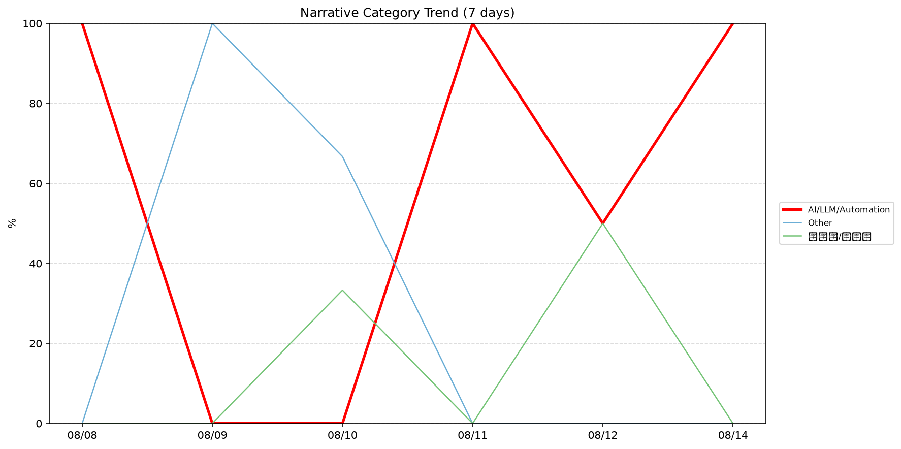
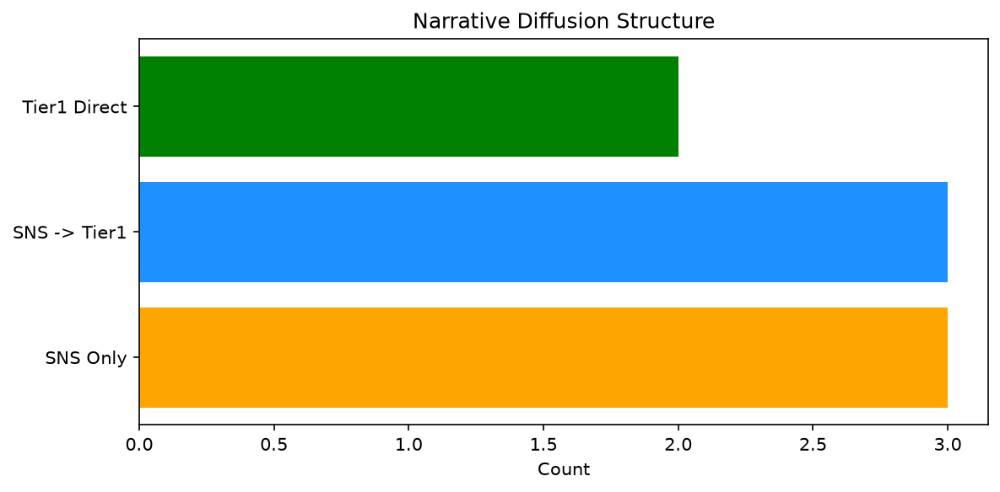

# 週次メタ分析レポート - 2026-08-15

> 分析期間: 過去7日間

---

## ショックタイプ分布

| ショックタイプ | 件数 |
|----------------|------|
| ナラティブシフト | 7 |
| テクノロジーショック | 4 |
| 業績シグナル | 1 |

---

## ナラティブ推移

### 2026-08-08
- AI/LLM/自動化: 100%

### 2026-08-09
- その他: 100%

### 2026-08-10
- その他: 67%
- 半導体/供給網: 33%

### 2026-08-11
- AI/LLM/自動化: 100%

### 2026-08-12
- AI/LLM/自動化: 50%
- 半導体/供給網: 50%

### 2026-08-14
- AI/LLM/自動化: 100%

---

## ナラティブ伝播構造

| 伝播パターン | 件数 |
|--------------|------|
| SNS→Tier1 | 3 |
| Tier1直接 | 2 |
| SNSのみ | 3 |
| カバレッジなし | 4 |

---

## 過熱警告事後検証

> ※ "過熱警告を出したか"と"AI偏重が実際に続いたか"の検証

| 指標 | 値 |
|------|-----|
| 検証対象数 | 7 |
| 正警告（TP） | 0 |
| 過剰警告（FP） | 1 |
| 正常判定（TN） | 3 |
| 見逃し（FN） | 3 |
| Precision | 0.0% |
| Recall | 0.0% |

- **2026-08-08**: 過剰警告 — Overheat alert with mixed follow-up: ai_continued=False, price_sustained=True. Classified as false positive (partial continuation).
- **2026-08-09**: 正常判定 — No overheat and conditions normal: ai_continued=False, price_sustained=True.
- **2026-08-10**: 見逃し — Missed overheat: AI events continued without price backing. An alert should have been raised.
- **2026-08-11**: 見逃し — Missed overheat: AI events continued without price backing. An alert should have been raised.
- **2026-08-12**: 正常判定 — No overheat and conditions normal: ai_continued=True, price_sustained=True.
- **2026-08-13**: 見逃し — Missed overheat: AI events continued without price backing. An alert should have been raised.
- **2026-08-14**: 正常判定 — No overheat and conditions normal: ai_continued=False, price_sustained=False.

---

## 非AIハイライト（週次）

### 1. NVDA
- **サマリー**: 10件の言及（通常の3.8倍）
- **スコア**: 0.62
- **ナラティブ分類**: 半導体/供給網
- **ショックタイプ**: テクノロジーショック
- **AI関連度**: 18%

### 2. NVDA
- **サマリー**: 6件の言及（通常の2.6倍）
- **スコア**: 0.40
- **ナラティブ分類**: 半導体/供給網
- **ショックタイプ**: ナラティブシフト
- **AI関連度**: 16%

### 3. NET
- **サマリー**: 出来高が平均の2.8倍
- **スコア**: 0.36
- **ナラティブ分類**: その他
- **ショックタイプ**: ナラティブシフト
- **AI関連度**: 0%

### 4. NET
- **サマリー**: 出来高が平均の2.05倍
- **スコア**: 0.26
- **ナラティブ分類**: その他
- **ショックタイプ**: ナラティブシフト
- **AI関連度**: 0%

### 5. XOM
- **サマリー**: 前日比+4.41%の価格変動
- **スコア**: 0.17
- **ナラティブ分類**: その他
- **ショックタイプ**: 業績シグナル
- **AI関連度**: 0%

---

## 構造持続確率 Top3

| 順位 | 銘柄 | SPP | ショックタイプ | 伝播パターン | サマリー |
|------|------|-----|----------------|--------------|----------|
| 1 | NVDA | 0.73 | ナラティブシフト | Tier1直接 | 出来高が平均の0.63倍 |
| 2 | XOM | 0.58 | 業績シグナル | なし | 前日比+4.41%の価格変動 |
| 3 | GOOGL | 0.53 | テクノロジーショック | SNS→Tier1 | 23件の言及（通常の2.4倍） |

---

## イベント持続性

| 銘柄 | 出現日数/観測日数 | SPP推移 | 最新SPP |
|------|------------------|---------|---------|
| NET | 4/6日 | 下降 | 0.31 |
| NVDA | 3/6日 | 上昇 | 0.73 |
| GOOGL | 3/6日 | 上昇 | 0.53 |
| XOM | 1/6日 | 横ばい | 0.58 |
| PLTR | 1/6日 | 横ばい | 0.35 |

---

## 転換点候補

転換点候補は検出されませんでした。

---

## 組織インパクト仮説

### 1. 今週の構造変化は「ナラティブシフト」に集中（58%）。この領域の専門知識・人材の重要性が高まっている可能性。
- **根拠**: ショックタイプ分布: ナラティブシフトが7件

### 2. NET（AI/LLM/自動化）: 言及急増・出来高急増 + ナラティブシフト + 4日間持続 + 高ボラ環境 → 構造的な市場関心の変化の可能性、SPP下降中
- **根拠**: 出現: 4/6日, SPP推移: 下降
- **根拠要素**:
- 言及急増
- 出来高急増
- ナラティブシフト型
- 4日間持続観測
- SPP下降（0.52→0.31）
- 高ボラレジーム下
- **データ期間**: 2026-08-08〜2026-08-14 (6日間)
- **信頼度注記**: 観測データに基づく示唆であり、因果関係を示すものではありません

### 3. NVDA（AI/LLM/自動化）: 言及急増・出来高急増 + テクノロジーショック + 3日間持続 + 高ボラ環境 → 構造的な市場関心の変化の可能性、SPP上昇中
- **根拠**: 出現: 3/6日, SPP推移: 上昇
- **根拠要素**:
- 言及急増
- 出来高急増
- テクノロジーショック型
- ナラティブシフト型
- 3日間持続観測
- SPP上昇（0.44→0.73）
- 高ボラレジーム下
- 関連: Nvidia discloses $21 billion stake in SpaceX at end of second quarter
- 関連: Nvidia’s new $500B plan is risky but brilliant, especially for aging GPUs
- **データ期間**: 2026-08-08〜2026-08-14 (6日間)
- **信頼度注記**: 観測データに基づく示唆であり、因果関係を示すものではありません

### 4. GOOGL（AI/LLM/自動化）: 言及急増 + テクノロジーショック + 3日間持続 + 高ボラ環境 → 構造的な市場関心の変化の可能性、SPP上昇中
- **根拠**: 出現: 3/6日, SPP推移: 上昇
- **根拠要素**:
- 言及急増
- テクノロジーショック型
- 3日間持続観測
- SPP上昇（0.45→0.53）
- 高ボラレジーム下
- 関連: Berkshire Hathaway boosts Alphabet to a top three holding, ups Delta and housing bets
- 関連: Google&#8217;s best new camera feature is only for the Pixel 11 series
- **データ期間**: 2026-08-08〜2026-08-14 (6日間)
- **信頼度注記**: 観測データに基づく示唆であり、因果関係を示すものではありません

---

## 市場レジーム推移

| 日付 | レジーム | ボラティリティ | 下落比率 | 信頼度 |
|------|----------|---------------|----------|--------|
| 2026-08-14 | 高ボラ | 48.4% | 27% | 98% |
| 2026-08-13 | 高ボラ | 48.1% | 27% | 98% |
| 2026-08-12 | 高ボラ | 48.6% | 27% | 98% |
| 2026-08-11 | 高ボラ | 49.4% | 27% | 98% |
| 2026-08-10 | 高ボラ | 50.0% | 13% | 100% |
| 2026-08-09 | 高ボラ | 49.2% | 27% | 98% |
| 2026-08-08 | 高ボラ | 49.2% | 27% | 98% |

---

## 前週比較

> 比較期間: 2026-08-01〜2026-08-08 (7日分)

**イベント件数**: 今週 12 件 / 前週 24 件（差分 -12）

**支配的レジーム**: 高ボラ（変化なし）

### ショックタイプ増減

| ショックタイプ | 今週 | 前週 | 差分 |
|----------------|------|------|------|
| テクノロジーショック | 4 | 6 | -2 |
| ナラティブシフト | 7 | 10 | -3 |
| ビジネスモデルショック | 0 | 1 | -1 |
| 業績シグナル | 1 | 7 | -6 |

### ナラティブ比率変化

| カテゴリ | 今週平均 | 前週平均 | 差分(pt) |
|----------|----------|----------|----------|
| AI/LLM/自動化 | 58% | 71% | -13 |
| その他 | 28% | 24% | +4 |
| ガバナンス/経営 | 0% | 12% | -12 |
| 半導体/供給網 | 14% | 5% | +9 |
| 金融/金利/流動性 | 0% | 3% | -3 |

---

## レジーム・ナラティブ同時変動

> ※ 同時期の観測であり、因果関係を示すものではありません

- **2026-08-09**: レジーム異常（高ボラ）と「その他」ナラティブ集中（100%）が共起
- **2026-08-10**: レジーム異常（高ボラ）と「その他」ナラティブ集中（67%）が共起
- **2026-08-11**: レジーム異常（高ボラ）と「AI/LLM/自動化」ナラティブ集中（100%）が共起
- **2026-08-14**: レジーム異常（高ボラ）と「AI/LLM/自動化」ナラティブ集中（100%）が共起

---

## 来週の監視比重提案

### 1. 「規制/政策/地政学」の監視比重を維持・注視
- **根拠**: 週平均ナラティブ比率0%と低く、イベント未検出だが、構造的に重要なカテゴリのため意図的な監視継続を推奨。
- **週平均ナラティブ比率**: 0%

### 2. 「金融/金利/流動性」の監視比重を維持・注視
- **根拠**: 週平均ナラティブ比率0%と低く、イベント未検出だが、構造的に重要なカテゴリのため意図的な監視継続を推奨。
- **週平均ナラティブ比率**: 0%

### 3. 「エネルギー/資源」の監視比重を維持・注視
- **根拠**: 週平均ナラティブ比率0%と低く、イベント未検出だが、構造的に重要なカテゴリのため意図的な監視継続を推奨。
- **週平均ナラティブ比率**: 0%

### 4. 「AI/LLM/自動化」の過集中に注意
- **根拠**: 週平均ナラティブ比率58%と高く、他カテゴリの構造変化を見落とすリスクがあります。
- **週平均ナラティブ比率**: 58%
- **⚡ 急変フラグ**: 直近100%へ急変 — 動向注視を推奨

### 5. 「その他」の過集中に注意
- **根拠**: 週平均ナラティブ比率28%と高く、他カテゴリの構造変化を見落とすリスクがあります。
- **週平均ナラティブ比率**: 28%
- **⚡ 急変フラグ**: 直近0%へ急変 — 動向注視を推奨

---

*レポート生成日時: 2026-08-15 01:09:13*
