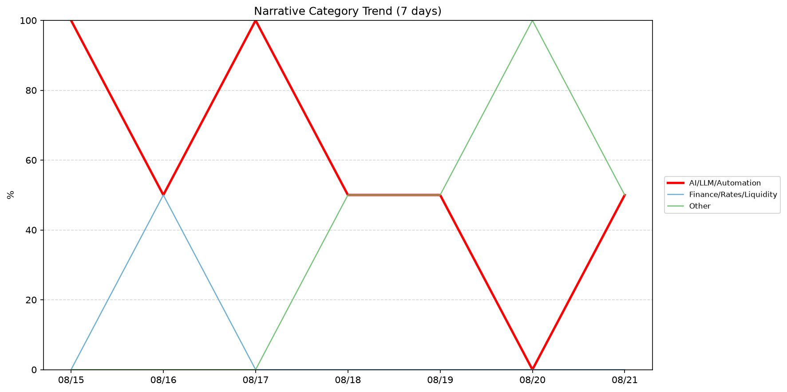
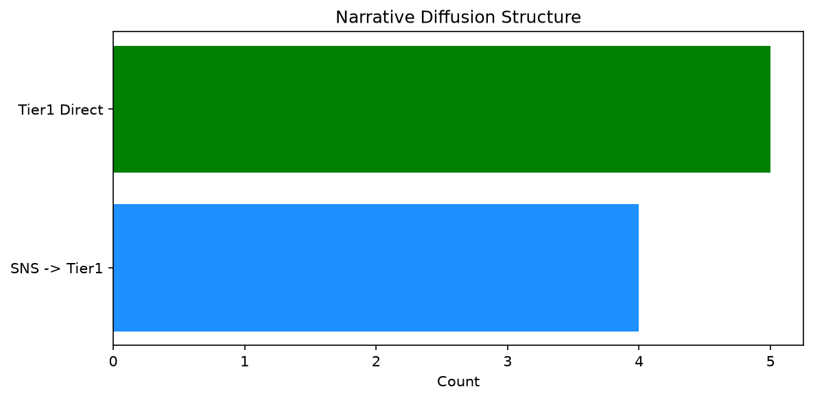

# 週次メタ分析レポート - 2026-08-22

> 分析期間: 過去7日間

---

## ショックタイプ分布

| ショックタイプ | 件数 |
|----------------|------|
| ナラティブシフト | 11 |
| 規制ショック | 2 |
| テクノロジーショック | 1 |

---

## ナラティブ推移

### 2026-08-15
- AI/LLM/自動化: 100%

### 2026-08-16
- AI/LLM/自動化: 50%
- 金融/金利/流動性: 50%

### 2026-08-17
- AI/LLM/自動化: 100%

### 2026-08-18
- その他: 50%
- AI/LLM/自動化: 50%

### 2026-08-19
- その他: 50%
- AI/LLM/自動化: 50%

### 2026-08-20
- その他: 100%

### 2026-08-21
- AI/LLM/自動化: 50%
- その他: 50%

---

## ナラティブ伝播構造

| 伝播パターン | 件数 |
|--------------|------|
| Tier1直接 | 5 |
| カバレッジなし | 5 |
| SNS→Tier1 | 4 |

---

## 過熱警告事後検証

> ※ "過熱警告を出したか"と"AI偏重が実際に続いたか"の検証

| 指標 | 値 |
|------|-----|
| 検証対象数 | 7 |
| 正警告（TP） | 0 |
| 過剰警告（FP） | 0 |
| 正常判定（TN） | 5 |
| 見逃し（FN） | 2 |
| Recall | 0.0% |

- **2026-08-15**: 正常判定 — No overheat and conditions normal: ai_continued=True, price_sustained=True.
- **2026-08-16**: 見逃し — Missed overheat: AI events continued without price backing. An alert should have been raised.
- **2026-08-17**: 正常判定 — No overheat and conditions normal: ai_continued=False, price_sustained=False.
- **2026-08-18**: 正常判定 — No overheat and conditions normal: ai_continued=False, price_sustained=False.
- **2026-08-19**: 正常判定 — No overheat and conditions normal: ai_continued=False, price_sustained=False.
- **2026-08-20**: 見逃し — Missed overheat: AI events continued without price backing. An alert should have been raised.
- **2026-08-21**: 正常判定 — No overheat and conditions normal: ai_continued=False, price_sustained=False.

---

## 非AIハイライト（週次）

### 1. JPM
- **サマリー**: 5件の言及（通常の4.8倍）
- **スコア**: 0.42
- **ナラティブ分類**: 金融/金利/流動性
- **ショックタイプ**: ナラティブシフト
- **AI関連度**: 2%

### 2. JPM
- **サマリー**: 4件の言及（通常の3.6倍）
- **スコア**: 0.34
- **ナラティブ分類**: その他
- **ショックタイプ**: ナラティブシフト
- **AI関連度**: 5%

### 3. XOM
- **サマリー**: 出来高が平均の1.71倍
- **スコア**: 0.27
- **ナラティブ分類**: その他
- **ショックタイプ**: ナラティブシフト
- **AI関連度**: 0%

### 4. NEE
- **サマリー**: 出来高が平均の1.81倍
- **スコア**: 0.21
- **ナラティブ分類**: その他
- **ショックタイプ**: ナラティブシフト
- **AI関連度**: 0%

### 5. CRWD
- **サマリー**: 出来高が平均の1.45倍
- **スコア**: 0.20
- **ナラティブ分類**: その他
- **ショックタイプ**: ナラティブシフト
- **AI関連度**: 0%

---

## 構造持続確率 Top3

| 順位 | 銘柄 | SPP | ショックタイプ | 伝播パターン | サマリー |
|------|------|-----|----------------|--------------|----------|
| 1 | NVDA | 0.66 | 規制ショック | SNS→Tier1 | 11件の言及（通常の4.2倍） |
| 2 | JPM | 0.52 | ナラティブシフト | Tier1直接 | 4件の言及（通常の3.6倍） |
| 3 | GOOGL | 0.47 | ナラティブシフト | なし | 16件の言及（通常の1.9倍） |

---

## イベント持続性

| 銘柄 | 出現日数/観測日数 | SPP推移 | 最新SPP |
|------|------------------|---------|---------|
| NVDA | 4/7日 | 下降 | 0.66 |
| GOOGL | 3/7日 | 下降 | 0.47 |
| JPM | 2/7日 | 上昇 | 0.52 |
| NEE | 1/7日 | 横ばい | 0.42 |
| XOM | 1/7日 | 横ばい | 0.42 |
| CRWD | 1/7日 | 横ばい | 0.42 |
| LMT | 1/7日 | 横ばい | 0.42 |

---

## 転換点候補

転換点候補は検出されませんでした。

---

## 組織インパクト仮説

### 1. 今週の構造変化は「ナラティブシフト」に集中（79%）。この領域の専門知識・人材の重要性が高まっている可能性。
- **根拠**: ショックタイプ分布: ナラティブシフトが11件

### 2. NVDA（AI/LLM/自動化）: 出来高急増・言及急増 + 規制ショック + 4日間持続 + 高ボラ環境 → 構造的な市場関心の変化の可能性、SPP下降中
- **根拠**: 出現: 4/7日, SPP推移: 下降
- **根拠要素**:
- 出来高急増
- 言及急増
- 規制ショック型
- ナラティブシフト型
- 4日間持続観測
- SPP下降（0.77→0.66）
- 高ボラレジーム下
- 関連: Big week coming up with PCE, Nvidia earnings and then Jackson Hole. Here's what to expect
- 関連: Nvidia just showed that the harness, not the AI model, is now the real hero
- **データ期間**: 2026-08-15〜2026-08-21 (7日間)
- **信頼度注記**: 観測データに基づく示唆であり、因果関係を示すものではありません

### 3. GOOGL（AI/LLM/自動化）: 言及急増 + ナラティブシフト + 3日間持続 + 高ボラ環境 → 構造的な市場関心の変化の可能性、SPP下降中
- **根拠**: 出現: 3/7日, SPP推移: 下降
- **根拠要素**:
- 言及急増
- ナラティブシフト型
- テクノロジーショック型
- 3日間持続観測
- SPP下降（0.52→0.47）
- 高ボラレジーム下
- 関連: Walmart is finally adding Apple Pay and Google Pay
- 関連: Google’s Pixel 10A is a great deal at 15 percent off
- **データ期間**: 2026-08-15〜2026-08-21 (7日間)
- **信頼度注記**: 観測データに基づく示唆であり、因果関係を示すものではありません

---

## 市場レジーム推移

| 日付 | レジーム | ボラティリティ | 下落比率 | 信頼度 |
|------|----------|---------------|----------|--------|
| 2026-08-21 | 高ボラ | 47.8% | 20% | 100% |
| 2026-08-20 | 高ボラ | 49.0% | 33% | 90% |
| 2026-08-19 | 高ボラ | 49.0% | 27% | 98% |
| 2026-08-18 | 高ボラ | 49.5% | 27% | 98% |
| 2026-08-17 | 高ボラ | 50.3% | 27% | 98% |
| 2026-08-16 | 高ボラ | 49.8% | 27% | 98% |
| 2026-08-15 | 高ボラ | 49.2% | 27% | 98% |

---

## 前週比較

> 比較期間: 2026-08-08〜2026-08-15 (7日分)

**イベント件数**: 今週 14 件 / 前週 15 件（差分 -1）

**支配的レジーム**: 高ボラ（変化なし）

### ショックタイプ増減

| ショックタイプ | 今週 | 前週 | 差分 |
|----------------|------|------|------|
| テクノロジーショック | 1 | 4 | -3 |
| ナラティブシフト | 11 | 10 | +1 |
| 業績シグナル | 0 | 1 | -1 |
| 規制ショック | 2 | 0 | +2 |

### ナラティブ比率変化

| カテゴリ | 今週平均 | 前週平均 | 差分(pt) |
|----------|----------|----------|----------|
| AI/LLM/自動化 | 57% | 64% | -7 |
| その他 | 36% | 24% | +12 |
| 半導体/供給網 | 0% | 12% | -12 |
| 金融/金利/流動性 | 7% | 0% | +7 |

---

## レジーム・ナラティブ同時変動

> ※ 同時期の観測であり、因果関係を示すものではありません

- **2026-08-17**: レジーム異常（高ボラ）と「AI/LLM/自動化」ナラティブ集中（100%）が共起
- **2026-08-20**: レジーム異常（高ボラ）と「その他」ナラティブ集中（100%）が共起

---

## 来週の監視比重提案

### 1. 「規制/政策/地政学」の監視比重を維持・注視
- **根拠**: 週平均ナラティブ比率0%と低く、イベント未検出だが、構造的に重要なカテゴリのため意図的な監視継続を推奨。
- **週平均ナラティブ比率**: 0%

### 2. 「エネルギー/資源」の監視比重を維持・注視
- **根拠**: 週平均ナラティブ比率0%と低く、イベント未検出だが、構造的に重要なカテゴリのため意図的な監視継続を推奨。
- **週平均ナラティブ比率**: 0%

### 3. 「AI/LLM/自動化」の過集中に注意
- **根拠**: 週平均ナラティブ比率57%と高く、他カテゴリの構造変化を見落とすリスクがあります。
- **週平均ナラティブ比率**: 57%

### 4. 「その他」の過集中に注意
- **根拠**: 週平均ナラティブ比率36%と高く、他カテゴリの構造変化を見落とすリスクがあります。
- **週平均ナラティブ比率**: 36%

---

*レポート生成日時: 2026-08-22 01:08:32*
