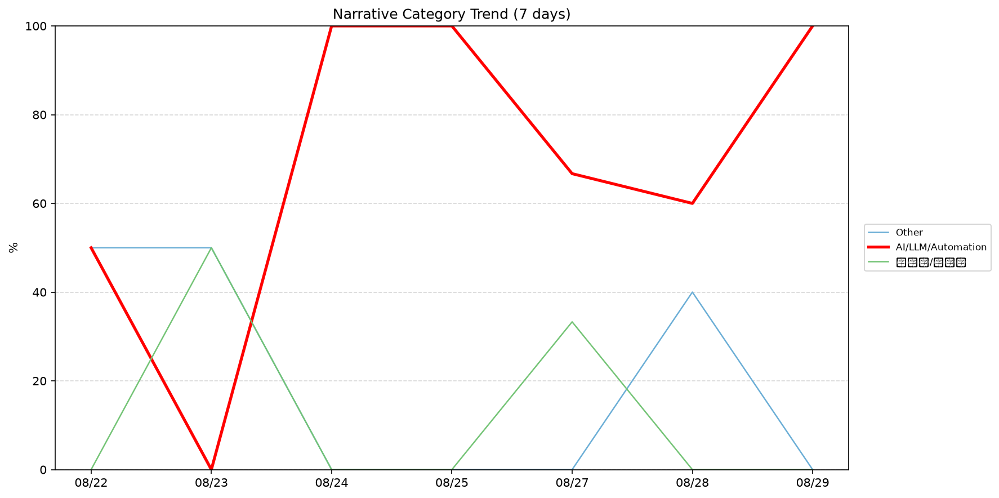
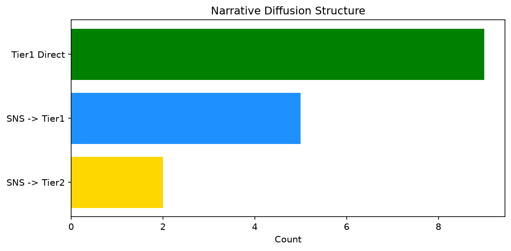

# 週次メタ分析レポート - 2026-08-29

> 分析期間: 過去7日間

---

## ショックタイプ分布

| ショックタイプ | 件数 |
|----------------|------|
| ナラティブシフト | 9 |
| 業績シグナル | 4 |
| テクノロジーショック | 4 |

---

## ナラティブ推移

### 2026-08-22
- その他: 50%
- AI/LLM/自動化: 50%

### 2026-08-23
- その他: 50%
- 半導体/供給網: 50%

### 2026-08-24
- AI/LLM/自動化: 100%

### 2026-08-25
- AI/LLM/自動化: 100%

### 2026-08-27
- AI/LLM/自動化: 67%
- 半導体/供給網: 33%

### 2026-08-28
- AI/LLM/自動化: 60%
- その他: 40%

### 2026-08-29
- AI/LLM/自動化: 100%

---

## ナラティブ伝播構造

| 伝播パターン | 件数 |
|--------------|------|
| Tier1直接 | 9 |
| SNS→Tier2 | 2 |
| SNS→Tier1 | 5 |
| カバレッジなし | 1 |

---

## 過熱警告事後検証

> ※ "過熱警告を出したか"と"AI偏重が実際に続いたか"の検証

| 指標 | 値 |
|------|-----|
| 検証対象数 | 7 |
| 正警告（TP） | 0 |
| 過剰警告（FP） | 0 |
| 正常判定（TN） | 3 |
| 見逃し（FN） | 4 |
| Recall | 0.0% |

- **2026-08-22**: 見逃し — Missed overheat: AI events continued without price backing. An alert should have been raised.
- **2026-08-23**: 見逃し — Missed overheat: AI events continued without price backing. An alert should have been raised.
- **2026-08-24**: 見逃し — Missed overheat: AI events continued without price backing. An alert should have been raised.
- **2026-08-25**: 正常判定 — No overheat and conditions normal: ai_continued=True, price_sustained=True.
- **2026-08-27**: 正常判定 — No overheat and conditions normal: ai_continued=True, price_sustained=True.
- **2026-08-28**: 見逃し — Missed overheat: AI events continued without price backing. An alert should have been raised.
- **2026-08-29**: 正常判定 — No overheat and conditions normal: ai_continued=False, price_sustained=False.

---

## 非AIハイライト（週次）

### 1. CRWD
- **サマリー**: 出来高が平均の3.03倍
- **スコア**: 0.57
- **ナラティブ分類**: その他
- **ショックタイプ**: ナラティブシフト
- **AI関連度**: 4%

### 2. NVDA
- **サマリー**: 13件の言及（通常の3.0倍）
- **スコア**: 0.52
- **ナラティブ分類**: 半導体/供給網
- **ショックタイプ**: 業績シグナル
- **AI関連度**: 12%

### 3. CRWD
- **サマリー**: 前日比+20.5%の価格変動
- **スコア**: 0.46
- **ナラティブ分類**: その他
- **ショックタイプ**: 業績シグナル
- **AI関連度**: 4%

### 4. JPM
- **サマリー**: 4件の言及（通常の3.8倍）
- **スコア**: 0.35
- **ナラティブ分類**: その他
- **ショックタイプ**: ナラティブシフト
- **AI関連度**: 5%

### 5. MDB
- **サマリー**: 出来高が平均の0.58倍
- **スコア**: 0.16
- **ナラティブ分類**: その他
- **ショックタイプ**: ナラティブシフト
- **AI関連度**: 0%

---

## 構造持続確率 Top3

| 順位 | 銘柄 | SPP | ショックタイプ | 伝播パターン | サマリー |
|------|------|-----|----------------|--------------|----------|
| 1 | CRWD | 0.65 | ナラティブシフト | Tier1直接 | 出来高が平均の3.03倍 |
| 2 | NVDA | 0.63 | 業績シグナル | Tier1直接 | 15件の言及（通常の3.0倍） |
| 3 | JPM | 0.55 | ナラティブシフト | Tier1直接 | 4件の言及（通常の3.8倍） |

---

## イベント持続性

| 銘柄 | 出現日数/観測日数 | SPP推移 | 最新SPP |
|------|------------------|---------|---------|
| NVDA | 7/7日 | 上昇 | 0.63 |
| CRWD | 2/7日 | 上昇 | 0.65 |
| GOOGL | 2/7日 | 横ばい | 0.47 |
| JPM | 1/7日 | 横ばい | 0.55 |
| MDB | 1/7日 | 横ばい | 0.42 |
| MSFT | 1/7日 | 横ばい | 0.41 |

---

## 転換点候補

転換点候補は検出されませんでした。

---

## 組織インパクト仮説

### 1. 今週の構造変化は「ナラティブシフト」に集中（53%）。この領域の専門知識・人材の重要性が高まっている可能性。
- **根拠**: ショックタイプ分布: ナラティブシフトが9件

### 2. NVDA（AI/LLM/自動化）: 出来高急増・言及急増 + 業績シグナル + 7日間持続 + 高ボラ環境 → 構造的な市場関心の変化の可能性、SPP上昇中
- **根拠**: 出現: 7/7日, SPP推移: 上昇
- **根拠要素**:
- 出来高急増
- 言及急増
- 価格変動
- 業績シグナル型
- ナラティブシフト型
- テクノロジーショック型
- 7日間持続観測
- SPP上昇（0.57→0.63）
- 高ボラレジーム下
- 関連: Nvidia’s revenue forecast is so huge that Wall Street wonders if SpaceX is the reason
- 関連: DLSS 5 leaked and modders are putting Nvidia&#8217;s AI effects on everything
- **データ期間**: 2026-08-22〜2026-08-29 (7日間)
- **信頼度注記**: 観測データに基づく示唆であり、因果関係を示すものではありません

---

## 市場レジーム推移

| 日付 | レジーム | ボラティリティ | 下落比率 | 信頼度 |
|------|----------|---------------|----------|--------|
| 2026-08-29 | 高ボラ | 47.9% | 33% | 90% |
| 2026-08-28 | 高ボラ | 49.7% | 33% | 90% |
| 2026-08-27 | 高ボラ | 46.7% | 33% | 90% |
| 2026-08-25 | 高ボラ | 47.0% | 27% | 98% |
| 2026-08-24 | 高ボラ | 47.8% | 27% | 98% |
| 2026-08-23 | 高ボラ | 47.4% | 33% | 90% |
| 2026-08-22 | 高ボラ | 46.5% | 27% | 98% |

---

## 前週比較

> 比較期間: 2026-08-15〜2026-08-22 (8日分)

**イベント件数**: 今週 17 件 / 前週 16 件（差分 +1）

**支配的レジーム**: 高ボラ（変化なし）

### ショックタイプ増減

| ショックタイプ | 今週 | 前週 | 差分 |
|----------------|------|------|------|
| テクノロジーショック | 4 | 2 | +2 |
| ナラティブシフト | 9 | 12 | -3 |
| 業績シグナル | 4 | 0 | +4 |
| 規制ショック | 0 | 2 | -2 |

### ナラティブ比率変化

| カテゴリ | 今週平均 | 前週平均 | 差分(pt) |
|----------|----------|----------|----------|
| AI/LLM/自動化 | 68% | 56% | +12 |
| その他 | 20% | 38% | -18 |
| 半導体/供給網 | 12% | 0% | +12 |
| 金融/金利/流動性 | 0% | 6% | -6 |

---

## レジーム・ナラティブ同時変動

> ※ 同時期の観測であり、因果関係を示すものではありません

- **2026-08-24**: レジーム異常（高ボラ）と「AI/LLM/自動化」ナラティブ集中（100%）が共起
- **2026-08-25**: レジーム異常（高ボラ）と「AI/LLM/自動化」ナラティブ集中（100%）が共起
- **2026-08-27**: レジーム異常（高ボラ）と「AI/LLM/自動化」ナラティブ集中（67%）が共起
- **2026-08-29**: レジーム異常（高ボラ）と「AI/LLM/自動化」ナラティブ集中（100%）が共起

---

## 来週の監視比重提案

### 1. 「規制/政策/地政学」の監視比重を維持・注視
- **根拠**: 週平均ナラティブ比率0%と低く、イベント未検出だが、構造的に重要なカテゴリのため意図的な監視継続を推奨。
- **週平均ナラティブ比率**: 0%

### 2. 「金融/金利/流動性」の監視比重を維持・注視
- **根拠**: 週平均ナラティブ比率0%と低く、イベント未検出だが、構造的に重要なカテゴリのため意図的な監視継続を推奨。
- **週平均ナラティブ比率**: 0%

### 3. 「エネルギー/資源」の監視比重を維持・注視
- **根拠**: 週平均ナラティブ比率0%と低く、イベント未検出だが、構造的に重要なカテゴリのため意図的な監視継続を推奨。
- **週平均ナラティブ比率**: 0%

### 4. 「AI/LLM/自動化」の過集中に注意
- **根拠**: 週平均ナラティブ比率68%と高く、他カテゴリの構造変化を見落とすリスクがあります。
- **週平均ナラティブ比率**: 68%
- **⚡ 急変フラグ**: 直近100%へ急変 — 動向注視を推奨

---

*レポート生成日時: 2026-08-29 05:45:01*
