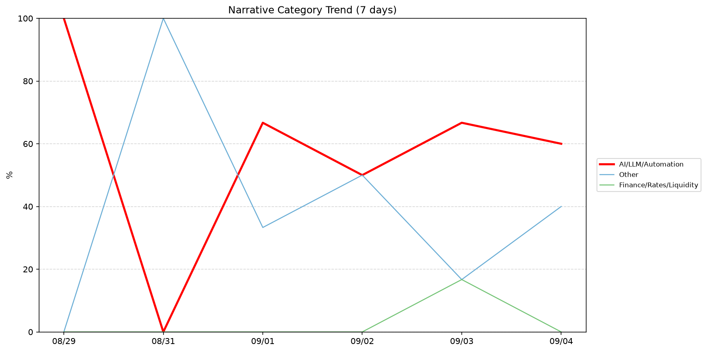
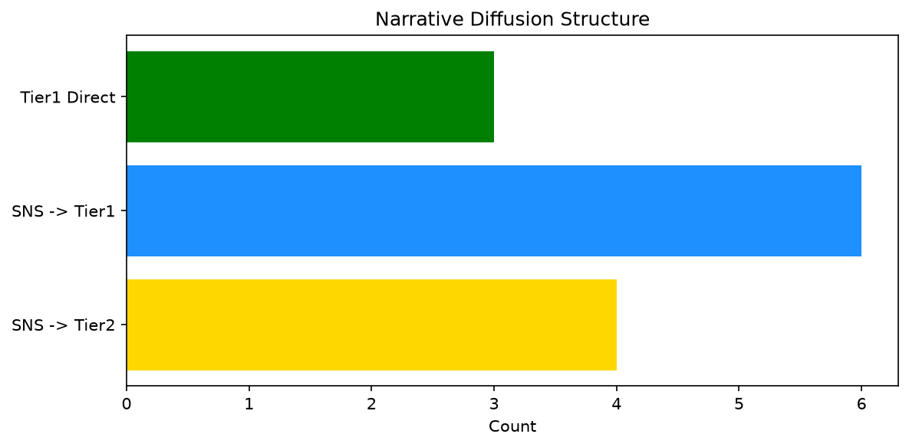

# 週次メタ分析レポート - 2026-09-05

> 分析期間: 過去7日間

---

## ショックタイプ分布

| ショックタイプ | 件数 |
|----------------|------|
| ナラティブシフト | 10 |
| 業績シグナル | 9 |
| 規制ショック | 3 |
| ビジネスモデルショック | 2 |
| テクノロジーショック | 2 |

---

## ナラティブ推移

### 2026-08-29
- AI/LLM/自動化: 100%

### 2026-08-31
- その他: 100%

### 2026-09-01
- AI/LLM/自動化: 67%
- その他: 33%

### 2026-09-02
- その他: 50%
- AI/LLM/自動化: 50%

### 2026-09-03
- AI/LLM/自動化: 67%
- 金融/金利/流動性: 17%
- その他: 17%

### 2026-09-04
- AI/LLM/自動化: 60%
- その他: 40%

---

## ナラティブ伝播構造

| 伝播パターン | 件数 |
|--------------|------|
| SNS→Tier1 | 6 |
| SNS→Tier2 | 4 |
| カバレッジなし | 13 |
| Tier1直接 | 3 |

---

## 過熱警告事後検証

> ※ "過熱警告を出したか"と"AI偏重が実際に続いたか"の検証

| 指標 | 値 |
|------|-----|
| 検証対象数 | 6 |
| 正警告（TP） | 1 |
| 過剰警告（FP） | 0 |
| 正常判定（TN） | 4 |
| 見逃し（FN） | 1 |
| Precision | 100.0% |
| Recall | 50.0% |

- **2026-08-29**: 正警告 — Overheat correctly warned: AI narrative faded and price signals did not sustain. The alert was justified.
- **2026-08-31**: 正常判定 — No overheat and conditions normal: ai_continued=True, price_sustained=True.
- **2026-09-01**: 正常判定 — No overheat and conditions normal: ai_continued=True, price_sustained=True.
- **2026-09-02**: 正常判定 — No overheat and conditions normal: ai_continued=True, price_sustained=True.
- **2026-09-03**: 見逃し — Missed overheat: AI events continued without price backing. An alert should have been raised.
- **2026-09-04**: 正常判定 — No overheat and conditions normal: ai_continued=False, price_sustained=False.

---

## 非AIハイライト（週次）

### 1. GOOGL
- **サマリー**: 出来高が平均の1.58倍
- **スコア**: 0.76
- **ナラティブ分類**: その他
- **ショックタイプ**: ナラティブシフト
- **AI関連度**: 3%

### 2. MSFT
- **サマリー**: 9件の言及（通常の6.9倍）
- **スコア**: 0.72
- **ナラティブ分類**: その他
- **ショックタイプ**: ビジネスモデルショック
- **AI関連度**: 0%

### 3. MDB
- **サマリー**: 出来高が平均の4.76倍
- **スコア**: 0.49
- **ナラティブ分類**: その他
- **ショックタイプ**: ナラティブシフト
- **AI関連度**: 0%

### 4. MDB
- **サマリー**: 出来高が平均の2.21倍
- **スコア**: 0.36
- **ナラティブ分類**: その他
- **ショックタイプ**: ナラティブシフト
- **AI関連度**: 0%

### 5. MDB
- **サマリー**: 前日比-13.54%の価格変動
- **スコア**: 0.32
- **ナラティブ分類**: その他
- **ショックタイプ**: 業績シグナル
- **AI関連度**: 0%

---

## 構造持続確率 Top3

| 順位 | 銘柄 | SPP | ショックタイプ | 伝播パターン | サマリー |
|------|------|-----|----------------|--------------|----------|
| 1 | MSFT | 0.64 | ビジネスモデルショック | SNS→Tier1 | 10件の言及（通常の6.9倍） |
| 2 | PLTR | 0.59 | 業績シグナル | なし | 前日比+7.71%の価格変動 |
| 3 | NVDA | 0.58 | テクノロジーショック | SNS→Tier1 | 20件の言及（通常の3.7倍） |

---

## イベント持続性

| 銘柄 | 出現日数/観測日数 | SPP推移 | 最新SPP |
|------|------------------|---------|---------|
| GOOGL | 5/6日 | 上昇 | 0.52 |
| MSFT | 4/6日 | 上昇 | 0.64 |
| NVDA | 3/6日 | 横ばい | 0.58 |
| SNOW | 2/6日 | 上昇 | 0.51 |
| MDB | 2/6日 | 上昇 | 0.48 |
| NEE | 2/6日 | 下降 | 0.45 |
| PLTR | 1/6日 | 横ばい | 0.59 |
| PATH | 1/6日 | 横ばい | 0.47 |
| JPM | 1/6日 | 横ばい | 0.42 |
| UNH | 1/6日 | 横ばい | 0.42 |

---

## 転換点候補

転換点候補は検出されませんでした。

---

## 組織インパクト仮説

### 1. GOOGL（AI/LLM/自動化）: 出来高急増・言及急増 + ナラティブシフト + 5日間持続 + 引き締め環境 → 構造的な市場関心の変化の可能性、SPP上昇中
- **根拠**: 出現: 5/6日, SPP推移: 上昇
- **根拠要素**:
- 出来高急増
- 言及急増
- ナラティブシフト型
- 規制ショック型
- 5日間持続観測
- SPP上昇（0.47→0.52）
- 引き締めレジーム下
- 関連: Google’s Gemini Spark can now manage your Google Photos library
- 関連: Google launches AI voice features in Gmail, Docs, and Keep
- **データ期間**: 2026-08-29〜2026-09-04 (6日間)
- **信頼度注記**: 観測データに基づく示唆であり、因果関係を示すものではありません

### 2. MSFT（AI/LLM/自動化）: 言及急増 + ナラティブシフト + 4日間持続 + 引き締め環境 → 構造的な市場関心の変化の可能性、SPP上昇中
- **根拠**: 出現: 4/6日, SPP推移: 上昇
- **根拠要素**:
- 言及急増
- ナラティブシフト型
- 業績シグナル型
- ビジネスモデルショック型
- 4日間持続観測
- SPP上昇（0.46→0.64）
- 引き締めレジーム下
- 関連: Microsoft says virtually nobody was grabbing NYT articles through its chatbot
- 関連: Microsoft to impose time limits on Xbox cloud gaming subscribers as costs continue to climb
- **データ期間**: 2026-08-29〜2026-09-04 (6日間)
- **信頼度注記**: 観測データに基づく示唆であり、因果関係を示すものではありません

### 3. NVDA（AI/LLM/自動化）: 言及急増 + 業績シグナル + 3日間持続 + 引き締め環境 → 構造的な市場関心の変化の可能性
- **根拠**: 出現: 3/6日, SPP推移: 横ばい
- **根拠要素**:
- 言及急増
- 業績シグナル型
- テクノロジーショック型
- 3日間持続観測
- SPP横ばい（0.58）
- 引き締めレジーム下
- 関連: Why Nvidia's 'defensive move' to acquire Hugging Face is about much more than chips
- 関連: Here’s what Nvidia’s $13 billion Hugging Face deal means for the world of AI
- **データ期間**: 2026-08-29〜2026-09-04 (6日間)
- **信頼度注記**: 観測データに基づく示唆であり、因果関係を示すものではありません

---

## 市場レジーム推移

| 日付 | レジーム | ボラティリティ | 下落比率 | 信頼度 |
|------|----------|---------------|----------|--------|
| 2026-09-04 | 引き締め | 49.3% | 53% | 65% |
| 2026-09-03 | 高ボラ | 47.2% | 40% | 82% |
| 2026-09-02 | 高ボラ | 48.9% | 47% | 74% |
| 2026-09-01 | 高ボラ | 47.7% | 33% | 90% |
| 2026-08-31 | 高ボラ | 48.0% | 33% | 90% |
| 2026-08-29 | 高ボラ | 47.9% | 33% | 90% |

---

## 前週比較

> 比較期間: 2026-08-22〜2026-08-29 (7日分)

**イベント件数**: 今週 26 件 / 前週 17 件（差分 +9）

**支配的レジーム**: 高ボラ（変化なし）

### ショックタイプ増減

| ショックタイプ | 今週 | 前週 | 差分 |
|----------------|------|------|------|
| テクノロジーショック | 2 | 4 | -2 |
| ナラティブシフト | 10 | 9 | +1 |
| ビジネスモデルショック | 2 | 0 | +2 |
| 業績シグナル | 9 | 4 | +5 |
| 規制ショック | 3 | 0 | +3 |

### ナラティブ比率変化

| カテゴリ | 今週平均 | 前週平均 | 差分(pt) |
|----------|----------|----------|----------|
| AI/LLM/自動化 | 57% | 68% | -11 |
| その他 | 40% | 20% | +20 |
| 半導体/供給網 | 0% | 12% | -12 |
| 金融/金利/流動性 | 3% | 0% | +3 |

---

## レジーム・ナラティブ同時変動

> ※ 同時期の観測であり、因果関係を示すものではありません

- **2026-08-31**: レジーム異常（高ボラ）と「その他」ナラティブ集中（100%）が共起
- **2026-09-01**: レジーム異常（高ボラ）と「AI/LLM/自動化」ナラティブ集中（67%）が共起
- **2026-09-03**: レジーム異常（高ボラ）と「AI/LLM/自動化」ナラティブ集中（67%）が共起
- **2026-09-04**: レジーム変化（高ボラ→引き締め）と「金融/金利/流動性」の17pt減少が同時期に観測
- **2026-09-04**: レジーム変化（高ボラ→引き締め）と「その他」の23pt増加が同時期に観測

---

## 来週の監視比重提案

### 1. 「規制/政策/地政学」の監視比重を維持・注視
- **根拠**: 週平均ナラティブ比率0%と低く、イベント未検出だが、構造的に重要なカテゴリのため意図的な監視継続を推奨。
- **週平均ナラティブ比率**: 0%

### 2. 「エネルギー/資源」の監視比重を維持・注視
- **根拠**: 週平均ナラティブ比率0%と低く、イベント未検出だが、構造的に重要なカテゴリのため意図的な監視継続を推奨。
- **週平均ナラティブ比率**: 0%

### 3. 「金融/金利/流動性」の監視比重を引き上げ
- **根拠**: 週平均ナラティブ比率3%と低いが、過去7日で1件のイベントが検出されており、見落としリスクがあります。
- **週平均ナラティブ比率**: 3%

### 4. 「AI/LLM/自動化」の過集中に注意
- **根拠**: 週平均ナラティブ比率57%と高く、他カテゴリの構造変化を見落とすリスクがあります。
- **週平均ナラティブ比率**: 57%

### 5. 「その他」の過集中に注意
- **根拠**: 週平均ナラティブ比率40%と高く、他カテゴリの構造変化を見落とすリスクがあります。
- **週平均ナラティブ比率**: 40%

---

*レポート生成日時: 2026-09-05 03:04:26*
