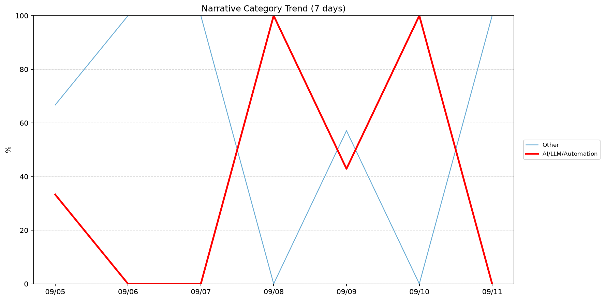
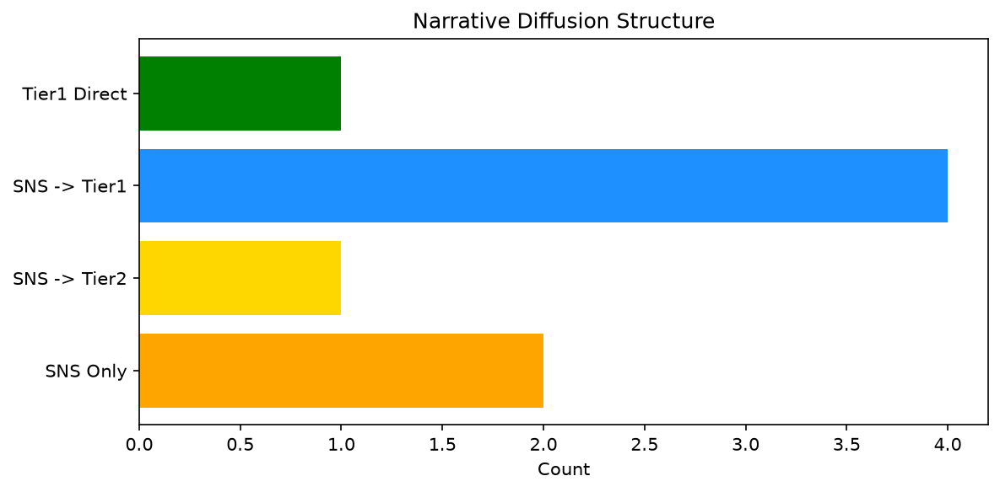

# 週次メタ分析レポート - 2026-09-12

> 分析期間: 過去7日間

---

## ショックタイプ分布

| ショックタイプ | 件数 |
|----------------|------|
| ナラティブシフト | 9 |
| 業績シグナル | 8 |
| テクノロジーショック | 1 |

---

## ナラティブ推移

### 2026-09-05
- その他: 67%
- AI/LLM/自動化: 33%

### 2026-09-06
- その他: 100%

### 2026-09-07
- その他: 100%

### 2026-09-08
- AI/LLM/自動化: 100%

### 2026-09-09
- その他: 57%
- AI/LLM/自動化: 43%

### 2026-09-10
- AI/LLM/自動化: 100%

### 2026-09-11
- その他: 100%

---

## ナラティブ伝播構造

| 伝播パターン | 件数 |
|--------------|------|
| カバレッジなし | 10 |
| SNS→Tier1 | 4 |
| SNSのみ | 2 |
| SNS→Tier2 | 1 |
| Tier1直接 | 1 |

---

## 過熱警告事後検証

> ※ "過熱警告を出したか"と"AI偏重が実際に続いたか"の検証

| 指標 | 値 |
|------|-----|
| 検証対象数 | 7 |
| 正警告（TP） | 0 |
| 過剰警告（FP） | 0 |
| 正常判定（TN） | 6 |
| 見逃し（FN） | 1 |
| Recall | 0.0% |

- **2026-09-05**: 正常判定 — No overheat and conditions normal: ai_continued=False, price_sustained=True.
- **2026-09-06**: 正常判定 — No overheat and conditions normal: ai_continued=False, price_sustained=True.
- **2026-09-07**: 見逃し — Missed overheat: AI events continued without price backing. An alert should have been raised.
- **2026-09-08**: 正常判定 — No overheat and conditions normal: ai_continued=False, price_sustained=True.
- **2026-09-09**: 正常判定 — No overheat and conditions normal: ai_continued=False, price_sustained=False.
- **2026-09-10**: 正常判定 — No overheat and conditions normal: ai_continued=False, price_sustained=False.
- **2026-09-11**: 正常判定 — No overheat and conditions normal: ai_continued=False, price_sustained=False.

---

## 非AIハイライト（週次）

### 1. NET
- **サマリー**: 出来高が平均の1.71倍
- **スコア**: 0.43
- **ナラティブ分類**: その他
- **ショックタイプ**: ナラティブシフト
- **AI関連度**: 0%

### 2. NET
- **サマリー**: 前日比+10.51%の価格変動
- **スコア**: 0.37
- **ナラティブ分類**: その他
- **ショックタイプ**: 業績シグナル
- **AI関連度**: 0%

### 3. PATH
- **サマリー**: 前日比-16.63%の価格変動
- **スコア**: 0.29
- **ナラティブ分類**: その他
- **ショックタイプ**: 業績シグナル
- **AI関連度**: 0%

### 4. PATH
- **サマリー**: 前日比-16.63%の価格変動
- **スコア**: 0.29
- **ナラティブ分類**: その他
- **ショックタイプ**: 業績シグナル
- **AI関連度**: 0%

### 5. PATH
- **サマリー**: 前日比-16.63%の価格変動
- **スコア**: 0.29
- **ナラティブ分類**: その他
- **ショックタイプ**: 業績シグナル
- **AI関連度**: 0%

---

## 構造持続確率 Top3

| 順位 | 銘柄 | SPP | ショックタイプ | 伝播パターン | サマリー |
|------|------|-----|----------------|--------------|----------|
| 1 | MSFT | 0.76 | テクノロジーショック | SNS→Tier1 | 出来高が平均の0.59倍 |
| 2 | PATH | 0.64 | 業績シグナル | なし | 前日比-16.63%の価格変動 |
| 3 | GOOGL | 0.61 | ナラティブシフト | SNS→Tier1 | 12件の言及（通常の2.0倍） |

---

## イベント持続性

| 銘柄 | 出現日数/観測日数 | SPP推移 | 最新SPP |
|------|------------------|---------|---------|
| PATH | 3/7日 | 上昇 | 0.64 |
| GOOGL | 3/7日 | 上昇 | 0.61 |
| MSFT | 2/7日 | 上昇 | 0.76 |
| UNH | 2/7日 | 横ばい | 0.37 |
| DDOG | 1/7日 | 横ばい | 0.45 |
| PLTR | 1/7日 | 横ばい | 0.33 |
| NET | 1/7日 | 横ばい | 0.31 |

---

## 転換点候補

転換点候補は検出されませんでした。

---

## 組織インパクト仮説

### 1. 今週の構造変化は「ナラティブシフト」に集中（50%）。この領域の専門知識・人材の重要性が高まっている可能性。
- **根拠**: ショックタイプ分布: ナラティブシフトが9件

### 2. PATH（その他）: 価格変動・出来高急増 + ナラティブシフト + 3日間持続 + 引き締め環境 → 構造的な市場関心の変化の可能性、SPP上昇中
- **根拠**: 出現: 3/7日, SPP推移: 上昇
- **根拠要素**:
- 価格変動
- 出来高急増
- ナラティブシフト型
- 業績シグナル型
- 3日間持続観測
- SPP上昇（0.56→0.64）
- 引き締めレジーム下
- **データ期間**: 2026-09-05〜2026-09-11 (7日間)
- **信頼度注記**: 観測データに基づく示唆であり、因果関係を示すものではありません

### 3. GOOGL（AI/LLM/自動化）: 出来高急増・言及急増 + ナラティブシフト + 3日間持続 + 引き締め環境 → 構造的な市場関心の変化の可能性、SPP上昇中
- **根拠**: 出現: 3/7日, SPP推移: 上昇
- **根拠要素**:
- 出来高急増
- 言及急増
- ナラティブシフト型
- 業績シグナル型
- 3日間持続観測
- SPP上昇（0.50→0.61）
- 引き締めレジーム下
- 関連: Panic builds over bankrupt Spirit’s looming data sale to Google
- 関連: Google is making it easier to switch between password managers on Android
- **データ期間**: 2026-09-05〜2026-09-11 (7日間)
- **信頼度注記**: 観測データに基づく示唆であり、因果関係を示すものではありません

### 4. レジームが高ボラ→引き締めに変化 — リスク管理基準の見直しを検討する契機
- **根拠**: 前週: 高ボラ, 今週: 引き締め
- **根拠要素**:
- 前週レジーム: 高ボラ
- 今週レジーム: 引き締め
- **データ期間**: 2026-09-05〜2026-09-11 (7日間)
- **信頼度注記**: 観測データに基づく示唆であり、因果関係を示すものではありません

---

## 市場レジーム推移

| 日付 | レジーム | ボラティリティ | 下落比率 | 信頼度 |
|------|----------|---------------|----------|--------|
| 2026-09-11 | 引き締め | 45.9% | 87% | 100% |
| 2026-09-10 | 引き締め | 46.0% | 80% | 100% |
| 2026-09-09 | 引き締め | 46.5% | 80% | 100% |
| 2026-09-08 | 引き締め | 46.1% | 80% | 100% |
| 2026-09-07 | 引き締め | 46.6% | 87% | 100% |
| 2026-09-06 | 引き締め | 47.5% | 60% | 76% |
| 2026-09-05 | 引き締め | 48.0% | 53% | 65% |

---

## 前週比較

> 比較期間: 2026-08-29〜2026-09-05 (7日分)

**イベント件数**: 今週 18 件 / 前週 29 件（差分 -11）

**支配的レジーム**: 高ボラ → 引き締め（変化あり）

### ショックタイプ増減

| ショックタイプ | 今週 | 前週 | 差分 |
|----------------|------|------|------|
| テクノロジーショック | 1 | 2 | -1 |
| ナラティブシフト | 9 | 12 | -3 |
| ビジネスモデルショック | 0 | 2 | -2 |
| 業績シグナル | 8 | 10 | -2 |
| 規制ショック | 0 | 3 | -3 |

### ナラティブ比率変化

| カテゴリ | 今週平均 | 前週平均 | 差分(pt) |
|----------|----------|----------|----------|
| AI/LLM/自動化 | 39% | 54% | -14 |
| その他 | 61% | 44% | +17 |
| 金融/金利/流動性 | 0% | 2% | -2 |

---

## レジーム・ナラティブ同時変動

> ※ 同時期の観測であり、因果関係を示すものではありません

- **2026-09-06**: レジーム異常（引き締め）と「その他」ナラティブ集中（100%）が共起
- **2026-09-07**: レジーム異常（引き締め）と「その他」ナラティブ集中（100%）が共起
- **2026-09-08**: レジーム異常（引き締め）と「AI/LLM/自動化」ナラティブ集中（100%）が共起
- **2026-09-10**: レジーム異常（引き締め）と「AI/LLM/自動化」ナラティブ集中（100%）が共起
- **2026-09-11**: レジーム異常（引き締め）と「その他」ナラティブ集中（100%）が共起

---

## 来週の監視比重提案

### 1. 「規制/政策/地政学」の監視比重を維持・注視
- **根拠**: 週平均ナラティブ比率0%と低く、イベント未検出だが、構造的に重要なカテゴリのため意図的な監視継続を推奨。
- **週平均ナラティブ比率**: 0%

### 2. 「金融/金利/流動性」の監視比重を維持・注視
- **根拠**: 週平均ナラティブ比率0%と低く、イベント未検出だが、構造的に重要なカテゴリのため意図的な監視継続を推奨。
- **週平均ナラティブ比率**: 0%

### 3. 「エネルギー/資源」の監視比重を維持・注視
- **根拠**: 週平均ナラティブ比率0%と低く、イベント未検出だが、構造的に重要なカテゴリのため意図的な監視継続を推奨。
- **週平均ナラティブ比率**: 0%

### 4. 「その他」の過集中に注意
- **根拠**: 週平均ナラティブ比率61%と高く、他カテゴリの構造変化を見落とすリスクがあります。
- **週平均ナラティブ比率**: 60%
- **⚡ 急変フラグ**: 直近100%へ急変 — 動向注視を推奨

### 5. 「AI/LLM/自動化」の過集中に注意
- **根拠**: 週平均ナラティブ比率39%と高く、他カテゴリの構造変化を見落とすリスクがあります。
- **週平均ナラティブ比率**: 40%
- **⚡ 急変フラグ**: 直近0%へ急変 — 動向注視を推奨

---

*レポート生成日時: 2026-09-12 03:15:22*
