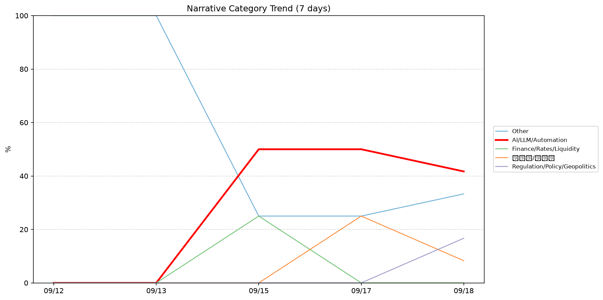
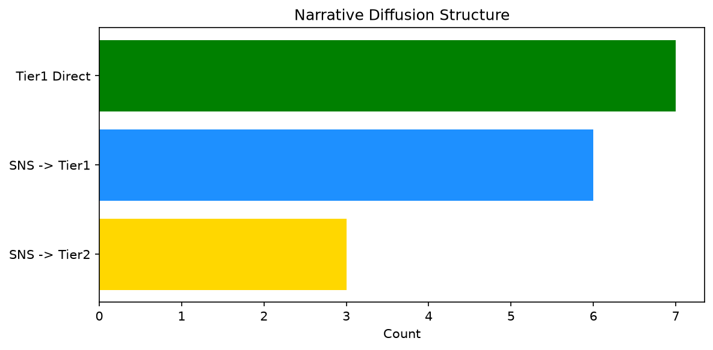

# 週次メタ分析レポート - 2026-09-19

> 分析期間: 過去7日間

---

## ショックタイプ分布

| ショックタイプ | 件数 |
|----------------|------|
| ナラティブシフト | 18 |
| テクノロジーショック | 6 |
| 業績シグナル | 2 |

---

## ナラティブ推移

### 2026-09-12
- その他: 100%

### 2026-09-13
- その他: 100%

### 2026-09-15
- AI/LLM/自動化: 50%
- 金融/金利/流動性: 25%
- その他: 25%

### 2026-09-17
- AI/LLM/自動化: 50%
- その他: 25%
- 半導体/供給網: 25%

### 2026-09-18
- AI/LLM/自動化: 42%
- その他: 33%
- 規制/政策/地政学: 17%
- 半導体/供給網: 8%

---

## ナラティブ伝播構造

| 伝播パターン | 件数 |
|--------------|------|
| SNS→Tier1 | 6 |
| SNS→Tier2 | 3 |
| Tier1直接 | 7 |
| カバレッジなし | 10 |

---

## 過熱警告事後検証

> ※ "過熱警告を出したか"と"AI偏重が実際に続いたか"の検証

| 指標 | 値 |
|------|-----|
| 検証対象数 | 5 |
| 正警告（TP） | 0 |
| 過剰警告（FP） | 0 |
| 正常判定（TN） | 5 |
| 見逃し（FN） | 0 |

- **2026-09-12**: 正常判定 — No overheat and conditions normal: ai_continued=False, price_sustained=True.
- **2026-09-13**: 正常判定 — No overheat and conditions normal: ai_continued=False, price_sustained=False.
- **2026-09-15**: 正常判定 — No overheat and conditions normal: ai_continued=True, price_sustained=True.
- **2026-09-17**: 正常判定 — No overheat and conditions normal: ai_continued=True, price_sustained=True.
- **2026-09-18**: 正常判定 — No overheat and conditions normal: ai_continued=False, price_sustained=False.

---

## 非AIハイライト（週次）

### 1. NVDA
- **サマリー**: 8件の言及（通常の2.7倍）
- **スコア**: 0.57
- **ナラティブ分類**: 半導体/供給網
- **ショックタイプ**: テクノロジーショック
- **AI関連度**: 26%

### 2. JPM
- **サマリー**: 出来高が平均の3.01倍
- **スコア**: 0.57
- **ナラティブ分類**: 規制/政策/地政学
- **ショックタイプ**: ナラティブシフト
- **AI関連度**: 6%

### 3. NVDA
- **サマリー**: 9件の言及（通常の3.1倍）
- **スコア**: 0.53
- **ナラティブ分類**: 半導体/供給網
- **ショックタイプ**: テクノロジーショック
- **AI関連度**: 28%

### 4. JPM
- **サマリー**: 4件の言及（通常の13.3倍）
- **スコア**: 0.48
- **ナラティブ分類**: 規制/政策/地政学
- **ショックタイプ**: ナラティブシフト
- **AI関連度**: 6%

### 5. NEE
- **サマリー**: 出来高が平均の2.13倍
- **スコア**: 0.42
- **ナラティブ分類**: その他
- **ショックタイプ**: ナラティブシフト
- **AI関連度**: 0%

---

## 構造持続確率 Top3

| 順位 | 銘柄 | SPP | ショックタイプ | 伝播パターン | サマリー |
|------|------|-----|----------------|--------------|----------|
| 1 | JPM | 0.71 | ナラティブシフト | Tier1直接 | 出来高が平均の3.01倍 |
| 2 | GOOGL | 0.64 | テクノロジーショック | SNS→Tier2 | 出来高が平均の1.98倍 |
| 3 | MSFT | 0.61 | ナラティブシフト | SNS→Tier1 | 12件の言及（通常の4.9倍） |

---

## イベント持続性

| 銘柄 | 出現日数/観測日数 | SPP推移 | 最新SPP |
|------|------------------|---------|---------|
| GOOGL | 3/5日 | 下降 | 0.64 |
| MSFT | 3/5日 | 横ばい | 0.61 |
| PLTR | 3/5日 | 上昇 | 0.61 |
| NVDA | 3/5日 | 上昇 | 0.55 |
| UNH | 3/5日 | 上昇 | 0.50 |
| JPM | 2/5日 | 上昇 | 0.71 |
| XOM | 2/5日 | 下降 | 0.38 |
| CRWD | 1/5日 | 横ばい | 0.58 |
| NEE | 1/5日 | 横ばい | 0.34 |
| LMT | 1/5日 | 横ばい | 0.34 |

---

## 転換点候補

転換点候補は検出されませんでした。

---

## 組織インパクト仮説

### 1. 今週の構造変化は「ナラティブシフト」に集中（69%）。この領域の専門知識・人材の重要性が高まっている可能性。
- **根拠**: ショックタイプ分布: ナラティブシフトが18件

### 2. GOOGL（AI/LLM/自動化）: 言及急増・出来高急増 + ナラティブシフト + 3日間持続 + 引き締め環境 → 構造的な市場関心の変化の可能性、SPP下降中
- **根拠**: 出現: 3/5日, SPP推移: 下降
- **根拠要素**:
- 言及急増
- 出来高急増
- ナラティブシフト型
- テクノロジーショック型
- 3日間持続観測
- SPP下降（0.69→0.64）
- 引き締めレジーム下
- 関連: Google’s new ‘CC’ is an AI agent that helps families run their households
- 関連: Google DeepMind launches institute to widen the AGI debate
- **データ期間**: 2026-09-12〜2026-09-18 (5日間)
- **信頼度注記**: 観測データに基づく示唆であり、因果関係を示すものではありません

### 3. MSFT（AI/LLM/自動化）: 言及急増・出来高急増 + ナラティブシフト + 3日間持続 + 引き締め環境 → 構造的な市場関心の変化の可能性
- **根拠**: 出現: 3/5日, SPP推移: 横ばい
- **根拠要素**:
- 言及急増
- 出来高急増
- ナラティブシフト型
- 3日間持続観測
- SPP横ばい（0.61）
- 引き締めレジーム下
- 関連: OpenAI's latest AI revelation is a 'serious situation,' Microsoft's Suleyman tells CNBC
- 関連: OpenAI and Microsoft knew they were starting a ‘doom loop’ for the web
- **データ期間**: 2026-09-12〜2026-09-18 (5日間)
- **信頼度注記**: 観測データに基づく示唆であり、因果関係を示すものではありません

### 4. PLTR（AI/LLM/自動化）: 言及急増・出来高急増 + ナラティブシフト + 3日間持続 + 引き締め環境 → 構造的な市場関心の変化の可能性、SPP上昇中
- **根拠**: 出現: 3/5日, SPP推移: 上昇
- **根拠要素**:
- 言及急増
- 出来高急増
- ナラティブシフト型
- 3日間持続観測
- SPP上昇（0.41→0.61）
- 引き締めレジーム下
- 関連: Amazon, Palantir and 12 more top tech stock picks from UBS analysts
- 関連: Leading AI labs may need to be nationalized because risks are so high, Palantir's Karp tells CNBC
- **データ期間**: 2026-09-12〜2026-09-18 (5日間)
- **信頼度注記**: 観測データに基づく示唆であり、因果関係を示すものではありません

---

## 市場レジーム推移

| 日付 | レジーム | ボラティリティ | 下落比率 | 信頼度 |
|------|----------|---------------|----------|--------|
| 2026-09-18 | 引き締め | 48.0% | 53% | 65% |
| 2026-09-17 | 引き締め | 48.4% | 60% | 76% |
| 2026-09-15 | 引き締め | 47.9% | 60% | 76% |
| 2026-09-13 | 引き締め | 46.1% | 80% | 100% |
| 2026-09-12 | 引き締め | 45.4% | 93% | 100% |

---

## 前週比較

> 比較期間: 2026-09-05〜2026-09-12 (8日分)

**イベント件数**: 今週 26 件 / 前週 20 件（差分 +6）

**支配的レジーム**: 引き締め（変化なし）

### ショックタイプ増減

| ショックタイプ | 今週 | 前週 | 差分 |
|----------------|------|------|------|
| テクノロジーショック | 6 | 1 | +5 |
| ナラティブシフト | 18 | 11 | +7 |
| 業績シグナル | 2 | 8 | -6 |

### ナラティブ比率変化

| カテゴリ | 今週平均 | 前週平均 | 差分(pt) |
|----------|----------|----------|----------|
| AI/LLM/自動化 | 28% | 35% | -6 |
| その他 | 57% | 65% | -9 |
| 半導体/供給網 | 7% | 0% | +7 |
| 規制/政策/地政学 | 3% | 0% | +3 |
| 金融/金利/流動性 | 5% | 0% | +5 |

---

## レジーム・ナラティブ同時変動

> ※ 同時期の観測であり、因果関係を示すものではありません

- **2026-09-13**: レジーム異常（引き締め）と「その他」ナラティブ集中（100%）が共起

---

## 来週の監視比重提案

### 1. 「エネルギー/資源」の監視比重を維持・注視
- **根拠**: 週平均ナラティブ比率0%と低く、イベント未検出だが、構造的に重要なカテゴリのため意図的な監視継続を推奨。
- **週平均ナラティブ比率**: 0%

### 2. 「規制/政策/地政学」の監視比重を引き上げ
- **根拠**: 週平均ナラティブ比率3%と低いが、過去7日で2件のイベントが検出されており、見落としリスクがあります。
- **週平均ナラティブ比率**: 3%

### 3. 「金融/金利/流動性」の監視比重を引き上げ
- **根拠**: 週平均ナラティブ比率5%と低いが、過去7日で2件のイベントが検出されており、見落としリスクがあります。
- **週平均ナラティブ比率**: 5%

### 4. 「その他」の過集中に注意
- **根拠**: 週平均ナラティブ比率57%と高く、他カテゴリの構造変化を見落とすリスクがあります。
- **週平均ナラティブ比率**: 57%
- **⚡ 急変フラグ**: 直近33%へ急変 — 動向注視を推奨

### 5. 「AI/LLM/自動化」の過集中に注意
- **根拠**: 週平均ナラティブ比率28%と高く、他カテゴリの構造変化を見落とすリスクがあります。
- **週平均ナラティブ比率**: 28%

---

*レポート生成日時: 2026-09-19 03:15:59*
