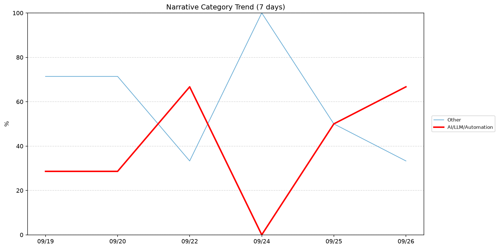
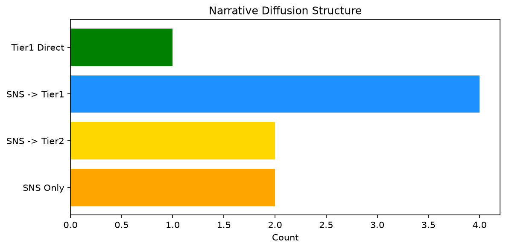

# 週次メタ分析レポート - 2026-09-26

> 分析期間: 過去7日間

---

## ショックタイプ分布

| ショックタイプ | 件数 |
|----------------|------|
| ナラティブシフト | 14 |
| 業績シグナル | 4 |
| テクノロジーショック | 4 |
| ビジネスモデルショック | 1 |

---

## ナラティブ推移

### 2026-09-19
- その他: 71%
- AI/LLM/自動化: 29%

### 2026-09-20
- その他: 71%
- AI/LLM/自動化: 29%

### 2026-09-22
- AI/LLM/自動化: 67%
- その他: 33%

### 2026-09-24
- その他: 100%

### 2026-09-25
- その他: 50%
- AI/LLM/自動化: 50%

### 2026-09-26
- AI/LLM/自動化: 67%
- その他: 33%

---

## ナラティブ伝播構造

| 伝播パターン | 件数 |
|--------------|------|
| SNS→Tier1 | 4 |
| カバレッジなし | 14 |
| SNS→Tier2 | 2 |
| SNSのみ | 2 |
| Tier1直接 | 1 |

---

## 過熱警告事後検証

> ※ "過熱警告を出したか"と"AI偏重が実際に続いたか"の検証

| 指標 | 値 |
|------|-----|
| 検証対象数 | 6 |
| 正警告（TP） | 0 |
| 過剰警告（FP） | 0 |
| 正常判定（TN） | 6 |
| 見逃し（FN） | 0 |

- **2026-09-19**: 正常判定 — No overheat and conditions normal: ai_continued=False, price_sustained=True.
- **2026-09-20**: 正常判定 — No overheat and conditions normal: ai_continued=True, price_sustained=True.
- **2026-09-22**: 正常判定 — No overheat and conditions normal: ai_continued=False, price_sustained=True.
- **2026-09-24**: 正常判定 — No overheat and conditions normal: ai_continued=True, price_sustained=True.
- **2026-09-25**: 正常判定 — No overheat and conditions normal: ai_continued=True, price_sustained=True.
- **2026-09-26**: 正常判定 — No overheat and conditions normal: ai_continued=False, price_sustained=False.

---

## 非AIハイライト（週次）

### 1. XOM
- **サマリー**: 出来高が平均の2.83倍
- **スコア**: 0.42
- **ナラティブ分類**: その他
- **ショックタイプ**: ナラティブシフト
- **AI関連度**: 0%

### 2. XOM
- **サマリー**: 出来高が平均の2.78倍
- **スコア**: 0.42
- **ナラティブ分類**: その他
- **ショックタイプ**: ナラティブシフト
- **AI関連度**: 0%

### 3. NEE
- **サマリー**: 出来高が平均の2.06倍
- **スコア**: 0.42
- **ナラティブ分類**: その他
- **ショックタイプ**: ナラティブシフト
- **AI関連度**: 0%

### 4. NEE
- **サマリー**: 出来高が平均の2.1倍
- **スコア**: 0.42
- **ナラティブ分類**: その他
- **ショックタイプ**: ナラティブシフト
- **AI関連度**: 0%

### 5. LMT
- **サマリー**: 出来高が平均の2.84倍
- **スコア**: 0.36
- **ナラティブ分類**: その他
- **ショックタイプ**: ナラティブシフト
- **AI関連度**: 0%

---

## 構造持続確率 Top3

| 順位 | 銘柄 | SPP | ショックタイプ | 伝播パターン | サマリー |
|------|------|-----|----------------|--------------|----------|
| 1 | JPM | 0.70 | 業績シグナル | なし | 前日比-2.77%の価格変動 |
| 2 | MSFT | 0.53 | ナラティブシフト | SNS→Tier1 | 10件の言及（通常の3.5倍） |
| 3 | UNH | 0.50 | ナラティブシフト | なし | 出来高が平均の1.83倍 |

---

## イベント持続性

| 銘柄 | 出現日数/観測日数 | SPP推移 | 最新SPP |
|------|------------------|---------|---------|
| JPM | 6/6日 | 上昇 | 0.70 |
| MSFT | 4/6日 | 横ばい | 0.53 |
| GOOGL | 4/6日 | 下降 | 0.49 |
| UNH | 2/6日 | 横ばい | 0.50 |
| NEE | 2/6日 | 横ばい | 0.46 |
| LMT | 2/6日 | 横ばい | 0.46 |
| XOM | 2/6日 | 横ばい | 0.46 |

---

## 転換点候補

転換点候補は検出されませんでした。

---

## 組織インパクト仮説

### 1. 今週の構造変化は「ナラティブシフト」に集中（61%）。この領域の専門知識・人材の重要性が高まっている可能性。
- **根拠**: ショックタイプ分布: ナラティブシフトが14件

### 2. JPM（その他）: 価格変動・出来高急増 + ナラティブシフト + 6日間持続 + 引き締め環境 → 構造的な市場関心の変化の可能性、SPP上昇中
- **根拠**: 出現: 6/6日, SPP推移: 上昇
- **根拠要素**:
- 価格変動
- 出来高急増
- ナラティブシフト型
- 業績シグナル型
- 6日間持続観測
- SPP上昇（0.42→0.70）
- 引き締めレジーム下
- **データ期間**: 2026-09-19〜2026-09-26 (6日間)
- **信頼度注記**: 観測データに基づく示唆であり、因果関係を示すものではありません

### 3. MSFT（AI/LLM/自動化）: 言及急増・出来高急増 + ナラティブシフト + 4日間持続 + 引き締め環境 → 構造的な市場関心の変化の可能性
- **根拠**: 出現: 4/6日, SPP推移: 横ばい
- **根拠要素**:
- 言及急増
- 出来高急増
- ナラティブシフト型
- テクノロジーショック型
- 4日間持続観測
- SPP横ばい（0.53）
- 引き締めレジーム下
- 関連: Microsoft’s stock has roared back to life, closing at its highest level of the year
- 関連: Microsoft stops insisting you need a "Copilot+ PC"
- **データ期間**: 2026-09-19〜2026-09-26 (6日間)
- **信頼度注記**: 観測データに基づく示唆であり、因果関係を示すものではありません

### 4. GOOGL（AI/LLM/自動化）: 言及急増・出来高急増 + テクノロジーショック + 4日間持続 + 引き締め環境 → 構造的な市場関心の変化の可能性、SPP下降中
- **根拠**: 出現: 4/6日, SPP推移: 下降
- **根拠要素**:
- 言及急増
- 出来高急増
- テクノロジーショック型
- ビジネスモデルショック型
- 4日間持続観測
- SPP下降（0.80→0.49）
- 引き締めレジーム下
- 関連: Gemini 3.8 Live with Live Avatar gives Google&#8217;s AI a face
- 関連: Now Google Chrome shares tabs to new devices that save where you were
- **データ期間**: 2026-09-19〜2026-09-26 (6日間)
- **信頼度注記**: 観測データに基づく示唆であり、因果関係を示すものではありません

---

## 市場レジーム推移

| 日付 | レジーム | ボラティリティ | 下落比率 | 信頼度 |
|------|----------|---------------|----------|--------|
| 2026-09-26 | 引き締め | 49.8% | 53% | 65% |
| 2026-09-25 | 高ボラ | 53.1% | 33% | 90% |
| 2026-09-24 | 高ボラ | 51.7% | 40% | 82% |
| 2026-09-22 | 高ボラ | 50.5% | 40% | 82% |
| 2026-09-20 | 引き締め | 49.3% | 67% | 87% |
| 2026-09-19 | 引き締め | 48.5% | 53% | 65% |

---

## 前週比較

> 比較期間: 2026-09-12〜2026-09-19 (6日分)

**イベント件数**: 今週 23 件 / 前週 33 件（差分 -10）

**支配的レジーム**: 引き締め（変化なし）

### ショックタイプ増減

| ショックタイプ | 今週 | 前週 | 差分 |
|----------------|------|------|------|
| テクノロジーショック | 4 | 7 | -3 |
| ナラティブシフト | 14 | 24 | -10 |
| ビジネスモデルショック | 1 | 0 | +1 |
| 業績シグナル | 4 | 2 | +2 |

### ナラティブ比率変化

| カテゴリ | 今週平均 | 前週平均 | 差分(pt) |
|----------|----------|----------|----------|
| AI/LLM/自動化 | 40% | 28% | +12 |
| その他 | 60% | 59% | +1 |
| 半導体/供給網 | 0% | 6% | -6 |
| 規制/政策/地政学 | 0% | 3% | -3 |
| 金融/金利/流動性 | 0% | 4% | -4 |

---

## レジーム・ナラティブ同時変動

> ※ 同時期の観測であり、因果関係を示すものではありません

- **2026-09-20**: レジーム異常（引き締め）と「その他」ナラティブ集中（71%）が共起
- **2026-09-22**: レジーム変化（引き締め→高ボラ）と「AI/LLM/自動化」の38pt増加が同時期に観測
- **2026-09-22**: レジーム変化（引き締め→高ボラ）と「その他」の38pt減少が同時期に観測
- **2026-09-22**: レジーム異常（高ボラ）と「AI/LLM/自動化」ナラティブ集中（67%）が共起
- **2026-09-24**: レジーム異常（高ボラ）と「その他」ナラティブ集中（100%）が共起
- **2026-09-26**: レジーム変化（高ボラ→引き締め）と「AI/LLM/自動化」の17pt増加が同時期に観測
- **2026-09-26**: レジーム変化（高ボラ→引き締め）と「その他」の17pt減少が同時期に観測
- **2026-09-26**: レジーム異常（引き締め）と「AI/LLM/自動化」ナラティブ集中（67%）が共起

---

## 来週の監視比重提案

### 1. 「規制/政策/地政学」の監視比重を維持・注視
- **根拠**: 週平均ナラティブ比率0%と低く、イベント未検出だが、構造的に重要なカテゴリのため意図的な監視継続を推奨。
- **週平均ナラティブ比率**: 0%

### 2. 「金融/金利/流動性」の監視比重を維持・注視
- **根拠**: 週平均ナラティブ比率0%と低く、イベント未検出だが、構造的に重要なカテゴリのため意図的な監視継続を推奨。
- **週平均ナラティブ比率**: 0%

### 3. 「エネルギー/資源」の監視比重を維持・注視
- **根拠**: 週平均ナラティブ比率0%と低く、イベント未検出だが、構造的に重要なカテゴリのため意図的な監視継続を推奨。
- **週平均ナラティブ比率**: 0%

### 4. 「その他」の過集中に注意
- **根拠**: 週平均ナラティブ比率60%と高く、他カテゴリの構造変化を見落とすリスクがあります。
- **週平均ナラティブ比率**: 60%
- **⚡ 急変フラグ**: 直近33%へ急変 — 動向注視を推奨

### 5. 「AI/LLM/自動化」の過集中に注意
- **根拠**: 週平均ナラティブ比率40%と高く、他カテゴリの構造変化を見落とすリスクがあります。
- **週平均ナラティブ比率**: 40%
- **⚡ 急変フラグ**: 直近67%へ急変 — 動向注視を推奨

---

*レポート生成日時: 2026-09-26 03:40:30*
