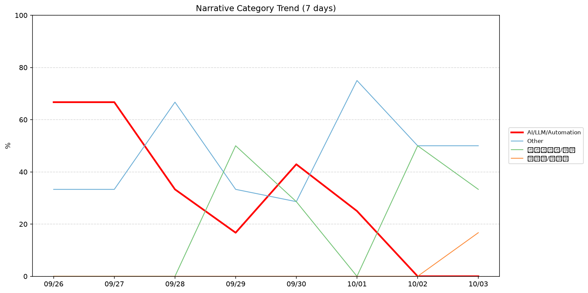
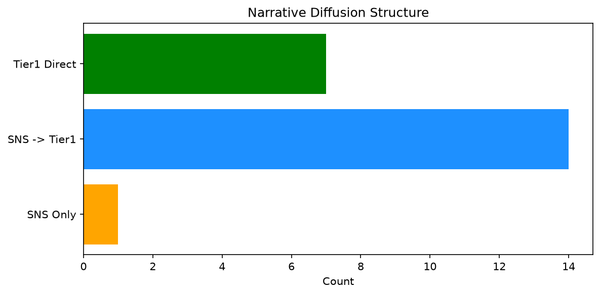

# 週次メタ分析レポート - 2026-10-03

> 分析期間: 過去7日間

---

## ショックタイプ分布

| ショックタイプ | 件数 |
|----------------|------|
| 業績シグナル | 18 |
| テクノロジーショック | 10 |
| ナラティブシフト | 8 |

---

## ナラティブ推移

### 2026-09-26
- AI/LLM/自動化: 67%
- その他: 33%

### 2026-09-27
- AI/LLM/自動化: 67%
- その他: 33%

### 2026-09-28
- その他: 67%
- AI/LLM/自動化: 33%

### 2026-09-29
- ガバナンス/経営: 50%
- その他: 33%
- AI/LLM/自動化: 17%

### 2026-09-30
- AI/LLM/自動化: 43%
- その他: 29%
- ガバナンス/経営: 29%

### 2026-10-01
- その他: 75%
- AI/LLM/自動化: 25%

### 2026-10-02
- その他: 50%
- ガバナンス/経営: 50%

### 2026-10-03
- その他: 50%
- ガバナンス/経営: 33%
- 半導体/供給網: 17%

---

## ナラティブ伝播構造

| 伝播パターン | 件数 |
|--------------|------|
| SNS→Tier1 | 14 |
| Tier1直接 | 7 |
| カバレッジなし | 14 |
| SNSのみ | 1 |

---

## 過熱警告事後検証

> ※ "過熱警告を出したか"と"AI偏重が実際に続いたか"の検証

| 指標 | 値 |
|------|-----|
| 検証対象数 | 8 |
| 正警告（TP） | 0 |
| 過剰警告（FP） | 0 |
| 正常判定（TN） | 8 |
| 見逃し（FN） | 0 |

- **2026-09-26**: 正常判定 — No overheat and conditions normal: ai_continued=False, price_sustained=True.
- **2026-09-27**: 正常判定 — No overheat and conditions normal: ai_continued=False, price_sustained=True.
- **2026-09-28**: 正常判定 — No overheat and conditions normal: ai_continued=False, price_sustained=True.
- **2026-09-29**: 正常判定 — No overheat and conditions normal: ai_continued=False, price_sustained=True.
- **2026-09-30**: 正常判定 — No overheat and conditions normal: ai_continued=False, price_sustained=True.
- **2026-10-01**: 正常判定 — No overheat and conditions normal: ai_continued=False, price_sustained=True.
- **2026-10-02**: 正常判定 — No overheat and conditions normal: ai_continued=False, price_sustained=True.
- **2026-10-03**: 正常判定 — No overheat and conditions normal: ai_continued=False, price_sustained=False.

---

## 非AIハイライト（週次）

### 1. MDB
- **サマリー**: 7件の言及（通常の17.5倍）
- **スコア**: 0.72
- **ナラティブ分類**: ガバナンス/経営
- **ショックタイプ**: テクノロジーショック
- **AI関連度**: 10%

### 2. MDB
- **サマリー**: 7件の言及（通常の17.5倍）
- **スコア**: 0.72
- **ナラティブ分類**: ガバナンス/経営
- **ショックタイプ**: テクノロジーショック
- **AI関連度**: 10%

### 3. MDB
- **サマリー**: 出来高が平均の11.28倍
- **スコア**: 0.72
- **ナラティブ分類**: ガバナンス/経営
- **ショックタイプ**: テクノロジーショック
- **AI関連度**: 10%

### 4. NVDA
- **サマリー**: 8件の言及（通常の2.6倍）
- **スコア**: 0.56
- **ナラティブ分類**: 半導体/供給網
- **ショックタイプ**: ナラティブシフト
- **AI関連度**: 17%

### 5. MDB
- **サマリー**: 前日比-21.75%の価格変動
- **スコア**: 0.54
- **ナラティブ分類**: ガバナンス/経営
- **ショックタイプ**: テクノロジーショック
- **AI関連度**: 10%

---

## 構造持続確率 Top3

| 順位 | 銘柄 | SPP | ショックタイプ | 伝播パターン | サマリー |
|------|------|-----|----------------|--------------|----------|
| 1 | MSFT | 0.78 | 業績シグナル | Tier1直接 | 9件の言及（通常の2.6倍） |
| 2 | MDB | 0.65 | 業績シグナル | なし | 前日比-21.75%の価格変動 |
| 3 | NEE | 0.61 | 業績シグナル | なし | 前日比-4.76%の価格変動 |

---

## イベント持続性

| 銘柄 | 出現日数/観測日数 | SPP推移 | 最新SPP |
|------|------------------|---------|---------|
| MSFT | 8/8日 | 上昇 | 0.78 |
| MDB | 7/8日 | 上昇 | 0.65 |
| NEE | 5/8日 | 横ばい | 0.61 |
| NVDA | 3/8日 | 上昇 | 0.51 |
| JPM | 2/8日 | 下降 | 0.61 |
| GOOGL | 1/8日 | 横ばい | 0.54 |
| SNOW | 1/8日 | 横ばい | 0.42 |
| PATH | 1/8日 | 横ばい | 0.34 |

---

## 転換点候補

- 「AI/LLM/自動化」が2026-09-27→2026-09-28で33ポイント下降（67% → 33%）

---

## 組織インパクト仮説

### 1. 今週の構造変化は「業績シグナル」に集中（50%）。この領域の専門知識・人材の重要性が高まっている可能性。
- **根拠**: ショックタイプ分布: 業績シグナルが18件

### 2. 「AI/LLM/自動化」ナラティブの下降は、市場の関心が他分野に移行中であることを示唆。この分野の見落としリスクに注意が必要です。
- **根拠**: 「AI/LLM/自動化」が2026-09-27→2026-09-28で33ポイント下降（67% → 33%）

### 3. MSFT（AI/LLM/自動化）: 価格変動・出来高急増 + ナラティブシフト + 8日間持続 + 引き締め環境 → 構造的な市場関心の変化の可能性、SPP上昇中
- **根拠**: 出現: 8/8日, SPP推移: 上昇
- **根拠要素**:
- 価格変動
- 出来高急増
- 言及急増
- ナラティブシフト型
- 業績シグナル型
- テクノロジーショック型
- 8日間持続観測
- SPP上昇（0.53→0.78）
- 引き締めレジーム下
- 関連: Former LinkedIn chief Roslansky to leave Microsoft, following other exec departures
- 関連: Microsoft’s Office and Teams chief is leaving
- **データ期間**: 2026-09-26〜2026-10-03 (8日間)
- **信頼度注記**: 観測データに基づく示唆であり、因果関係を示すものではありません

### 4. MDB（ガバナンス/経営）: 価格変動・出来高急増 + 業績シグナル + 7日間持続 + 引き締め環境 → 構造的な市場関心の変化の可能性、SPP上昇中
- **根拠**: 出現: 7/8日, SPP推移: 上昇
- **根拠要素**:
- 価格変動
- 出来高急増
- 言及急増
- 業績シグナル型
- テクノロジーショック型
- 7日間持続観測
- SPP上昇（0.45→0.65）
- 引き締めレジーム下
- 関連: MongoDB’s stock is down nearly 20% as CEO decamps to Meta
- 関連: Meta hires MongoDB CEO CJ Desai to lead enterprise unit. MongoDB shares crater
- **データ期間**: 2026-09-26〜2026-10-03 (8日間)
- **信頼度注記**: 観測データに基づく示唆であり、因果関係を示すものではありません

### 5. NEE（その他）: 価格変動 + 業績シグナル + 5日間持続 + 引き締め環境 → 構造的な市場関心の変化の可能性
- **根拠**: 出現: 5/8日, SPP推移: 横ばい
- **根拠要素**:
- 価格変動
- 業績シグナル型
- 5日間持続観測
- SPP横ばい（0.61）
- 引き締めレジーム下
- **データ期間**: 2026-09-26〜2026-10-03 (8日間)
- **信頼度注記**: 観測データに基づく示唆であり、因果関係を示すものではありません

---

## 市場レジーム推移

| 日付 | レジーム | ボラティリティ | 下落比率 | 信頼度 |
|------|----------|---------------|----------|--------|
| 2026-10-03 | 引き締め | 50.4% | 53% | 65% |
| 2026-10-02 | 高ボラ | 53.1% | 47% | 74% |
| 2026-10-01 | 高ボラ | 54.8% | 47% | 74% |
| 2026-09-30 | 高ボラ | 55.1% | 47% | 74% |
| 2026-09-29 | 高ボラ | 55.1% | 47% | 74% |
| 2026-09-28 | 引き締め | 51.9% | 60% | 76% |
| 2026-09-27 | 引き締め | 50.6% | 53% | 65% |
| 2026-09-26 | 引き締め | 49.8% | 53% | 65% |

---

## 前週比較

> 比較期間: 2026-09-19〜2026-09-26 (6日分)

**イベント件数**: 今週 36 件 / 前週 23 件（差分 +13）

**支配的レジーム**: 引き締め（変化なし）

### ショックタイプ増減

| ショックタイプ | 今週 | 前週 | 差分 |
|----------------|------|------|------|
| テクノロジーショック | 10 | 4 | +6 |
| ナラティブシフト | 8 | 14 | -6 |
| ビジネスモデルショック | 0 | 1 | -1 |
| 業績シグナル | 18 | 4 | +14 |

### ナラティブ比率変化

| カテゴリ | 今週平均 | 前週平均 | 差分(pt) |
|----------|----------|----------|----------|
| AI/LLM/自動化 | 31% | 40% | -9 |
| その他 | 46% | 60% | -14 |
| ガバナンス/経営 | 20% | 0% | +20 |
| 半導体/供給網 | 2% | 0% | +2 |

---

## レジーム・ナラティブ同時変動

> ※ 同時期の観測であり、因果関係を示すものではありません

- **2026-09-27**: レジーム異常（引き締め）と「AI/LLM/自動化」ナラティブ集中（67%）が共起
- **2026-09-28**: レジーム異常（引き締め）と「その他」ナラティブ集中（67%）が共起
- **2026-09-29**: レジーム変化（引き締め→高ボラ）と「ガバナンス/経営」の50pt増加が同時期に観測
- **2026-09-29**: レジーム変化（引き締め→高ボラ）と「その他」の33pt減少が同時期に観測
- **2026-09-29**: レジーム変化（引き締め→高ボラ）と「AI/LLM/自動化」の17pt減少が同時期に観測
- **2026-10-01**: レジーム異常（高ボラ）と「その他」ナラティブ集中（75%）が共起
- **2026-10-03**: レジーム変化（高ボラ→引き締め）と「ガバナンス/経営」の17pt減少が同時期に観測
- **2026-10-03**: レジーム変化（高ボラ→引き締め）と「半導体/供給網」の17pt増加が同時期に観測

---

## 来週の監視比重提案

### 1. 「規制/政策/地政学」の監視比重を維持・注視
- **根拠**: 週平均ナラティブ比率0%と低く、イベント未検出だが、構造的に重要なカテゴリのため意図的な監視継続を推奨。
- **週平均ナラティブ比率**: 0%

### 2. 「金融/金利/流動性」の監視比重を維持・注視
- **根拠**: 週平均ナラティブ比率0%と低く、イベント未検出だが、構造的に重要なカテゴリのため意図的な監視継続を推奨。
- **週平均ナラティブ比率**: 0%

### 3. 「エネルギー/資源」の監視比重を維持・注視
- **根拠**: 週平均ナラティブ比率0%と低く、イベント未検出だが、構造的に重要なカテゴリのため意図的な監視継続を推奨。
- **週平均ナラティブ比率**: 0%

### 4. 「半導体/供給網」の監視比重を引き上げ
- **根拠**: 週平均ナラティブ比率2%と低いが、過去7日で1件のイベントが検出されており、見落としリスクがあります。
- **週平均ナラティブ比率**: 2%

### 5. 「その他」の過集中に注意
- **根拠**: 週平均ナラティブ比率46%と高く、他カテゴリの構造変化を見落とすリスクがあります。
- **週平均ナラティブ比率**: 46%

### 6. 「AI/LLM/自動化」の過集中に注意
- **根拠**: 週平均ナラティブ比率31%と高く、他カテゴリの構造変化を見落とすリスクがあります。
- **週平均ナラティブ比率**: 31%
- **⚡ 急変フラグ**: 直近0%へ急変 — 動向注視を推奨

---

*レポート生成日時: 2026-10-03 03:54:57*
