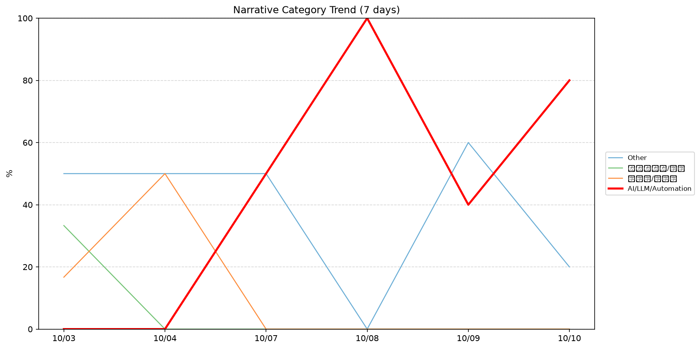
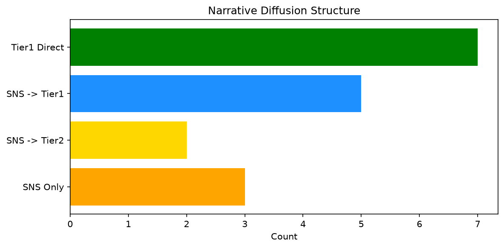

# 週次メタ分析レポート - 2026-10-10

> 分析期間: 過去7日間

---

## ショックタイプ分布

| ショックタイプ | 件数 |
|----------------|------|
| ナラティブシフト | 13 |
| 業績シグナル | 5 |
| テクノロジーショック | 4 |
| ビジネスモデルショック | 1 |

---

## ナラティブ推移

### 2026-10-03
- その他: 50%
- ガバナンス/経営: 33%
- 半導体/供給網: 17%

### 2026-10-04
- 半導体/供給網: 50%
- その他: 50%

### 2026-10-07
- その他: 50%
- AI/LLM/自動化: 50%

### 2026-10-08
- AI/LLM/自動化: 100%

### 2026-10-09
- その他: 60%
- AI/LLM/自動化: 40%

### 2026-10-10
- AI/LLM/自動化: 80%
- その他: 20%

---

## ナラティブ伝播構造

| 伝播パターン | 件数 |
|--------------|------|
| SNS→Tier1 | 5 |
| SNS→Tier2 | 2 |
| SNSのみ | 3 |
| Tier1直接 | 7 |
| カバレッジなし | 6 |

---

## 過熱警告事後検証

> ※ "過熱警告を出したか"と"AI偏重が実際に続いたか"の検証

| 指標 | 値 |
|------|-----|
| 検証対象数 | 8 |
| 正警告（TP） | 0 |
| 過剰警告（FP） | 0 |
| 正常判定（TN） | 3 |
| 見逃し（FN） | 5 |
| Recall | 0.0% |

- **2026-10-03**: 正常判定 — No overheat and conditions normal: ai_continued=False, price_sustained=False.
- **2026-10-04**: 見逃し — Missed overheat: AI events continued without price backing. An alert should have been raised.
- **2026-10-05**: 見逃し — Missed overheat: AI events continued without price backing. An alert should have been raised.
- **2026-10-06**: 見逃し — Missed overheat: AI events continued without price backing. An alert should have been raised.
- **2026-10-07**: 見逃し — Missed overheat: AI events continued without price backing. An alert should have been raised.
- **2026-10-08**: 正常判定 — No overheat and conditions normal: ai_continued=True, price_sustained=True.
- **2026-10-09**: 見逃し — Missed overheat: AI events continued without price backing. An alert should have been raised.
- **2026-10-10**: 正常判定 — No overheat and conditions normal: ai_continued=False, price_sustained=False.

---

## 非AIハイライト（週次）

### 1. NVDA
- **サマリー**: 8件の言及（通常の2.6倍）
- **スコア**: 0.56
- **ナラティブ分類**: 半導体/供給網
- **ショックタイプ**: ナラティブシフト
- **AI関連度**: 17%

### 2. MSFT
- **サマリー**: 9件の言及（通常の2.6倍）
- **スコア**: 0.49
- **ナラティブ分類**: ガバナンス/経営
- **ショックタイプ**: 業績シグナル
- **AI関連度**: 8%

### 3. MSFT
- **サマリー**: 前日比+2.25%の価格変動
- **スコア**: 0.43
- **ナラティブ分類**: ガバナンス/経営
- **ショックタイプ**: 業績シグナル
- **AI関連度**: 8%

### 4. PLTR
- **サマリー**: 出来高が平均の1.87倍
- **スコア**: 0.35
- **ナラティブ分類**: その他
- **ショックタイプ**: ナラティブシフト
- **AI関連度**: 8%

### 5. JPM
- **サマリー**: 3件の言及（通常の6.0倍）
- **スコア**: 0.33
- **ナラティブ分類**: その他
- **ショックタイプ**: ナラティブシフト
- **AI関連度**: 4%

---

## 構造持続確率 Top3

| 順位 | 銘柄 | SPP | ショックタイプ | 伝播パターン | サマリー |
|------|------|-----|----------------|--------------|----------|
| 1 | NEE | 0.69 | 業績シグナル | なし | 前日比+2.1%の価格変動 |
| 2 | MDB | 0.65 | 業績シグナル | なし | 前日比-21.75%の価格変動 |
| 3 | NVDA | 0.62 | ナラティブシフト | SNS→Tier1 | 7件の言及（通常の2.1倍） |

---

## イベント持続性

| 銘柄 | 出現日数/観測日数 | SPP推移 | 最新SPP |
|------|------------------|---------|---------|
| NVDA | 5/6日 | 上昇 | 0.62 |
| MSFT | 4/6日 | 下降 | 0.52 |
| NET | 3/6日 | 上昇 | 0.25 |
| NEE | 2/6日 | 上昇 | 0.69 |
| JPM | 2/6日 | 上昇 | 0.50 |
| GOOGL | 2/6日 | 横ばい | 0.38 |
| MDB | 1/6日 | 横ばい | 0.65 |
| PLTR | 1/6日 | 横ばい | 0.42 |
| UNH | 1/6日 | 横ばい | 0.42 |
| PATH | 1/6日 | 横ばい | 0.34 |

---

## 転換点候補

転換点候補は検出されませんでした。

---

## 組織インパクト仮説

### 1. 今週の構造変化は「ナラティブシフト」に集中（57%）。この領域の専門知識・人材の重要性が高まっている可能性。
- **根拠**: ショックタイプ分布: ナラティブシフトが13件

### 2. NVDA（AI/LLM/自動化）: 価格変動・言及急増 + ナラティブシフト + 5日間持続 + 高ボラ環境 → 構造的な市場関心の変化の可能性、SPP上昇中
- **根拠**: 出現: 5/6日, SPP推移: 上昇
- **根拠要素**:
- 価格変動
- 言及急増
- ナラティブシフト型
- 5日間持続観測
- SPP上昇（0.51→0.62）
- 高ボラレジーム下
- 関連: Two massive trades just happened in Micron and Nvidia. What they could mean for chips
- 関連: Nvidia-backed Aussie AI firm Firmus withdraws historic IPO, citing market volatility
- **データ期間**: 2026-10-03〜2026-10-10 (6日間)
- **信頼度注記**: 観測データに基づく示唆であり、因果関係を示すものではありません

### 3. MSFT（AI/LLM/自動化）: 価格変動・言及急増 + 業績シグナル + 4日間持続 + 高ボラ環境 → 構造的な市場関心の変化の可能性、SPP下降中
- **根拠**: 出現: 4/6日, SPP推移: 下降
- **根拠要素**:
- 価格変動
- 言及急増
- 業績シグナル型
- ビジネスモデルショック型
- ナラティブシフト型
- テクノロジーショック型
- 4日間持続観測
- SPP下降（0.78→0.52）
- 高ボラレジーム下
- 関連: Microsoft is nearing a big milestone that solidifies its revival
- 関連: Microsoft tries to spark new life into Windows
- **データ期間**: 2026-10-03〜2026-10-10 (6日間)
- **信頼度注記**: 観測データに基づく示唆であり、因果関係を示すものではありません

### 4. NET（AI/LLM/自動化）: 言及急増 + ナラティブシフト + 3日間持続 + 高ボラ環境 → 構造的な市場関心の変化の可能性、SPP上昇中
- **根拠**: 出現: 3/6日, SPP推移: 上昇
- **根拠要素**:
- 言及急増
- ナラティブシフト型
- テクノロジーショック型
- 3日間持続観測
- SPP上昇（0.19→0.25）
- 高ボラレジーム下
- **データ期間**: 2026-10-03〜2026-10-10 (6日間)
- **信頼度注記**: 観測データに基づく示唆であり、因果関係を示すものではありません

---

## 市場レジーム推移

| 日付 | レジーム | ボラティリティ | 下落比率 | 信頼度 |
|------|----------|---------------|----------|--------|
| 2026-10-10 | 高ボラ | 32.6% | 40% | 50% |
| 2026-10-09 | 高ボラ | 32.4% | 33% | 53% |
| 2026-10-08 | 高ボラ | 33.4% | 33% | 60% |
| 2026-10-07 | 高ボラ | 33.9% | 33% | 64% |
| 2026-10-06 | 高ボラ | 34.0% | 33% | 65% |
| 2026-10-05 | 高ボラ | 34.6% | 33% | 70% |
| 2026-10-04 | 高ボラ | 34.9% | 40% | 65% |
| 2026-10-03 | 引き締め | 50.4% | 53% | 65% |

---

## 前週比較

> 比較期間: 2026-09-26〜2026-10-03 (8日分)

**イベント件数**: 今週 23 件 / 前週 36 件（差分 -13）

**支配的レジーム**: 引き締め → 高ボラ（変化あり）

### ショックタイプ増減

| ショックタイプ | 今週 | 前週 | 差分 |
|----------------|------|------|------|
| テクノロジーショック | 4 | 10 | -6 |
| ナラティブシフト | 13 | 8 | +5 |
| ビジネスモデルショック | 1 | 0 | +1 |
| 業績シグナル | 5 | 18 | -13 |

### ナラティブ比率変化

| カテゴリ | 今週平均 | 前週平均 | 差分(pt) |
|----------|----------|----------|----------|
| AI/LLM/自動化 | 45% | 31% | +14 |
| その他 | 38% | 46% | -8 |
| ガバナンス/経営 | 6% | 20% | -15 |
| 半導体/供給網 | 11% | 2% | +9 |

---

## レジーム・ナラティブ同時変動

> ※ 同時期の観測であり、因果関係を示すものではありません

- **2026-10-04**: レジーム変化（引き締め→高ボラ）と「ガバナンス/経営」の33pt減少が同時期に観測
- **2026-10-04**: レジーム変化（引き締め→高ボラ）と「半導体/供給網」の33pt増加が同時期に観測
- **2026-10-08**: レジーム異常（高ボラ）と「AI/LLM/自動化」ナラティブ集中（100%）が共起
- **2026-10-10**: レジーム異常（高ボラ）と「AI/LLM/自動化」ナラティブ集中（80%）が共起

---

## 来週の監視比重提案

### 1. 「規制/政策/地政学」の監視比重を維持・注視
- **根拠**: 週平均ナラティブ比率0%と低く、イベント未検出だが、構造的に重要なカテゴリのため意図的な監視継続を推奨。
- **週平均ナラティブ比率**: 0%

### 2. 「金融/金利/流動性」の監視比重を維持・注視
- **根拠**: 週平均ナラティブ比率0%と低く、イベント未検出だが、構造的に重要なカテゴリのため意図的な監視継続を推奨。
- **週平均ナラティブ比率**: 0%

### 3. 「エネルギー/資源」の監視比重を維持・注視
- **根拠**: 週平均ナラティブ比率0%と低く、イベント未検出だが、構造的に重要なカテゴリのため意図的な監視継続を推奨。
- **週平均ナラティブ比率**: 0%

### 4. 「ガバナンス/経営」の監視比重を引き上げ
- **根拠**: 週平均ナラティブ比率6%と低いが、過去7日で2件のイベントが検出されており、見落としリスクがあります。
- **週平均ナラティブ比率**: 6%

### 5. 「AI/LLM/自動化」の過集中に注意
- **根拠**: 週平均ナラティブ比率45%と高く、他カテゴリの構造変化を見落とすリスクがあります。
- **週平均ナラティブ比率**: 45%
- **⚡ 急変フラグ**: 直近80%へ急変 — 動向注視を推奨

### 6. 「その他」の過集中に注意
- **根拠**: 週平均ナラティブ比率38%と高く、他カテゴリの構造変化を見落とすリスクがあります。
- **週平均ナラティブ比率**: 38%
- **⚡ 急変フラグ**: 直近20%へ急変 — 動向注視を推奨

---

*レポート生成日時: 2026-10-10 04:28:04*
